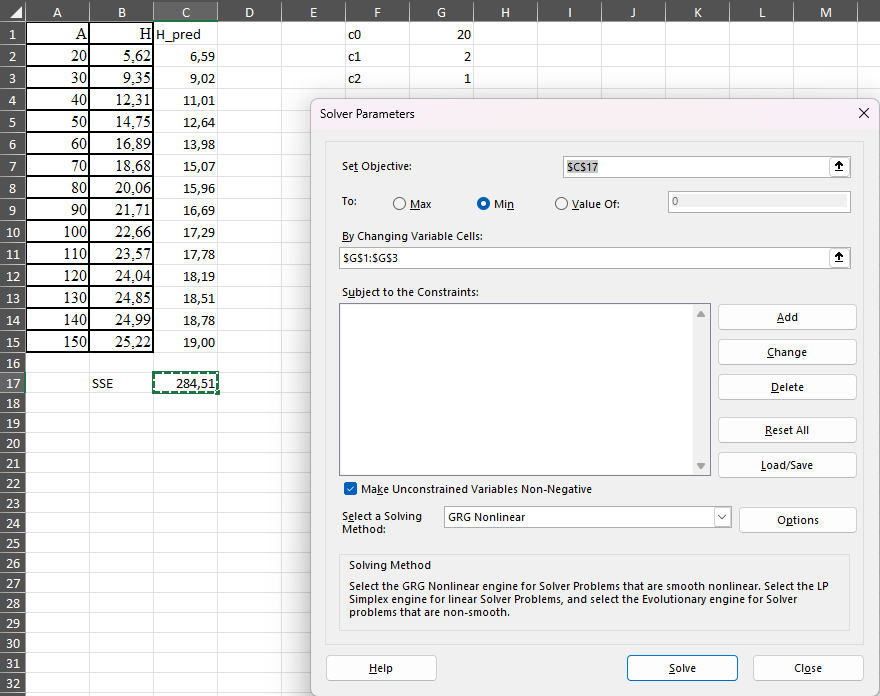

# Mittelineaarne regressioon

**Mittelineaarne regressioon** on statistiline meetod, mida kasutatakse sõltuva muutuja ja ühe või mitme sõltumatu muutuja vahelise mittelineaarse seose modelleerimiseks. Erinevalt lineaarsest regressioonist, mis eeldab sirgjoonelist seost, võimaldab mittelineaarne regressioon paindlikumaid seoseid, näiteks kõverjoonelisi, eksponentsiaalseid või logistilisi seoseid.

Metsanduses esineb sageli mittelineaarseid seoseid. Mittelineaarne regressioon võimaldab neid keerukaid seoseid täpsemalt modelleerida ja paremini mõista.

Mittelineaarne regressioonimudel kirjutatakse üldjuhul kujul:

\[Y = f(X, \beta) + \epsilon\]

kus:
  
*   **Y** on sõltuv muutuja.
*   **X** on sõltumatu(te) muutuja(te) vektor.
*   **\(f(X, \beta)\)** on mittelineaarne funktsioon, mis kirjeldab seost X ja Y vahel.
*   **\(\beta\)** on mudeli parameetrite vektor, mida tuleb hinnata.
*   **\(\epsilon\)** on vealiige, mis esindab juhuslikku varieeruvust.


Mittelineaarse regressiooni parameetreid hinnatakse tavaliselt **vähimruutude meetodil**, kus otsitakse parameetrite väärtusi, mis minimeerivad mudeli ennustatud väärtuste ja tegelike väärtuste vaheliste ruutude summat. See on iteratiivne protsess, mis nõuab arvutitarkvara kasutamist.

## Mittelineaarne regressioon R keskkonnas

R-is kasutatakse mittelineaarse regressiooni lähendamiseks funktsiooni `nls()`. 

```{r, warning=FALSE, message=FALSE}
# Laadime peatükis kasutatavad paketid
library(dplyr)
library(readxl)
library(ggplot2)
```


:::{.naidis}
Olgu meil ülesandeks lähendada Eesti riigimetsa pohla kasvukohatüübi männikute keskmiste kõrguste vanuserea andmed Mitcherlichi kasvufunktsiooniga
:::

\[H = c0 * (1 - exp(-c1 * A))^{c2}\]

Kus A on vanus, H on puistu kõrgus ning c0, c1 ja c2 on mudeli parameetrid. 

```{r}
# Laadime andmed sisse failist ning
# filtreerime välja puud, mille h > 0
andmed <- read_excel("data/naited.xlsx","PH_MA")
```

Mudeli lähendamiseks koostame esmalt oma funktsiooni ning lisame täiendava teisenduse, kus vanus jagatakse 100-ga. Kuna parameeter $c_1$ korrutatakse valemis vanusega ning selle parameetri väärtus on väga väike, siis lähendamine on lihtsam, kui see on sada korda suurem ehk 0,02 asemel on 2.

```{r}
# Määratleme mudeli funktsioon
kasvuMudel <- function(A, c0, c1, c2) {
 c0 * (1 - exp(-c1 * A/100))^c2
}
```

```{r}
# Omistame algväärtused parameetritele
alg_param <- list(c0 = 20, c1 = 2, c2 = 1)
```

```{r}
# Sobitame mudel andmetele
mudel <- nls(H ~ kasvuMudel(A, c0, c1, c2), data = andmed, start = alg_param)
```

```{r}
# Vaatame mudeli kokkuvõtet
summary(mudel)
```

Esitame selle kohta ka graafiku kasutades funktsiooni `ggplot()`.

```{r, fig.cap = "Mittelineaarne regressioon"}

ggplot(andmed, aes(x = A, y = H)) +
  geom_point() +
  stat_function(
    fun = function(x)
      predict(mudel, newdata = data.frame(A = x)),
    color = 2
  ) 

```

Testime mittelineaarset lähenemist puu diameetri ja kõrguse vahelise seose modelleerimiseks. 

Kasutame samu andmeid nagu lineaarses regressioonis.

```{r}
# Loe andmed Exceli failist ja konkreetselt töölehelt
prt <- read_excel("data/naited.xlsx", sheet = "MA")
```

```{r}
# Lühendame koodi ning kirjutame ühe käsuna
summary(nls_mudel <- nls(H ~ 1.3 + (D / (c0 + c1 * D))^2, prt, start = list(c0 = 1, c1 = 1)))
```


Järgnevalt kontrollime ka jääkide hajuvust.

```{r, fig.cap = "Jäägid vs ennustatud"}
library(ggplot2)
ggplot(data.frame(fitted = fitted(nls_mudel), resid = resid(nls_mudel)),
       aes(x = fitted, y = resid)) +
  geom_point() +
  geom_hline(yintercept = 0) +
  geom_smooth(method = "gam", formula = y ~ s(x))  # Lisab sujuva joone GAM mudeli abil

```

**Mida sellelt graafikult otsida:**

- **Juhuslik hajuvus.** Ideaalis peaksid punktid paiknema juhuslikult nulljoone ümber, ilma selge mustrita.
- **Süsteemne muster.** Kui punktid moodustavad mingi süsteemse mustri (nt kaar, lehter), siis see viitab probleemidele mudelis (nt mittelineaarsus, heteroskedastiivsus).
- **Silutud joone kuju.** Kui silutud joon on sirge ja horisontaalne, siis see viitab, et ennustatud väärtuste ja jääkide vahel puudub süsteemne seos. Kui joon on kõver, siis see viitab mittelineaarsele seosele, mida mudel ei pruugi arvesse võtta.

## Mittelineaarne regressioon MS Excel keskkonnas

MS Exceli keskkonnas saab mittelineaarse funktsiooni parameetrite hindamiseks kasutada optimeerimisprotseduuri Solver. Selleks tuleks MS Exceli töölehele salvestada argumenttunnuse väärtused, funktsioontunnuse väärtused, prognoosifunktsiooni arvutusvalemid ja prognoosijääkide ruutude summa  arvutuseeskiri. Samuti peavad töölehel olema lahtrid funktsiooni parameetrite jaoks, mida prognoosifunktsiooni arvutusvalemid kasutavad. MS Exceli optimeerimisalgoritm käivitatakse menüüst: Andmed, Solver. 

Andmete ettevalmistamisel tuleb esmalt määrata lahtrid, kuhu kirjutatakse mudeli parameetrid. Järgnevas näites on need lahtrites G1:G3 ning nende nimetused on lahtrites F1:F3. Kõrguse kõrval tulpa on sisestatud valem, millega kõrgust prognoositakse sõltuvalt vanusest. Eraldi on välja arvutatud 	prognoosijääkide ruutude summa (SSE) MS Exceli funktsiooniga `SUMXMY2()`, millel on sisendiks tegelik kõrgus ja prognoositud kõrgus. 

Solverile tuleb anda ette lahtrid, mille väärtust minimeeritakse (SSE) ja lahtrid, mille väärtusi protseduur hakkab muutma, et minimeerida prognoosijääkide ruutude summat.


