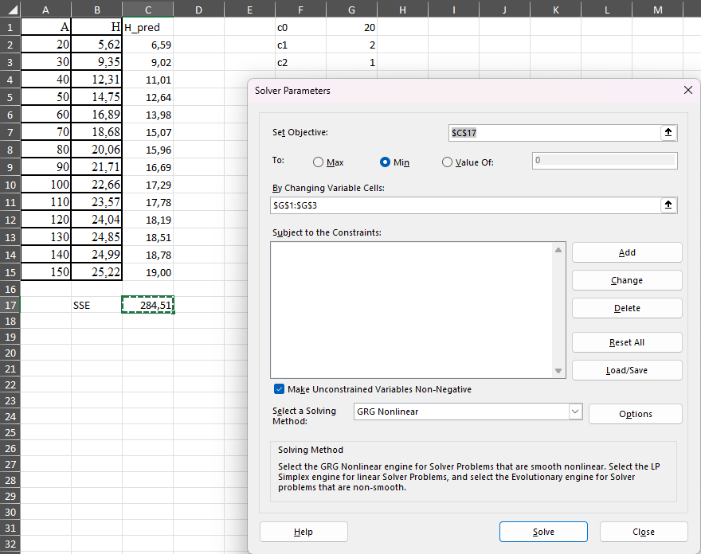

--- 
title: "Metsanduslik statistika R ja MS Excel keskkonnas"
author: "Allan Sims, Andres Kiviste, Diana Laarmann"
date: "Tartu, 2025"
site: bookdown::bookdown_site
documentclass: book
bibliography: [book.bib, packages.bib]
description: |
  Metsanduslik statistika R ja MS Excel keskkonnas
link-citations: yes
github-repo: xyzallan/met-stat-opik
---
```{r include=FALSE, cache=FALSE}
knitr::opts_chunk$set(
  comment = '', fig.width = 7, fig.height = 4, out.width = "80%", size = "small", fig.pos = "H"
)

knitr::knit_engines$set(naidis = function(options) {
  excel_env_start <- '\n\\begin{naidis}\n'
  excel_env_end <- '\n\\end{naidis}\n'
  
  excel_code <- paste(excel_env_start,
                      paste0(options$code, "\n"),
                      excel_env_end, sep="")
  knitr::asis_output(excel_code)
})

knitr::knit_engines$set(excel = function(options) {
  excel_env_start <- '\n\\begin{naideExcel}\n'
  excel_env_end <- '\n\\end{naideExcel}\n'
  
  excel_code <- paste(excel_env_start,
                      paste0(options$code, "\n"),
                      excel_env_end, sep="")
  knitr::asis_output(excel_code)
})


options(OutDec = ",", digits = 5, "show.signif.stars" = F)

print_termin <- function(x) {
  #paste0('[',x,']', "(https://sonaveeb.ee/search/unif/dlall/aso/",gsub(" ", "%20", tolower(x)),"/1/est){target=\"_blank\"}") 
  paste0("**",x,"**")
}


print_func <- function(x) {
  paste0('`',x,'()`')
}

# for(x in list.files("peatykid", "*.Rmd", full.names = T))
# {
#   sisu <- readLines(x)
#   cat(sisu[8:length(sisu)], file = basename(x), sep="\n")
# }

for(x in list.files("peatykid/pildid", "*.png", full.names = T))
{
  file.copy(x, paste0("pildid/", basename(x)), overwrite = T)
}


#file.exists("peatykid/data/naited.xlsx")
#file.copy("peatykid/data/naited.xlsx", "data/naited.xlsx", overwrite = T)


```

# Sissejuhatus  

Käesolev õpik on mõeldud metsandusüliõpilastele, kes soovivad omandada matemaatilise statistika põhitõdesid praktilises kontekstis. Materjali koostamisel on lähtutud eeldusest, et lugejatel ei pruugi olla sügavamat matemaatilist ettevalmistust. Statistika terminoloogiaga saab tutvuda  *[andmeanalüüsi ja statistika oskussõnastikus](https://sonaveeb.ee/ds/aso)*.  

Metsanduses toimub pidev andmete kogumine ja nende töötlemine. Kõiki soovitud andmeid ei ole võimalik alati mõõta ning seetõttu tuletatakse need erinevate mudelite abil. Sellised mudelid on saadud statistilise andmetöötluse ja modelleerimise abil. Seetõttu on andmete töötlemisel oluline tunda ka statistika põhitõdesid, et mõista paremini andmetest järelduste ja otsuste tegemisel. Õpiku näited keskenduvad metsanduslikele andmetele. Tarkvarana on kasutatud statistikatarkvara **R** ja **MS Excel**, kuid nende valikul on oluline märkida nende erinevaid võimekusi:  

1. **R** on spetsialiseerunud statistiliseks modelleerimiseks ja analüüsiks, pakkudes laia valikut meetodeid (nt regressioon, testid). Kuid andmehalduse lihtsustamiseks võib olla vaja täiendavaid tööriistu.  
2. **MS Excel** on kasutajasõbralik platvorm andmete korrastamiseks ja esmaseks visualiseerimiseks, kuid selle statistilised funktsioonid on piiratud (nt puuduvad keerukama modelleerimise võimalused).  

Need tarkvarad täiendavad üksteist. MS Excel sobib hästi andmete esmaseks töötluseks, R aga detailsemaks analüüsiks. Näiteks võib MS Excelis ette valmistatud andmeid edasi analüüsida R-is. Samuti on võimalik integreerida R-skripte Exceli makrotesse või kasutada Pythoni skripte R-i keskkonnas, et laiendada funktsionaalsust, aga neid integratsioone käesolev õpik ei käsitle. Sellised moodulipõhised lahendused muudavad tarkvaravahendid paindlikumaks, kuid nõuavad aga pidevat oskuste arendamist.  

Oluline on mõista, et üksik tarkvara ei suuda katta kõiki analüüsivajadusi. Seetõttu on õpikus rõhk praktilistel lahendustel, mis õpetavad ülesannete jaoks optimaalsete tööriistade valikut. Statistika valdkond areneb kiiresti – nii meetodid, tarkvarad kui rakendusvaldkonnad muutuvad. Käesolevat õpikut uuendatakse regulaarselt, et kajastada ajakohaseid standardeid ja tarkvarauuendusi.  


## Statistikaprogramm R

R on tarkvarakeskkond, mis on loodud spetsiaalselt statistiliseks arvutamiseks ja andmete graafiliseks esitamiseks. See on avatud lähtekoodiga projekt, mida toetab suur kogukond ning mida eelistavad andmeteadlased ja statistikud üle kogu maailma oma andmeanalüüsi vajadusteks. R pakub laia valikut tööriistu andmete importimiseks, töötlemiseks, modelleerimiseks, analüüsiks ja visualiseerimiseks. Järgnevalt on ülevaade R-i peamistest kasutusvõimalustest statistilise analüüsi tegemiseks.

**Andmete importimine ja töötlemine**

- **Andmete importimine.** R toetab andmete importimist paljudest allikatest, sealhulgas teksti-, CSV- ja MS Exceli failidest ning andmebaasidest ja isegi veebist.
- **Andmete puhastamine.** Andmete analüüsiks ettevalmistamisel pakub R võimalusi nende sortimiseks, filtreerimiseks, puuduvate väärtuste käsitlemiseks ja duplikaatide eemaldamiseks.

**Andmete analüüs**

- **Statistilised funktsioonid.** R sisaldab ulatuslikku valikut sisseehitatud funktsioone statistilisi tunnuste arvutamiseks, nagu keskmine, mediaan, standardhälve, kvantiilid ja palju muud, mis võimaldavad kiiresti arvutada olulisi statistilisi näitajaid.
- **Andmete manipuleerimine.** R pakub võimekaid pakette andmete manipuleerimiseks, mis võimaldavad efektiivselt andmete filtreerimist, valimist, rühmitamist ja kokkuvõtete tegemist.

**Statistilised mudelid ja analüüsimeetodid**

- **Hüpoteeside testimine.** R võimaldab kasutajatel teostada erinevaid statistilisi teste, nagu t-testid, hii-ruut-testid, ANOVA ja palju muud, et uurida andmete omavahelisi seoseid ja testida hüpoteese.
- **Regressioon ja korrelatsioon.** R toetab mitmesuguseid regressioonianalüüse võimaldades seeläbi uurida muutujate vahelisi seoseid.

**Andmete visualiseerimine**

- **Graafikud ja diagrammid.** R pakub mitmeid pakette andmete visualiseerimiseks võimaldades luua keerukaid ja esteetiliselt meeldivaid graafikuid.
- **Interaktiivsed visualisatsioonid.** Lisaks staatilistele graafikutele võimaldab R luua interaktiivseid visualisatsioone.

**Laiendatavus ja kogukond**

- **Pakettide ökosüsteem.** R toetab laialdast pakettide ökosüsteemi, mis katab spetsiifilisi statistilisi meetodeid, andmete visualiseerimise tehnikaid, masinõpet ja palju muud, võimaldades kasutajatel laiendada R-i funktsionaalsust vastavalt vajadusele.
- **Tugev kogukond.** R-i kasutajate ja arendajate kogukond on väga aktiivne, pakkudes tuge, juhendeid ja ressursse, mis aitavad lahendada keerulisi analüütilisi väljakutseid. 
- **Õpikud ja juhendid.** R-i kasutamiseks on koostatud erinevaid õpikud, mis on mõeldud nii algajatele kui ka edasijõudnutele. Veebilehel [https://bookdown.org/](https://bookdown.org/) on mitmed sellised õpikud.


### R-i paketid

Statistikaprogramm põhineb pakettidel. Iga pakett on meetodite ja funktsioonide kogumik ning need võimaldavad teha kindlaid protseduure. Kasutajal on võimalik installeerida teiste poolt koostatud pakette või neid vajadusel ise koostada. R-i paketid on tööriistade, funktsioonide ja andmete kogumikud, mis laiendavad R-i põhifunktsionaalsust ning võimaldavad lahendada erinevaid andmetöötluse, statistilise analüüsi ja visualiseerimise ülesandeid. Enamik pakette on loodud R-i kogukonna liikmete poolt. CRAN (Comprehensive R Archive Network) on ametlik hoidla, kuhu arendajad saavad pakette üles laadida ning kasutajad neid alla laadida.

Pakettide installeerimiseks kasutatakse funktsiooni `install.packages()`. Näiteks:

```{r, eval = F}
install.packages("ggplot2")
```

Kui pakett on installitud, tuleb see sessioonis laadida, kasutades funktsiooni `library()`:

```{r}
library(ggplot2) 
# või
library("ggplot2")
```

Pakettide puhul tuleb jälgida, et installimise funktsioonis peab paketi nimetus olema jutumärkide vahel, aga paketi sisse laadimisel võib see olla ka jutumärkideta.

Lisaks on ka funktsioon `require()`, mis võimaldab testida paketi olemasolu. Selline testimise vajadus tekib, kui skripti kasutatakse korduvalt erinevates arvutites ning ühes arvutis skripti loomisel võib olla vajalikud paketid juba installitud ning teises arvutis ei pruugi veel vajalikke pakette olla. Näiteks, kontrollime, kas antud pakett on olemas ning kui see puudub, siis installime:

```{r, eval = F}
if(!require(ggplot2)){
    install.packages("ggplot2")    
}
```

Funktsioon `require()` loeb ka paketi sisse, kui see on installitud, aga seda on soovituslik kasutada pigem selleks, et kontrollida paketi olemasolu. Kui koostatud on arvutusskript, milles antud funktsiooniga laaditakse pakett, mis puudub, siis skripti töö jätkub, aga see ebaõnnestub, sest vajalikku paketti ei ole. 


Igal paketil on põhjalik dokumentatsioon, millele pääseb ligi, kasutades `help()` või `?` süntaksit. Paljud paketid pakuvad ka sissejuhatavaid õpetusi ja veebipõhiseid juhendeid.

## MS Excel

MS Excel on laialdaselt kasutatav tabelarvutusprogramm, mis pakub mitmekülgseid tööriistu andmete analüüsimiseks, visualiseerimiseks ja esitlemiseks. MS Exceli kasutusvõimalused statistilise analüüsi tegemiseks hõlmavad mitmesuguseid funktsioone ja lisavahendeid, mis võimaldavad kasutajatel teostada põhjalikke analüüse erinevate andmekogumite põhjal. Järgnevalt on toodud ülevaade peamistest MS Exceli kasutusvõimalustest statistiliseks analüüsiks.

**Andmete importimine ja korraldamine**

- **Andmete importimine.** Excel võimaldab importida andmeid erinevatest allikatest, sealhulgas tekstifailidest, CSV-failidest, andmebaasidest ja veebiteenustest.
- **Andmete puhastamine ja ettevalmistamine.** Kasutajad saavad kasutada tööriistu, nagu sortimine, filtreerimine ja eemaldamine, et korrastada andmeid analüüsi jaoks. Samuti on võimalik kasutada tingimusvormingut, et esile tõsta olulisi andmepunkte või mustreid.

**Andmete analüüsimine**

- **Põhilised statistilised funktsioonid.** Excel sisaldab mitmesuguseid statistilisi funktsioone, nagu keskmine (AVERAGE), mediaan (MEDIAN), standardhälve (STDEV), minimaalne (MIN) ja maksimaalne (MAX) väärtus.
- **Liigendtabelid.** Liigendtabelid võimaldavad kiiresti kokku võtta, analüüsida, uurida ja esitada andmeid. Kasutajad saavad hõlpsasti grupeerida ja segmenteerida andmeid, et tuvastada mustreid või suundumusi.

**Statistilised testid ja analüüsimeetodid**

- **Hüpoteeside testimine.** Excelis saab teostada t-Testi ja ANOVA (Analysis of Variance) teste, et võrrelda andmekogumeid või analüüsida erinevusi rühmade vahel.
- **Regressioonianalüüs.** Kasutajad saavad kasutada regressioonianalüüsi, et uurida muutujate vahelisi seoseid ja ennustada tulemusi.

**Andmete visualiseerimine**
- **Diagrammid ja graafikud.** Excel pakub erinevaid viise andmete visualiseerimiseks, sealhulgas tulp-, joon-, piirkonna-, ring-, hajuvus- ja mullidiagramme.
- **Tingimuslik vormindamine.** See võimaldab andmeid visuaalselt esile tõsta, kasutades värve, ikoone ja andmeribasid, et lihtsustada andmestiku mustrite ja trendide tuvastamist.

**Makrod ja VBA skriptimine**
- **Automatiseerimine ja kohandamine.** Kasutajad saavad luua makrosid ja kasutada Visual Basic for Applications (VBA) skriptimist, et automatiseerida korduvaid ülesandeid ja kohandada analüütilisi protseduure, mis ületavad Exceli standardfunktsioonide piire.

**Lisandmoodulid ja tööriistad**
- **Analysis ToolPak.** See on MS Exceli lisandmoodul, mis pakub täiendavaid statistilisi funktsioone, sealhulgas keerulisemaid analüütilisi tööriistu ja statistilisi meetodeid.

MS Exceli paindlikkus ja lai funktsionaalsus muudavad selle heaks tööriistaks statistiliseks analüüsiks. Siiski on oluline märkida, et keerukamate statistiliste analüüside ja suurte andmekogumite korral pakuvad spetsialiseeritud statistikatarkvarad rohkem võimalusi.

<!--chapter:end:index.Rmd-->

```{r include=FALSE, cache=FALSE}
knitr::opts_chunk$set(
  comment = '', fig.width = 7, fig.height = 4, out.width = "80%", size = "small", fig.pos = "H"
)

knitr::knit_engines$set(naidis = function(options) {
  excel_env_start <- '\n\\begin{naidis}\n'
  excel_env_end <- '\n\\end{naidis}\n'
  
  excel_code <- paste(excel_env_start,
                      paste0(options$code, "\n"),
                      excel_env_end, sep="")
  knitr::asis_output(excel_code)
})

knitr::knit_engines$set(excel = function(options) {
  excel_env_start <- '\n\\begin{naideExcel}\n'
  excel_env_end <- '\n\\end{naideExcel}\n'
  
  excel_code <- paste(excel_env_start,
                      paste0(options$code, "\n"),
                      excel_env_end, sep="")
  knitr::asis_output(excel_code)
})


options(OutDec = ",", digits = 5, "show.signif.stars" = F)

print_termin <- function(x) {
  #paste0('[',x,']', "(https://sonaveeb.ee/search/unif/dlall/aso/",gsub(" ", "%20", tolower(x)),"/1/est){target=\"_blank\"}") 
  paste0("**",x,"**")
}


print_func <- function(x) {
  paste0('`',x,'()`')
}

# for(x in list.files("peatykid", "*.Rmd", full.names = T))
# {
#   sisu <- readLines(x)
#   cat(sisu[8:length(sisu)], file = basename(x), sep="\n")
# }

for(x in list.files("peatykid/pildid", "*.png", full.names = T))
{
  file.copy(x, paste0("pildid/", basename(x)), overwrite = T)
}


#file.exists("peatykid/data/naited.xlsx")
#file.copy("peatykid/data/naited.xlsx", "data/naited.xlsx", overwrite = T)


```
# Andmestik

Metsanduses kogutakse pidevalt mitmesuguseid andmeid, mis võivad erineda nii oma tüübilt kui ka struktuurilt. Andmekogumise protsessi üldnimetus on **takseerimine**, mis hõlmab mitmesuguseid meetodeid nagu mõõtmine, loendamine, määramine ja muud sarnased tegevused. Iga takseerimisviis määrab ühtlasi ka kogutavate andmete tüübi. 

* **Mõõtmisel** saadakse enamasti **pidev tunnus**. See on tunnus, mille väärtused võivad olla mistahes arvud teatud vahemikus. See tähendab, et pideva tunnuse puhul ei ole väärtused piiratud kindlate, eraldiseisvate arvudega, vaid võivad muutuda sujuvalt ja pidevalt. Näiteks mõõdetud puu kõrgus või diameeter. 
* **Loendamisel** saadakse **diskreetne tunnus**. See on tunnus, mille väärtused saavad olla ainult teatud kindlad, eraldiseisvad arvud, tavaliselt täisarvud. See tähendab, et diskreetsete tunnuste puhul ei saa väärtused olla sujuvad või pidevad, vaid peavad olema selgelt eristuvad. Näiteks puude ja aastarõngaste loendamine. Diskreetne on ka rinnaspindala mõõtmisel relaskoobiga loendamine, kus loendatakse puid, kuid teatud juhtudel kasutatakse ka konstanti 0,5.
* **Määramisel** saadakse üldjuhul **nominaalne tunnus**. See on selline tunnus, mis väljendab kvalitatiivseid ehk mittearvulisi andmeid, mida ei saa järjestada. Näiteks puuliik, kasvukohatüüp vms. Selle alla liigitub ka **ordinaalne tunnus** ehk järjestustunnus on tunnus, mille väärtustel on loogiline järjestus, kuid väärtuste vahed ei ole tingimata võrdsed. Näiteks on metsanduses selleks boniteediklass.


Statistikas tähendab **andmestik** vaatlusandmete kogumit, mis on kogutud mingi uuringu või eksperimendi käigus. See on toorandmete hulk, mida analüüsitakse, et avastada mustreid, seoseid ja teha järeldusi. Andmete tüüp mängib olulist rolli statistilises analüüsis, kuna see määrab, milliseid meetodeid ja visualiseerimisviise saab kasutada. Õige andmetüübi tuvastamine on seega esimene samm edukaks andmetöötluseks ja tulemuste tõlgendamiseks.


Andmestik on organiseeritud andmete kogum, mis on tavaliselt salvestatud tabelitesse, andmebaasidesse või muudesse struktuuridesse.

* **Tüübid:**
    * **Vektor.** Sama tüüpi väärtuste jada (nt arvude vektor, tekstiväärtuste vektor).
    * **Maatriks.** Sama tüüpi väärtuste kogum, kuid mis on mitmemõõtmeline.
    * **Andmetabel.** Struktureeritud andmete kogum, kus iga rida esindab ühte objekti ja iga veerg esindab objekti atribuuti.


## Andmestiku struktuur R keskkonnas

### Vektor
Vektor on andmetüüp, mis võimaldab talletada mitut ühesugust andmetüüpi elementi ühes andmestruktuuris. Vektoris saab hoida näiteks numbreid, teksti või loogilisi väärtusi. Vektorit loetakse ühemõõtmeliseks andmestruktuuriks, kuna kõik selles sisalduvad elemendid asuvad ühes reas.

Vektorit saab luua kasutades funktsiooni `c()`, kuhu tuleb sisestada eraldatud komadega elemendid. Näiteks:
```{r}
# Näide R keskkonnas
num_vektor <- c(1, 2, 3, 4, 5)
```

Vektori elementidele saab viidata indeksite abil, alustades indeksist 1, näiteks:
```{r}
# Näide R keskkonnas

# väljastab vektori num_vektor kolmanda elemendi väärtuse
num_vektor[3] 
```

Vektori pikkus ehk elementide arv on võimalik saada funktsiooniga `length()`. Vektorit saab ühendada teise vektoriga funktsiooniga `c()`, näiteks:
```{r}
# Näide R keskkonnas

num_vektor_2 <- c(6, 7, 8)
kombineeritud_vektor <- c(num_vektor, num_vektor_2)
```

Võimalik on ka vektorit luua jada genereerimise abil, kasutades funktsiooni `seq()`, näiteks:
```{r}
# Näide R keskkonnas

# loob vektori, mis sisaldab arve vahemikus 1 kuni 10 sammuga 2
jarg_vector <- seq(1, 10, by = 2) 
```

Vektoritega on võimalik teostada erinevaid arvutusi, teisendusi ning andmete filtreerimist. Vektorid on olulised R programmeerimises, kuna nende abil on mugav töödelda andmeid ja teostada statistilisi analüüse.

### Maatriks

Andmetüüp maatriks on kahe- või mitmemõõtmeline andmete struktuur, kus andmed on paigutatud mitme rea ja veeruna, moodustades seeläbi mitmemõõtmelise andmestiku. Maatriksis olevad andmed peavad olema kõik samatüübilised, näiteks kõik arvud või kõik tekstid.

Maatriksi loomiseks kasutatakse funktsioone `matrix()` või `array()`, millest esimene võimaldab luua kahemõõtmelist ning teine juba mitmemõõtmelisi maatrikseid. Nendele funktsioonidele saab määrata erinevaid parameetreid, näiteks andmete sisu, ridade ja veergude arvu ning rea- ja veerunimed. 

```{r}
# Näide R keskkonnas
# funktsioon runif() loob juhuslike andmete vektori
# Loome kahemõõtmelise maatriksi juhuslikest arvudest
minu_maatriks <- matrix(runif(12), nrow=3, ncol=4)
print(minu_maatriks)

# Loome kolmemõõtmelise maatriksi juhuslikest arvudest
minu_array <- array(runif(12), dim = c(2,2,3))
```

Maatriksit saab kasutada erinevate arvutusoperatsioonide tegemiseks, nagu maatriksite korrutamine, liitmine, lahutamine jne. Samuti on võimalik maatriksit indekseerida ja välja printida konkreetseid ridu ja veerge.

### Andmetabel
R-i andmetüüp andmetabel (data.frame) on üks olulisemaid andmestruktuure andmete haldamiseks ja analüüsimiseks R-keskkonnas. Tabelis on andmed korraldatud ridade (vaatluste) ja veergude (tunnuste) kaupa. Iga veerg andmetabelis vastab ühele muutujale, mis võib olla numbriline, tekstiline või faktor. Iga rida esindab ühte andmepunkti, mis sisaldab väärtusi vastavatele muutujatele.

Andmetabeli loomiseks saab kasutada funktsiooni `data.frame()`. Andmed saab andmetabelisse importida erinevatest andmeallikatest (nt CSV-failid, andmebaasid) või genereerida otse R-s.
```{r}
# Näide R keskkonnas

# Loome data.frame andmestiku
minu_data_frame <- data.frame(x = runif(5), y = runif(5), z = 1)
```

Andmetabeli puhul on võimalik teha erinevaid andmehalduse ja analüüsi operatsioone nagu veergude ja ridade lisamine, kustutamine, filtreerimine, rühmitamine, sorteerimine ja statistiliste analüüside tegemine. Andmetabelil on oluline oskuslikult hallata ja kasutada, kuna see on väga levinud andmestruktuur R-keskkonnas ning võimaldab mugavalt töötada suurte andmekogumitega.

### List
R-i andmetüüp list on objektide kogu, mis võimaldab ühte muutujasse salvestada erineva pikkuse ja tüübiga andmeid. Üks list võib koosneda erinevatest vektoritest, maatriksitest või tabelitest.

```{r}
# Näide R keskkonnas

# Loome list andmestiku
minu_list <- list(
  x = runif(5), 
  y = array(runif(16), dim = c(2,2,2)), 
  z = c("MA","KU"))
```

## Andmestike importimine R keskkonda

Andmete importimine CSV või Exceli failist R-i keskkonda on väga lihtne. Siin on näited mõlemast.

**Andmete importimine CSV failist**

Enne koodi käivitamist veendu, et CSV fail on salvestatud samas kaustas, kus Sa töötad R-is või et oled määranud õige tee failini.

```{r, eval = F}
# Näide R keskkonnas

andmed <- read.csv("failinimi.csv")
```

Kui CSV failil on teistsugune eraldusmärk (nt semikoolon), siis saab selle täpsustada lisades argumenti `sep=";"`.

```{r, eval = F}
# Näide R keskkonnas

andmed <- read.csv("failinimi.csv", sep=";")
```

**Andmete importimine MS Exceli failist**

Esmalt tuleb installida ja laadida sisse `openxlsx` pakett, mis võimaldab Exceli failidest andmete lugemist.

```{r, warning=FALSE, message=FALSE}
# Laadime peatükis kasutatavad paketid
library(dplyr)
library(readxl)
```

Seejärel kasutada funktsiooni `read_excel()`, et importida andmed Exceli failist.

```{r, eval = F}
# Näide R keskkonnas

andmed <- read_excel("failinimi.xlsx")
```

**Arvutamine R-i keskkonnas**

```{r}
# Liitmine
1 + 1

# Lahutamine
5 - 3

# Korrutamine
2 * 4

# Jagamine
10 / 2

# Astendamine
2 ^ 3

# Jäägi leidmine
10 %% 3
```

R keskkonnas on võimalik teha arvutusi tsüklina
```{r}
# Loome vektori 1st 10ni

for(x in 1:10)
{
  y <- x + 1
}
```


<!--chapter:end:02-andmestikud.Rmd-->

```{r include=FALSE, cache=FALSE}
knitr::opts_chunk$set(
  comment = '', fig.width = 7, fig.height = 4, out.width = "80%", size = "small", fig.pos = "H"
)

knitr::knit_engines$set(naidis = function(options) {
  excel_env_start <- '\n\\begin{naidis}\n'
  excel_env_end <- '\n\\end{naidis}\n'
  
  excel_code <- paste(excel_env_start,
                      paste0(options$code, "\n"),
                      excel_env_end, sep="")
  knitr::asis_output(excel_code)
})

knitr::knit_engines$set(excel = function(options) {
  excel_env_start <- '\n\\begin{naideExcel}\n'
  excel_env_end <- '\n\\end{naideExcel}\n'
  
  excel_code <- paste(excel_env_start,
                      paste0(options$code, "\n"),
                      excel_env_end, sep="")
  knitr::asis_output(excel_code)
})


options(OutDec = ",", digits = 5, "show.signif.stars" = F)

print_termin <- function(x) {
  #paste0('[',x,']', "(https://sonaveeb.ee/search/unif/dlall/aso/",gsub(" ", "%20", tolower(x)),"/1/est){target=\"_blank\"}") 
  paste0("**",x,"**")
}


print_func <- function(x) {
  paste0('`',x,'()`')
}

# for(x in list.files("peatykid", "*.Rmd", full.names = T))
# {
#   sisu <- readLines(x)
#   cat(sisu[8:length(sisu)], file = basename(x), sep="\n")
# }

for(x in list.files("peatykid/pildid", "*.png", full.names = T))
{
  file.copy(x, paste0("pildid/", basename(x)), overwrite = T)
}


#file.exists("peatykid/data/naited.xlsx")
#file.copy("peatykid/data/naited.xlsx", "data/naited.xlsx", overwrite = T)


```
# Andmestike rühmitamine

Pideva tunnuse rühmitamine tähendab andmete jaotamist gruppidesse või kategooriatesse vastavalt nende väärtustele. See on oluline statistilise analüüsi meetod, kui soovime analüüsida suurt hulka andmeid ning leida seoseid või mustreid nende vahel. 

Pideva tunnuse rühmitamine võib olla vajalik mitmel põhjusel:

- **Andmete lihtsustamine.** Pidevate tunnuste rühmitamine võib muuta andmed hõlpsamini tõlgendatavaks ja analüüsitavaks, eriti juhul, kui on suur hulk erinevaid väärtusi.

- **Seoste või trendide avastamine.** Rühmitades pidevaid tunnuseid, võime avastada seoseid või mustreid erinevate gruppide vahel. See võib aidata mõista näiteks, kuidas üks muutuja mõjutab teist või millised tegurid on omavahel seotud.

- **Statistilise analüüsi täpsus.** Pidevate tunnuste rühmitamine võib parandada statistiliste analüüside täpsust ja usaldusväärsust, kuna see võib aidata vähendada andmete varieeruvust ning korrigeerida võimalikke moonutusi.

Seega on pideva tunnuse rühmitamine oluline statistilise analüüsi tööriist, mis aitab andmeid paremini mõista ja interpreteerida ning seeläbi teha järeldusi ja otsuseid põhinevalt faktidel ja statistilistel seostel.

## Jaotused
### Empiiriline jaotus

Empiiriline jaotus on statistilise andmestiku jaotus, mis põhineb tegelikel vaatlustel või mõõtmistel. See erineb teoreetilisest jaotusest, mis on abstraktne ja ideaalne jaotus, mida kasutatakse statistilistes mudelites ja analüüsides.

Empiiriline jaotus saadakse andmete kogumisel ja nende analüüsimisel, et mõista nähtuse tegelikku jaotust ja omadusi. See võib olla esitatud graafikuna (nt histogrammina) või matemaatilise mudelina, mis kirjeldab andmestiku jaotust.

Empiirilise jaotuse kasutamine on oluline, et saada parem arusaam uuritavast populatsioonist või nähtusest ning teha usaldusväärseid järeldusi statistiliste analüüside põhjal.

### Teoreetiline jaotus

Teoreetiline jaotus on statistikas abstraktne kontseptsioon, mis kirjeldab tõenäosust, et mingi nähtuse väärtus võtab teatud vahemiku või konkreetse väärtuse. Teoreetiline jaotus arvutatakse tavaliselt matemaatiliste mudelite abil ning see aitab meil mõista andmete tõenäosuslikku käitumist mingi statistilise populatsiooni või nähtuse puhul. Teoreetilised jaotused on olulised statistiliste analüüside läbiviimisel ning nende põhjal saab teha järeldusi ja prognoose erinevate metsandustega seotud uuringute kohta.


## Histogramm

Histogramm ehk sagedusjaotuse tulpdiagramm on graafiline esitusviis andmehulga sageduste jaotumise näitamiseks. Histogramm koosneb üksteise kõrvale paigutatud tulpadest, kus iga tulp esindab teatud vahemikku või klassi, ning selle kõrgus näitab antud klassi sagedust. Horisontaaltelg esitab klasside vahemikke või kategooriaid ning vertikaaltelg näitab vastavate klasside sagedusi või sageduste suhtarvu. Histogrammi abil saab hinnata andmehulga jaotust ning tuvastada erinevaid tendentse ja mustreid andmetes. Histogrammi loomise eesmärgiks on anda visuaalne ülevaade andmete koondumisest ja levikust ning seeläbi paremini mõista andmete struktuuri. Histogrammi loomisel on oluline valida sobiv klassilaius, mis võimaldab õigesti tõlgendada ja analüüsida andmeid. Histogramm on oluline tööriist statistilise info esitamiseks ja mõistmiseks nii akadeemilistes kui ka praktilistes seadetes, sealhulgas metsanduses.


:::{.naidis}
Olgu juhuslikuks suuruseks puu diameeter. Antud näites on esitatud Järvseljal kvartalis 252  kasvanud 75 aasta vanuse naadisaariku saarepuude diameetri empiiriline jaotus proovitüki kluppimisandmete järgi. 
:::

### R keskkonnas histogrammi loomine


```{r, warning=FALSE, message=FALSE}
# Näide R keskkonnas
# Laadime peatükis kasutatavad paketid
library(dplyr)
library(ggplot2)
```

Esmalt loome pidevast tunnusest mõned juhuslikud andmed ning seejärel kuvame nende andmete põhjal histogrammi.

**Histogramm**

```{r, include = F}
set.seed(123)
```

```{r, fig.cap = "Histogramm"}
# Laadime proovitükkide andmed
df <- readxl::read_excel("data/naited.xlsx","prt_andmed")

# koostame diameetrite histogrammi
ggplot(df, aes(d)) +
  geom_histogram(
    aes(y = after_stat(density)),
    bins = 15,
    fill = "white",
    color = "black"
  ) +
  geom_density(color = "red", lwd = 1) +
  labs(y = "f(x)")

```

See kood loob R-keeles `ggplot2` paketiga graafiku, mis visualiseerib andmete jaotust. Vaatame seda samm-sammult:

1. **`ggplot(df, aes(x))`**: See alustab graafiku loomist. `df` on andmetabel, mis sisaldab andmeid. `aes(x)` määrab, et x-teljele kuvatakse muutujat `x`.  See on graafiku "põhi", millele järgnevad kihid lisatakse.

2. **`geom_histogram(...)`**: See lisab histogrammi.
    * `geom_histogram()` funktsioon loob histogrammi, mis näitab andmete sagedust erinevatesse gruppidesse jaotatuna.
    * `aes(y=after_stat(density))` on oluline osa. See määrab, et y-teljel kuvatakse *tihedust* (density), mitte lihtsalt sagedust (count).  `after_stat()` funktsiooniga pääsetakse ligi statistilisele väärtusele, mis arvutatakse histogrammi joonistamisel.  Tihedus on normaliseeritud sagedus, nii et histogrammi pindala on 1. See võimaldab histogrammi ja tihedusfunktsiooni kõrvuti kuvada.
    * `fill="white"` määrab histogrammi kastide sisemise värvi valgeks.
    * `color="black"` määrab histogrammi kastide piirjoone värvi mustaks.

3. **`geom_density(color="red", lwd=1)`**: See lisab tihedusfunktsiooni graafikule.
    * `geom_density()` funktsioon arvutab ja joonistab andmete tihedusfunktsiooni, mis on silutud kõver, mis näitab andmete jaotuse kuju.
    * `color="red"` määrab tihedusfunktsiooni joone värvi punaseks.
    * `lwd=1` määrab joone paksuse (line width) 1-ks.

4. **`labs(y = "f(x)")`**: See lisab y-teljele sildi "f(x)".  See on hea tava, et telgi selgelt märgistada, eriti kui y-telg näitab tihedust, mitte sagedust.  "f(x)" on levinud tähistus tõenäosustihedusfunktsioonile (probability density function).


**Sageduste arvutamine**

Tulpdiagrammile võib eelnevalt välja arvutada antud sagedused. Selleks saab kasutada funktsiooni `cut()`, mis vajab rühmade piire sisendiks ning seejärel saab juba funktsiooniga `table()` loendada kokku iga rühma liikmete arvu.

### Exceli keskkonnas histogrammi loomine

#### Histogramm
Histogrammi loomiseks Excelis peab andmed esmalt sisestama tabelisse ja seejärel kasutama selle jaoks sobivat tööriista.

1. Sisesta pideva tunnuse väärtused Exceli tabelisse.
2. Vali need lahtrid, kuhu soovid luua histogrammi.
3. Mine menüüsse "Lisa" ja vali "Diagramm".
4. Vali "Histogramm" ja klikka "OK".
5. Seejärel on võimalik vormindada telje suvandeid, millega määratakse rühmade (MS Exceli keskkonnas nimetusega "salv") parameetrid.

#### Sageduste arvutamine

MS Exceli funktsioon `FREQUENCY()` võimaldab kasutajatel määrata, kui sageli väärtused esinevad teatud väärtusvahemikes. See funktsioon sobib hästi suurte andmekogumite analüüsimiseks, et mõista andmete jaotust ilma iga üksiku väärtuse manuaalse üle vaatamiseta. 

Enne `FREQUENCY()` funktsiooni kasutamist peate määrama rühmade vahemike piirid, millesse soovite oma andmed jaotada. Need piirid tuleks sisestada eraldi veergu Exceli töölehel. Näiteks, kui soovite analüüsida testitulemusi vahemikus 0-100, võite määrata piirid 0, 20, 40, 60, 80, 100.

1. **Andmete ja piiride sisestamine.**
 - Sisestage oma andmekogum ühte veergu (nt A2:A101).
 - Sisestage vahemike piirid teise veergu (nt B2:B7, eeldades, et esitasite näiteks eelmises punktis toodud piirid).

2. **Funktsiooni rakendamine.**
 - Valige tühi ala, kuhu soovite tulemused väljastada. Sellel peaks olema sama palju lahtrid kui määratletud vahemike piire. Kui teil on 6 piiri, valige 6 lahtrit vertikaalselt.
 - Sisestage `FREQUENCY()` funktsioon. Kuna `FREQUENCY()` on massiivifunktsioon, tuleb see sisestada massiivivalemiga. Algusesse minev andmevahemik on teie andmekogum ja teine vahemik on teie vahemike piirid.
 Näiteks: `=FREQUENCY(A2:A101, B2:B7)`
 - Pärast funktsiooni sisestamist lõpetage sisestus, vajutades **Ctrl+Shift+Enter**. Excel käitab nüüd `FREQUENCY()` funktsiooni massiivina ja täidab valitud lahtrid andmete sagedustega, mis vastavad määratud vahemikele.


<!--chapter:end:03-ruhmitamine.Rmd-->

```{r include=FALSE, cache=FALSE}
knitr::opts_chunk$set(
  comment = '', fig.width = 7, fig.height = 4, out.width = "80%", size = "small", fig.pos = "H"
)

knitr::knit_engines$set(naidis = function(options) {
  excel_env_start <- '\n\\begin{naidis}\n'
  excel_env_end <- '\n\\end{naidis}\n'
  
  excel_code <- paste(excel_env_start,
                      paste0(options$code, "\n"),
                      excel_env_end, sep="")
  knitr::asis_output(excel_code)
})

knitr::knit_engines$set(excel = function(options) {
  excel_env_start <- '\n\\begin{naideExcel}\n'
  excel_env_end <- '\n\\end{naideExcel}\n'
  
  excel_code <- paste(excel_env_start,
                      paste0(options$code, "\n"),
                      excel_env_end, sep="")
  knitr::asis_output(excel_code)
})


options(OutDec = ",", digits = 5, "show.signif.stars" = F)

print_termin <- function(x) {
  #paste0('[',x,']', "(https://sonaveeb.ee/search/unif/dlall/aso/",gsub(" ", "%20", tolower(x)),"/1/est){target=\"_blank\"}") 
  paste0("**",x,"**")
}


print_func <- function(x) {
  paste0('`',x,'()`')
}

# for(x in list.files("peatykid", "*.Rmd", full.names = T))
# {
#   sisu <- readLines(x)
#   cat(sisu[8:length(sisu)], file = basename(x), sep="\n")
# }

for(x in list.files("peatykid/pildid", "*.png", full.names = T))
{
  file.copy(x, paste0("pildid/", basename(x)), overwrite = T)
}


#file.exists("peatykid/data/naited.xlsx")
#file.copy("peatykid/data/naited.xlsx", "data/naited.xlsx", overwrite = T)


```
# Karakteristikud

Statistilised karakteristikud on kvantitatiivsed või kvalitatiivsed omadused, mis kirjeldavad ja iseloomustavad andmekogumeid või andmete jaotusi. Neid kasutatakse andmete kokkuvõtlikuks esitamiseks, et saada aru andmete üldisest käitumisest, trendidest ja omadustest. Statistilised karakteristikud võimaldavad teha järeldusi kogu populatsiooni kohta, analüüsides selleks valimit. Peamised statistilised karakteristikud jagunevad kaheks suureks rühmaks: keskmise ja hajuvuse karakteristikud.

Juhuslik suurus on täielikult kirjeldatud üldkogumi jaotus- või tihedusfunktsiooniga (jaotusega). Juhusliku suuruse iseloomustamiseks teatud aspektist kasutatakse erinevaid arvkarakteristikuid. Neist tähtsaim on **keskväärtus** ehk matemaatiline ootus, mida tähistatakse EX ja mis on defineeritud järgnevalt.

Pideva juhusliku suuruse korral:

\[EX = \sum_{-\infty}^{\infty} x \cdot f(x) dx\]

Diskreetse juhusliku suuruse korral:
\[EX = \sum_{i=1}^{n} x_i \cdot p_i\]

## Keskmised

### Aritmeetiline keskmine

Juhusliku suuruse jaotusseadus on uurijale enamasti teadmata. Seetõttu kasutatakse üldkogumi karakteristikute hindamiseks valimi vastavaid karakteristikuid. Üldkogumi keskväärtusele vastab valimi aritmeetiline keskmine, mida tähistatakse ülakriipsuga vastava muutuja kohal \(\bar x \) ja arvutatakse järgnevalt. 

\[ \bar x=\frac{1}{N}\sum_{i=1}^{k}n_i \cdot x_i \]

Kus \(x_{i}\) on iga andmehulga liige ning \(n\) on andmehulga suurus.


```{r, include = F}
```

**R keskkonnas**

```{r}
# Laadime proovitükkide andmed
df <- readxl::read_excel("data/naited.xlsx","prt_andmed")
# Tunnusest arvutatakse keskmine:
mean(df$d)
```

**MS Exceli keskkonnas**

:::{.excel}
=MEAN(andme_vektor)
:::


### Ruutkeskmine

Ruutkeskmine on üks keskmise leidmise meetoditest, mis annab ülevaate andmehulgast ning aitab mõõta andmete hajuvust. Ruutkeskmise leidmiseks tuleb iga andmehulga liige ruutu võtta, seejärel leida nende aritmeetiline keskmine ning võtta sellest ruutjuur. Matemaatiliselt väljendatuna on ruutkeskmine järgmine:

\[ \bar x_{ruut}=\sqrt{\frac{1}{N}\sum_{i=1}^{k}n_i \cdot x_i^2} \],

kus \(x_{i}\) on iga andmehulga liige ning \(n\) on andmehulga suurus.

Metsanduses on ruutkeskmine kasutusel keskmise diameetri arvutamisel.

**R keskkonnas**

```{r}
# Tunnusest arvutatakse ruut ning keskmisest võetakse ruutjuur:
sqrt(mean(df$d^2))
```

**MS Exceli keskkonnas**

:::{.excel}
=SQRT(MEAN(andmeplokk^2))
:::

### Geomeetriline keskmine

Geomeetriline keskmine on keskmise arvutamise meetod, mille puhul kõik antud arvud korrutatakse omavahel ning seejärel võetakse saadud korrutisest n-nda astme juur, kus n tähistab arvude kogust. Geomeetriline keskmine \(\bar x_{geom}\) arvutatakse järgneva valemiga:

\[\bar x_{geom}=\exp \biggl( \frac{1}{N}\sum_{i=n}^k n_i \cdot \ln(x_i) \biggr) \]

kus:

- \(n\) on arvude kogus
- \(x_1, x_2, \ldots, x_n\) on positiivsed arvud


**R keskkonnas**

```{r}
# Tunnusest arvutatakse logaritm ning keskmisest võetakse exponent:
exp(mean(log(df$d)))
```

**MS Exceli keskkonnas**

:::{.excel}
=GEOMEAN(andmeplokk)
:::


### Harmooniline keskmine
Harmooniline keskmine on statistiline mõõde, mis arvutatakse jagades arvude hulk nende vastandväärtuste summa järgi. Harmooniline keskmine on erinev aritmeetilisest ja geomeetrilisest keskmisest ning seda kasutatakse eelkõige siis, kui on vaja leida keskmine, mis arvestab vastandväärtusi või suhtarve.

Harmoonilist keskmist kasutatakse sageli olukordades, kus on vaja arvutada keskmine mingis suhtarvulises kontekstis, näiteks kiiruste, ajade või muude vastandväärtustega seotud suuruste puhul. Näiteks võib harmooniline keskmine kiirus olla kasulik, kui on vaja arvutada keskmine kiirus teepikkuse ja sõiduaegadega seotud olukorras.

Harmoonilist keskmist arvutatakse valemiga:
\[\bar x_{harm} = \frac{N}{\sum_{i=1}^k n_i / x_i},\]
kus \(x_{1}, x_{2}, \ldots, x_{n}\) on arvude hulk, mille harmoonilist keskmist soovitakse leida ning \(n\) on arvude hulga suurus.

**R keskkonnas**

```{r}
# Tunnuse pöördväärtuse keskmisest võetakse pöördväärtus:
1/mean(1/df$d)
```

**MS Exceli keskkonnas**

:::{.excel}
=HARMEAN(andmeplokk)
:::


## Kvantiilid


Juhusliku suuruse p-kvantiiliks (0 < p < 1) nimetatakse sellist juhusliku suuruse väärtust xp, millest väiksemate väärtuste esinemise tõenäosus on p:

 \[ P (X < x_p) = p \]

Teatud kvantiilide jaoks kasutatakse erinimetusi:

- \(x_{0,50}\)	– mediaan, tähistatakse ka Me;
- \(x_{0,25}\)	– alumine kvartiil;
- \(x_{0,75}\)	– ülemine kvartiil;
- \(x_{0,10}\)	– alumine detsiil;
- \(x_{0,9}\)	– ülemine detsiil;
- \(x_{0,01}\)	– alumine protsentiil;
- \(x_{0,99}\)	– ülemine protsentiil. 

Enamkasutatavam kvantiil on **mediaan**, mida võib pidada (nagu keskväärtustki) juhusliku suuruse tsentriks. Mediaan on juhusliku suuruse selline väärtus, millest nii väiksemate kui ka suuremate väärtuste esinemise tõenäosus on 0,5. Mediaan iseloomustab juhusliku suuruse asendi poolest keskmist väärtust. 
Kui on teada juhusliku suuruse jaotusfunktsioon F(x), siis saab juhusliku suuruse kvantiili xp arvutada kui jaotusfunktsiooni pöördfunktsiooni, sest kvantiili definitsioonist tuleneb F(xp) = p. Juhul kui on tegemist vaatlusandmestikuga, saab kvantiile ligikaudu hinnata empiiriliselt jaotusfunktsiooni graafikult. 


## Mediaan
Mediaan väärtus, mis jagab andmed kaheks võrdselt suureks pooleks. See ei sõltu ekstreemsetest väärtustest ega hajutatud andmetest.


**R keskkonnas**

```{r}
median(df$d)
```

**MS Exceli keskkonnas**

:::{.excel}
=MEDIAN(andmeplokk)
:::

<!--chapter:end:04-karakteristikud.Rmd-->

```{r include=FALSE, cache=FALSE}
knitr::opts_chunk$set(
  comment = '', fig.width = 7, fig.height = 4, out.width = "80%", size = "small", fig.pos = "H"
)

knitr::knit_engines$set(naidis = function(options) {
  excel_env_start <- '\n\\begin{naidis}\n'
  excel_env_end <- '\n\\end{naidis}\n'
  
  excel_code <- paste(excel_env_start,
                      paste0(options$code, "\n"),
                      excel_env_end, sep="")
  knitr::asis_output(excel_code)
})

knitr::knit_engines$set(excel = function(options) {
  excel_env_start <- '\n\\begin{naideExcel}\n'
  excel_env_end <- '\n\\end{naideExcel}\n'
  
  excel_code <- paste(excel_env_start,
                      paste0(options$code, "\n"),
                      excel_env_end, sep="")
  knitr::asis_output(excel_code)
})


options(OutDec = ",", digits = 5, "show.signif.stars" = F)

print_termin <- function(x) {
  #paste0('[',x,']', "(https://sonaveeb.ee/search/unif/dlall/aso/",gsub(" ", "%20", tolower(x)),"/1/est){target=\"_blank\"}") 
  paste0("**",x,"**")
}


print_func <- function(x) {
  paste0('`',x,'()`')
}

# for(x in list.files("peatykid", "*.Rmd", full.names = T))
# {
#   sisu <- readLines(x)
#   cat(sisu[8:length(sisu)], file = basename(x), sep="\n")
# }

for(x in list.files("peatykid/pildid", "*.png", full.names = T))
{
  file.copy(x, paste0("pildid/", basename(x)), overwrite = T)
}


#file.exists("peatykid/data/naited.xlsx")
#file.copy("peatykid/data/naited.xlsx", "data/naited.xlsx", overwrite = T)


```
# Jaotusfunktsioonid

## Hüpotees
Hüpotees on statistikas ja teadusuuringutes oluline mõiste, mis kujutab endast oletust või väidet üldkogumi kohta, mida soovitakse testida. Hüpoteesid on aluseks statistilisele analüüsile, võimaldades teha järeldusi valimi põhjal üldkogumi kohta. Hüpoteeside kontrollimise eesmärk on otsustada, kas andmed toetavad teatud väidet või mitte.

**Hüpoteeside liigid**

**Nullhüpotees ($H_0$).** Nullhüpotees on väide, mille kohaselt oletatav seos või erinevus puudub, uuritav faktor ei mõjuta tunnuse jaotust või üldkogumi parameeter on võrdne teatud väärtusega. See on hüpotees, mida soovitakse ümber lükata või mille kehtivust testitakse. Nullhüpotees on seisukoht, mis kehtib vaikimisi, kuni on olemas piisavalt tõendeid selle ümberlükkamiseks. Näiteks võidakse püstitada nullhüpotees, et kahe grupi keskmised väärtused on võrdsed või et mingi muutuja jaotust ei mõjuta teine muutuja. Nullhüpoteesi püstitamine peab võimaldama selle ümberlükkamist.

**Sisukas hüpotees ($H_1$).** Sisukas hüpotees, mida nimetatakse ka alternatiivseks hüpoteesiks, on väide, mis on nullhüpoteesile vastand. See väljendab uurija ootust või arvamust, et mingi seos või erinevus on olemas või et uuritav faktor mõjutab tunnuse jaotust. Sisukas hüpotees on see, mida uurija soovib tõestada, seega on uurimise eesmärk leida piisavalt tõendeid, mis toetaksid sisuka hüpoteesi vastuvõtmist ja nullhüpoteesi ümberlükkamist. Näiteks, et kahe grupi keskmised väärtused erinevad või et mingi muutuja jaotus on mõjutatud teisest muutujast.

**Hüpoteeside püstitamine.** Hüpoteese püstitatakse üldkogumi, mitte valimi kohta. Hüpoteeside kontrollimise loogika algab eeldusest, et nullhüpotees kehtib ning uuritakse, kui tõenäoline on antud andmete saamine nullhüpoteesi kehtimise korral. Hüpoteese on alati kaks, sest need peavad teineteist välistama. Üldjuhul on nii, et ühte hüpoteesi ümber lükates, võetakse vastu teine hüpotees.

**Hüpoteeside testimine.** Hüpoteeside testimisel arvutatakse valimi andmete põhjal teststatistik. Teststatistiku väärtust võrreldakse teoreetilise jaotusega, mis on teada nullhüpoteesi kehtivuse korral. Kui valimi põhjal arvutatud teststatistiku väärtus on ebatõenäoline, loetakse nullhüpotees ümber lükatuks ja sisukas hüpotees tõestatuks. Oluline on mõista, et hüpoteese ei saa tõestada, vaid saab leida tõendeid nende toetuseks või vastuoluks. Kui andmed ei anna piisavalt tõendeid sisuka hüpoteesi kasuks, jäädakse nullhüpoteesi juurde. See ei tähenda, et nullhüpotees on tõestatud, vaid seda, et ei leitud piisavalt tõendeid selle ümberlükkamiseks.

**Vead hüpoteeside kontrollimisel.** Hüpoteeside kontrollimisel on võimalik teha kaht liiki vigu:

**I liiki viga ($\alpha$).** I liiki viga tekib siis, kui otsustatakse sisukas hüpotees vastu võtta, kuigi tegelikult on õige nullhüpotees. See on vale positiivne järeldus, mis tähendab, et leitakse seos või erinevus, mida tegelikult ei ole. I liiki vea tegemise tõenäosust nimetatakse olulisuse nivooks ja tähistatakse sümboliga $\alpha$. Üldiselt on I liiki vea tõenäosus seatud tasemele 0,05, mis tähendab, et on 5% tõenäosus teha viga, kui nullhüpotees on õige. I liiki viga on enamasti raskemate tagajärgedega. I liiki vea tõenäosuse vähendamiseks tuleb vähendada olulisuse nivood.

**II liiki viga ($\beta$).** II liiki viga tekib siis, kui jäädakse nullhüpoteesi juurde, kuigi tegelikult on õige sisukas hüpotees. See on vale negatiivne järeldus, mis tähendab, et jäetakse leidmata seos või erinevus, mis tegelikult eksisteerib. II liiki viga on kergem viga, sest see tavaliselt tähendab, et soovitud tulemuste saamiseks on vaja rohkem andmeid koguda. Olulisuse nivoo vähendamine suurendab II liiki vea tõenäosust.

**Hüpoteeside liigid vastavalt suunale:**

**Kahepoolne hüpotees.** Kahepoolse hüpoteesi puhul testitakse, kas üldkogumi parameeter erineb teatud väärtusest, ilma et oleks määratud erinevuse suund. Näiteks, kas kahe grupi keskmised väärtused on erinevad ($H_1: \mu_1 \neq \mu_2$). Kahepoolse hüpoteesi korral on kriitiline piirkond mõlemal pool jaotuse keskmist.

**Ühepoolne hüpotees.** Ühepoolse hüpoteesi puhul testitakse, kas üldkogumi parameeter on suurem või väiksem teatud väärtusest. Ühepoolse hüpoteesi korral on kriitiline piirkond ühel pool jaotuse keskmist. Näiteks, kas ühe grupi keskmine on suurem kui teise grupi keskmine ($H_1: \mu_1 > \mu_2$) või vastupidi ($H_1: \mu_1 < \mu_2$).

Järgnevalt nimekiri täiendavatest statistika mõistetest, mida on oluline tunda hüpoteesi testimisel:

**Testimise protsess:**

*   **Valim.** Populatsioonist võetud vaatluste kogum, mida kasutatakse hüpoteesi testimiseks.
*   **Valimstatistik.** Valimist arvutatud väärtus, mis iseloomustab valimit (nt keskmine, standardhälve).
*   **Teststatistik.** Arvutatud väärtus, mis võrdleb valimi statistikat nullhüpoteesis oletatud väärtusega.
*   **P-väärtus.** Tõenäosus saada valimi statistika, mis on sama ekstreemne või ekstreemsem kui tegelikult saadud statistika, eeldades, et nullhüpotees on tõene.
*   **Olulisuse nivoo ($\alpha$).** Ettenähtud tõenäosuse piir, mille alusel otsustatakse nullhüpotees ümber lükata. Tavaliselt on see 0,05 või 0,01.
*   **Järeldus.** Otsus, kas lükata nullhüpotees ümber või mitte, tuginedes p-väärtuse ja olulisuse nivoo võrdlemisele.

**Muud olulised mõisted:**

*   **Ühepoolne test.** Hüpoteesi test, kus alternatiivne hüpotees määratleb suuna (nt keskmine on suurem kui).
*   **Kahepoolne test.** Hüpoteesi test, kus alternatiivne hüpotees ei määra suunda (nt keskmine on erinev).
*   **Usaldusnivoo.** Usaldusvahemikuga seotud kindluse tase, mis näitab usaldusvahemiku katvustõenäosust.
*   **Usaldusvahemik.** Väärtuste vahemik, mis teatud usaldusnivooga sisaldab populatsiooni parameetri tegelikku väärtust.
*   **Vabadusastmete arv.** Vaatlusandmete arv, mis on vabad varieeruma pärast statistiliste parameetrite hindamist.
*   **Jaotus.** Statistiline funktsioon, mis kirjeldab juhusliku muutuja võimalike väärtuste ja nende esinemise tõenäosusi (nt normaaljaotus, t-jaotus).


## Jaotusfunktsioon
Jaotusfunktsioon on matemaatilise statistika mõiste, mis kirjeldab juhusliku suuruse väärtuste jaotust tõenäosuste kaudu. See seob iga juhusliku muutuja võimaliku väärtusega tõenäosuse, et muutuja väärtus on sellest väärtusest väiksem või sellega võrdne. Jaotusfunktsiooni tähistatakse tavaliselt $F(x)$ või $F_X(a)$, kus $x$ või $a$ tähistab reaalarvu, mille kohta tõenäosust arvutatakse. Seega,

$$F(x) = P(X \leq x),$$

kus $X$ on juhuslik suurus ja $P(X \leq x)$ on tõenäosus, et $X$ võtab väärtuse, mis on väiksem või võrdne $x$-ga.

**Jaotusfunktsiooni olemus**

**Kumulatiivne tõenäosus.** Jaotusfunktsioon esitab kumulatiivset tõenäosust, st see näitab, kui suure tõenäosusega on juhusliku suuruse väärtus mingist antud väärtusest väiksem või sellega võrdne.

**Diskreetse juhusliku suuruse jaotusfunktsioon.** Diskreetse muutuja puhul, mille väärtused on eraldiseisvad (nt täisarvud), on jaotusfunktsioon treppfunktsioon, mis kasvab hüppeliselt iga võimaliku väärtuse juures. Jaotusfunktsiooni väärtus on sel juhul iga konkreetse väärtuse tõenäosuste summa. Kui $p_i$ on tõenäosus, et $X = x_i$, siis diskreetse muutuja jaotusfunktsiooni võib kirjutada kui

$$F(a) = \sum_{x_i \leq a} p_i.$$

**Pideva juhusliku suuruse jaotusfunktsioon.** Pideva muutuja puhul, mille väärtused võivad olla mistahes arvud teatud vahemikus (nt pikkus, kaal), on jaotusfunktsioon pidev. Pideva muutuja puhul on iga üksiku väärtuse tõenäosus null, seega kasutatakse tihedusfunktsiooni, mis kirjeldab muutuja väärtuste jaotumist. Jaotusfunktsioon on sel juhul tihedusfunktsiooni $f(x)$ integraal:

$$F(x) = \int_{-\infty}^{x} f(t) dt.$$

Graafiliselt vastab integraalile graafikualuse ala pindala integreeritavas vahemikus, mis tähendab, et sündmuse tõenäosus kuuluda etteantud väärtusvahemikku on võrdne väärtusvahemikku jääva tihedusfunktsiooni aluse pindalaga.

**Jaotusfunktsiooni omadused.** Jaotusfunktsioon on mittekahanev, mis tähendab, et see ei saa kahaneda, kui argument suureneb. Jaotusfunktsiooni piirväärtused on 0 ja 1, st $\lim_{x \to -\infty} F(x) = 0$ ja $\lim_{x \to \infty} F(x) = 1$, mis tähendab, et tõenäosus on vahemikus 0 ja 1. Samuti on jaotusfunktsioon paremalt pidev.

**Kasutusalad.** Jaotusfunktsiooni abil saab leida tõenäosusi, et juhuslik suurus $X$ on väiksem või võrdne mingi arvuga $a$ ($P(X \leq a)$), suurem mingist arvust $b$ ($P(X > b) = 1 - P(X \leq b)$), või asub mingis vahemikus $a$ kuni $b$ ($P(a < X \leq b) = F(b) - F(a)$). Jaotusfunktsioon on oluline tööriist mitmesugustes statistilistes analüüsides ja modelleerimises.

**Näide**

Kui meil on juhuslik suurus $X$, mis näitab mündiviske tulemust (0 = "kiri" ja 1 = "kull"), siis jaotusfunktsioon oleks järgmine:

*   $F(x) = 0$, kui $x < 0$
*   $F(x) = 0,5$, kui $0 \leq x < 1$
*   $F(x) = 1$, kui $x \geq 1$

See näide illustreerib diskreetse jaotusfunktsiooni, kus tõenäosus hüppab 0-lt 0,5-le ja sealt 1-le.

**Seos tihedusfunktsiooniga**

Pideva juhusliku suuruse puhul on tihedusfunktsioon $f(x)$ jaotusfunktsiooni tuletis, ja jaotusfunktsioon on tihedusfunktsiooni integraal. Tihedusfunktsioon kirjeldab tõenäosustihedust juhusliku suuruse väärtuse ümber, ja jaotusfunktsioon kirjeldab kumulatiivset tõenäosust kuni teatud väärtuseni. Seega:

$$f(x) = \frac{dF(x)}{dx}$$

Jaotusfunktsiooni abil on võimalik arvutada tõenäosusi erinevate sündmuste toimumiseks. See on aluseks paljudele statistilistele meetoditele ja mudelitele, mis aitavad mõista ja prognoosida juhuslike suuruste käitumist.


## Normaaljaotus

Normaaljaotus, tuntud ka kui Gaussi jaotus, on pidev sümmeetriline jaotus, mida iseloomustab kellakujuline tihedusfunktsiooni graafik. See on statistikas üks olulisemaid jaotusi, kuna paljud juhuslikud suurused on ligikaudu normaaljaotusega või on teisendatavad normaaljaotusele alluvaks.

**Põhiomadused**

**Sümmeetria.** Normaaljaotus on sümmeetriline keskväärtuse ($\mu$) suhtes. Keskväärtus, mediaan ja mood langevad kokku.

```{r, echo = F, fig.cap="Normaaljaotuse tihedusfunktsioon."}
par(mar=c(4,4,1,1), mgp=c(2, 0.7, 0))
curve(dnorm(x), -3, 3)
```

**Tihedusfunktsioon.** Normaaljaotuse tihedusfunktsioon on defineeritud järgmiselt:

$$f(x) = \frac{1}{\sigma \sqrt{2\pi}} e^{-\frac{(x-\mu)^2}{2\sigma^2}}$$

kus:

 * $\mu$ on jaotuse keskväärtus (määrab jaotuskõvera asukoha).
 * $\sigma$ on standardhälve (määrab jaotuskõvera laiuse - suurem $\sigma$ tähendab laiemat ja madalamat kõverat).

**Tõenäosused ja standardhälve.**

* $P(\mu - \sigma \le X \le \mu + \sigma) \approx 0,683$ (68,3% väärtustest jääb $\pm 1\sigma$ vahemikku).
* $P(\mu - 2\sigma \le X \le \mu + 2\sigma) \approx 0,954$ (95,4% väärtustest jääb $\pm 2\sigma$ vahemikku).
* $P(\mu - 3\sigma \le X \le \mu + 3\sigma) \approx 0,997$ (99,7% väärtustest jääb $\pm 3\sigma$ vahemikku).

**Standardiseeritud normaaljaotus (Z-jaotus).** Normaaljaotusega juhuslik suurus $X$ saab teisendada standardiseeritud normaaljaotusele $Z$ järgmise valemiga:

$$z = \frac{x - \mu}{\sigma}$$

Standardiseeritud normaaljaotuse puhul $\mu = 0$ ja $\sigma = 1$, tähistatakse $N(0,1)$.

**Jaotusfunktsioon.** Kumulatiivne jaotusfunktsioon $F(x)$ näitab tõenäosust $P(X \le x)$ ja on tihedusfunktsiooni integraal. Normaaljaotuse jaotusfunktsioon on S-kujuline.

**Kasutusalad**

**Statistilised järeldused.** Normaaljaotus on aluseks paljudele statistilistele meetoditele (nt t-testid, ANOVA, regressioonanalüüs), mis sageli eeldavad andmete normaaljaotust. Suurte valimite puhul (n > 30) on võimalik teatud piirini eirata andmete kõrvalekaldumist normaaljaotusest.

**Protsesside modelleerimine.** Paljud looduslikud ja majanduslikud nähtused on ligikaudu normaaljaotusega, olles mõjutatud mitmetest sõltumatutest juhuslikest teguritest.


**Eelised ja piirangud.**

**Eelised:**

  *   Lihtne matemaatiline kirjeldus kahe parameetriga ($\mu$ ja $\sigma$).
  *   Laialdane kasutus ja põhjalikud teoreetilised alused.
  *   Aluseks paljudele statistilistele testidele.
  *   Tsentraalne piirteoreem tagab rakendatavuse valimite keskmiste analüüsil.

**Piirangud:**

  *   Ei sobi kõikide andmetüüpidega, eriti tugeva asümmeetria või erindite korral.
  *   Reaalsed andmed harva täielikult vastavad normaaljaotusele.
  *   Ebasobivate andmete korral võib anda eksitavaid tulemusi.


## T-jaotus

T-jaotus, tuntud ka kui Studenti t-jaotus, on pidev tõenäosusjaotus, mis meenutab normaaljaotust, olles lamedam ja laiema sabaga. See on eriti kasulik statistikas väikeste valimite puhul (tavaliselt alla 30) ja kui üldkogumi standardhälve pole teada. T-jaotust rakendatakse peamiselt hüpoteeside testimisel, usaldusvahemike leidmisel ja valimi keskmise võrdlemisel üldkogumi keskväärtusega. T-jaotuse kuju sõltub vabadusastmete arvust (df - *degrees of freedom*), mis on seotud valimi suurusega. Mida suurem on vabadusastmete arv, seda enam sarnaneb t-jaotus normaaljaotusega.

**T-jaotuse omadused ja tunnused**

**Sümmeetria.** T-jaotus on sümmeetriline nulli ümber, sarnaselt standardsele normaaljaotusele. See tähendab, et jaotuse mõlemad pooled on keskmisest võrdsel kaugusel.

```{r, echo = F, fig.cap="T-jaotuse tihedusfunktsioon"}
par(mar=c(4,4,1,1), mgp=c(2, 0.7, 0))
curve(dt(x, 4), -3, 3)
```

**Tihedusfunktsioon.** T-jaotuse tihedusfunktsioon on keerukam kui normaaljaotusel ja sõltub vabadusastmete arvust. Valem on järgmine:

$$f(t) = \frac{\Gamma\left(\frac{\nu + 1}{2}\right)}{\sqrt{\nu\pi}\Gamma\left(\frac{\nu}{2}\right)} \left(1 + \frac{t^2}{\nu}\right)^{-\frac{\nu + 1}{2}}$$

kus $\nu$ on vabadusastmete arv ja $\Gamma$ on gammafunktsioon.

**Vabadusastmed (df).** T-jaotuse kuju määrab vabadusastmete arv. See arvutatakse valimi suuruse ($n$) põhjal. Ühe valimi t-testi korral on $df = n - 1$, sõltumatute valimite t-testi korral $df = n_1 + n_2 - 2$. Mida suurem on vabadusastmete arv, seda enam sarnaneb t-jaotus standardsele normaaljaotusele.

**Keskväärtus ja dispersioon.** T-jaotuse keskväärtus on 0, kui vabadusastmed on suuremad kui 1 ($\nu > 1$). Dispersioon sõltub vabadusastmetest ja on suurem kui 1 ($\frac{\nu}{\nu-2}$, kui $\nu>2$).

**Kasutusala.** T-jaotust kasutatakse peamiselt juhul, kui valimi suurus on väike (tavaliselt $n < 30$) ja üldkogumi standardhälve on teadmata. Sellisel juhul ei saa kasutada standardset normaaljaotust.

**T-jaotuse rakendamine**

**Hüpoteeside testimine.** T-jaotust kasutatakse hüpoteeside testimisel, kui võrreldakse valimi keskmist teatud väärtusega või kahe valimi keskmisi. Näiteks t-testi abil kontrollitakse, kas kahe grupi keskmised erinevad oluliselt. T-testid võivad olla ühepoolsed või kahepoolsed. Ühepoolset testi kasutatakse siis, kui on teada, mis suunas hüpotees peaks erinema. Kahepoolset testi rakendatakse, kui soovitakse kontrollida, kas erinevus üldse on olemas.

**Usaldusvahemikud.** T-jaotust rakendatakse usaldusvahemike leidmisel, kui hinnatakse, millises vahemikus paikneb üldkogumi keskväärtus antud valimi põhjal. Usaldusvahemik näitab, kui suur on tõenäosus, et tegelik keskmine väärtus jääb antud piiridesse.

**Regressioonanalüüs.** Regressioonanalüüsis rakendatakse t-jaotust regressioonimudeli parameetrite olulisuse testimiseks. Näiteks, et teha kindlaks, kas mingi muutuja mõjutab sõltuvat muutujat statistiliselt olulisel määral. Regressioonanalüüsi käigus hinnatakse mudeli parameetreid ja iga parameetri kohta arvutatakse t-statistik, mille abil otsustatakse, kas vastav muutuja on oluline mudeli seletusjõu seisukohalt.

**Järelduste tegemine väikeste valimitega.** T-jaotus on hädavajalik, kui valim on väike. Sellisel juhul ei saa kasutada normaaljaotust, mis eeldab suuremat valimit usaldusväärsete järelduste tegemiseks. T-jaotus võimaldab teha järeldusi ka väikeste valimite puhul, arvestades ebakindlust, mis kaasneb väikese valimi kasutamisega.

**Võrdlusülesanded.** T-test on statistiline meetod, mida kasutatakse kahe valimi keskmiste võrdlemiseks, eeldades, et andmed on normaalselt jaotunud või valimi suurus on piisavalt suur.

**T-testide liigid**

**Ühe valimi t-test.** Kasutatakse, kui võrreldakse valimi keskmist teadaoleva või hüpoteetilise keskväärtusega.

**Sõltumatute valimite t-test.** Kasutatakse, kui võrreldakse kahe sõltumatu valimi keskmisi. See test eeldab, et andmed on mõlemas valimis ligikaudu normaalselt jaotunud ja et dispersioonid on ligikaudu võrdsed (või tehakse korrektsioon ebavõrdsete dispersioonide korral).

**Sõltuvate valimite t-test.** Kasutatakse, kui võrreldakse kahe sõltuva valimi keskmisi, kus iga vaatlus ühes valimis on seotud vastava vaatlusega teises valimis (näiteks mõõtmised enne ja pärast sekkumist).

**T-statistiku arvutamine**

T-statistiku arvutamise valem sõltub kasutatavast t-testist, kuid üldine idee on leida valimi keskmise hälve hüpoteetilisest keskväärtusest või kahe valimi keskmise erinevus, jagatuna standardveaga. Ühe valimi t-testi puhul on valem järgmine:

$$t = \frac{\bar{x} - \mu}{s / \sqrt{n}}$$

kus $\bar{x}$ on valimi keskmine, $\mu$ on hüpoteetiline keskväärtus, $s$ on valimi standardhälve ja $n$ on valimi suurus.

**Vead t-testi rakendamisel**

**I liiki viga ($\alpha$).** I liiki viga tekib siis, kui lükatakse tagasi nullhüpotees, kuigi see on tegelikult õige. See tähendab, et leitakse statistiliselt oluline erinevus, mida tegelikult ei ole. T-testi tulemustes on selle vea tõenäosus P(T<=t), mis tähistab tõenäosust, et t-statistik on võrdne või suurem antud väärtusest.

**II liiki viga ($\beta$).** II liiki viga tekib siis, kui ei lükata tagasi nullhüpoteesi, kuigi see on tegelikult vale. See tähendab, et ei leita statistiliselt olulist erinevust, kuigi see tegelikult eksisteerib.

**Olulisuse nivoo.** Enne testi tegemist valitakse olulisuse nivoo ($\alpha$), mis määrab tõenäosuse teha I liiki viga. Tavaliselt kasutatakse olulisuse nivood 0,05, mis tähendab, et on 5% tõenäosus teha I liiki viga. Olulisuse nivoo valik sõltub ka sellest, milliseid tagajärgi toob kaasa vea tegemine.


## F-jaotus

F-jaotus on pidev tõenäosusjaotus, mida kasutatakse peamiselt dispersioonanalüüsis (ANOVA) ja hüpoteeside testimisel, eriti kahe või enama valimi dispersioonide võrdlemisel. See jaotus on statistikas oluline, kuna võimaldab hinnata, kas erinevused valimite dispersioonides on statistiliselt olulised või juhuslikud. F-jaotus on alati positiivne, sest see põhineb dispersioonide jagatisel, mis on alati positiivne.

**F-jaotuse omadused ja tunnused**

**Pidevus.** F-jaotus on pidev jaotus, mis tähendab, et see hõlmab kõiki positiivseid reaalarve.

**Asümmeetria.** F-jaotus on parempoolse kaldega, asümmeetriline jaotus. Jaotuse tihedusfunktsioon ei ole sümmeetriline, jaotuse "saba" ulatub paremale poole.

**Parameetrid.** F-jaotust iseloomustavad kaks parameetrit: lugeja vabadusastmete arv (k) ja nimetaja vabadusastmete arv (h). Need vabadusastmed on seotud võrreldavate valimite suurustega.

**Vabadusastmed.** Vabadusastmed (degrees of freedom) tähistavad sõltumatute andmepunktide arvu, mida saab kasutada dispersiooni hindamiseks. Vabadusastmete arv mõjutab oluliselt F-jaotuse kuju.
**Tihedusfunktsioon.** F-jaotuse tihedusfunktsioon on defineeritud järgmiselt:

$$f(x) = \frac{\Gamma\left(\frac{k + h}{2}\right)}{\Gamma\left(\frac{k}{2}\right) \Gamma\left(\frac{h}{2}\right)} \left(\frac{k}{h}\right)^{\frac{k}{2}} x^{\frac{k}{2} - 1} \left(1 + \frac{k}{h} x\right)^{-\frac{k + h}{2}}, \quad x > 0$$
kus $x$ on argument, $\Gamma$ on gammafunktsioon, $k$ on lugeja vabadusastmete arv ja $h$ on nimetaja vabadusastmete arv. Valem näitab, kuidas F-jaotuse tihedus muutub argumendi $x$ väärtuste korral.

```{r, echo = F, fig.cap="T-jaotuse tihedusfunktsioon."}
par(mar=c(4,4,1,1), mgp=c(2, 0.7, 0))
curve(df(x, 4, 40), 0, 5, ylab="f(x)")
curve(df(x, 40, 4), 0, 5, add=T, col = 2)
legend("topright", 
       legend = c(bquote(F[4][","][40]), bquote(F[40][","][4])), 
       lty = 1, col = 1:2)

```

**Väärtuste vahemik.** F-jaotuse väärtused on alati positiivsed ja ulatuvad nullist lõpmatuseni.

**Kuju sõltuvus vabadusastmetest.** F-jaotuse kuju sõltub lugeja ja nimetaja vabadusastmetest. Suuremate vabadusastmete korral muutub jaotus sümmeetrilisemaks ja läheneb normaaljaotusele.

**F-jaotuse rakendused.**

**Dispersioonanalüüs (ANOVA).** F-jaotust kasutatakse peamiselt ANOVA-s, et testida, kas kahe või enama grupi keskmiste vahel on statistiliselt olulisi erinevusi. ANOVA-s arvutatakse F-statistik, mis on gruppidevahelise dispersiooni jagatis grupisisese dispersiooniga. Kui F-statistik on piisavalt suur, lükatakse tagasi nullhüpotees, mis väidab, et kõikide gruppide keskmised on võrdsed.

**Hüpoteeside testimine.** F-jaotust rakendatakse hüpoteeside testimisel, eriti dispersioonide võrdlemisel. Näiteks Levene'i test kasutab F-jaotust, et kontrollida, kas kahe või enama valimi dispersioonid on võrdsed. Seda tehakse sageli enne t-testi või ANOVA-t, veendumaks, et eeldus dispersioonide võrdsusest on täidetud.

**Regressioonanalüüs.** F-jaotust kasutatakse regressioonanalüüsis mudeli sobivuse hindamiseks. F-testi abil hinnatakse, kas regressioonimudel seletab olulisel määral sõltuva muutuja varieeruvust, võrreldes mudeliga, mis ei sisalda ühtegi seletavat muutujat.

**Kahe dispersiooni võrdlemine.** Kahe valimi dispersiooni võrdlemiseks kasutatakse F-testi, mis põhineb F-jaotusel. Teststatistiku arvutamiseks jagatakse suurem dispersioon väiksemaga. Seejärel võrreldakse saadud väärtust F-jaotuse kriitilise väärtusega, et teha kindlaks statistiline olulisus.

**Mudelite võrdlemine.** F-jaotust saab rakendada ka erinevate statistiliste mudelite võrdlemiseks, et selgitada välja, milline mudel sobib andmetega paremini. Näiteks mitme lineaarse regressiooni mudeli puhul saab F-testi abil võrrelda mudelite seletusjõudu ja parameetrite olulisust.

**F-statistiku arvutamine**

F-statistiku arvutamise täpne valem sõltub konkreetsest testist või analüüsist, kuid üldpõhimõte on dispersioonide võrdlemine.

ANOVA-s defineeritakse F-statistik järgmiselt:

$$F = \frac{MST}{MSE}$$

kus $MST$ on rühmadevaheline keskmine ruut (mean square between groups) ehk seletatud hajumine ja $MSE$ on rühmasisene keskmine ruut (mean square within groups) ehk seletamata hajumine.

Kahe dispersiooni võrdlemisel arvutatakse F-statistik järgmiselt:

$$F = \frac{s_1^2}{s_2^2}$$
kus $s_1^2$ on suurem dispersioon ja $s_2^2$ on väiksem dispersioon.

**F-jaotuse seos teiste jaotustega**

**$\chi^2$-jaotus.** F-jaotus on tihedalt seotud $\chi^2$-jaotusega. Kui kaks sõltumatut juhuslikku suurust $X_k$ ja $X_h$ alluvad $\chi^2$-jaotusele vabadusastmetega $k$ ja $h$, siis avaldis $\frac{X_k/k}{X_h/h}$ allub F-jaotusele vabadusastmetega $k$ ja $h$.

**T-jaotus.** F-jaotust saab kasutada t-jaotuse tulemuste tuletamiseks. Kui $t$ allub t-jaotusele vabadusastmega $v$, siis $t^2$ allub F-jaotusele vabadusastmetega 1 ja $v$. Seega saab F-jaotust kasutada näiteks kahe valimi t-testi tulemuste kontrollimiseks ja usaldusväärsuse hindamiseks.

**Vead F-testi rakendamisel**

**I liiki viga ($\alpha$).** I liiki viga tekib, kui lükatakse tagasi tõene nullhüpotees. See tähendab, et leitakse statistiliselt oluline erinevus, mida tegelikult ei eksisteeri.

**II liiki viga ($\beta$).** II liiki viga tekib, kui jäetakse tagasi lükkamata vale nullhüpotees. See tähendab, et ei leita statistiliselt olulist erinevust, mis tegelikult eksisteerib.


## $\chi^2$-jaotus (hii-ruut-jaotus)

$\chi^2$-jaotus ehk hii-ruut-jaotus on pidev tõenäosusjaotus, mida kasutatakse statistikas laialdaselt erinevate hüpoteeside testimiseks, eriti kategooriliste andmete puhul või dispersioonide hindamisel. See jaotus on asümmeetriline ja omab olulist rolli mitmetes statistilistes testides.

**$\chi^2$-jaotuse omadused ja tunnused**

**Pidevus.** $\chi^2$-jaotus on pidev, mis tähendab, et see võib omandada mis tahes positiivseid väärtusi.

**Asümmeetria.** Jaotus on parempoolse kaldega, st jaotuse saba ulatub paremale ja tihedusfunktsioon ei ole sümmeetriline. Mida suurem on vabadusastmete arv, seda sümmeetrilisemaks jaotus muutub, lähenedes normaaljaotusele.

**Parameetrid.** $\chi^2$-jaotust iseloomustab üks parameeter: vabadusastmete arv ($n$). Vabadusastmed on seotud valimi suuruse ja analüüsis kasutatavate piirangutega.

**Vabadusastmed.** Vabadusastmed (degrees of freedom) tähistavad iseseisvate andmepunktide arvu, mis on kasutatavad dispersiooni hindamiseks. Vabadusastmete arv mõjutab oluliselt $\chi^2$-jaotuse kuju ja positsiooni.

**Tihedusfunktsioon.** $\chi^2$-jaotuse tihedusfunktsioon on määratud valemiga, kus parameetriks on vabadusastmete arv. Konkreetne valem on keeruline, aga oluline on teada, et see kirjeldab, kuidas $\chi^2$-jaotuse tihedus muutub sõltuvalt väärtusest ja vabadusastmetest.

**Väärtuste vahemik.** $\chi^2$-jaotuse väärtused on alati positiivsed ja ulatuvad nullist lõpmatuseni, kuna $\chi^2$-statistikud arvutatakse ruutude summana.

**Seos normaaljaotusega.** Kui sõltumatud juhuslikud suurused $X_1, X_2, ..., X_n$ alluvad standardsele normaaljaotusele $N(0, 1)$, siis nende ruutude summa, $Y_n = \sum_{i=1}^n X_i^2$, allub $\chi^2$-jaotusele vabadusastmete arvuga $n$. See seos on oluline, kuna see võimaldab seostada $\chi^2$-jaotust normaaljaotusega.

**Keskväärtus ja dispersioon.** $\chi^2$-jaotuse keskväärtus võrdub vabadusastmete arvuga ($n$) ja dispersioon on $2n$.

**$\chi^2$-jaotuse kasutamine**

**Hüpoteeside testimine.** $\chi^2$-jaotust kasutatakse laialdaselt erinevate hüpoteeside testimiseks, eriti kategooriliste andmete puhul. See hõlmab järgmisi olukordi:

**Sobivuse test.** $\chi^2$-sobivuse test (goodness-of-fit test) hindab, kas empiiriliste andmete jaotus vastab teoreetilisele jaotusele. Näiteks, kas mündiviske tulemused vastavad ootusele, et mõlemad pooled on võrdselt tõenäolised.

**Sõltumatuse test.** $\chi^2$-sõltumatuse test (test of independence) uurib, kas kaks kategoorilist muutujat on omavahel sõltuvad. Näiteks, kas haridustase ja sotsiaalmajanduslik staatus on omavahel seotud.

**Homogeensuse test.** $\chi^2$-homogeensuse test uurib, kas mitu valimit on pärit samast populatsioonist. Näiteks, kas erinevates piirkondades esineb samasugune osakaal erinevaid haridustasemeid.

**Dispersiooni hindamine.** $\chi^2$-jaotust kasutatakse ka valimi dispersiooni hindamisel, kui populatsioon on normaaljaotusega. Näiteks valimi standardhälbe usalduspiiride leidmisel.

**Vastavusanalüüs.** $\chi^2$-statistikut kasutatakse vastavusanalüüsis (correspondence analysis) kategooriliste muutujate vahelise seose hindamiseks ja visualiseerimiseks.

**Teguranalüüs.** $\chi^2$-testi kasutatakse ka teguranalüüsis, et hinnata mudeli sobivust andmetega.

**Pideva juhusliku suuruse testimine.** $\chi^2$-testi saab kasutada ka pidevate juhuslike suuruste korral, aga sel juhul tuleb variatsioonrida eelnevalt intervallida.

**$\chi^2$-statistiku arvutamine**

$\chi^2$-statistiku arvutamise valem sõltub testitavast hüpoteesist, aga üldine idee on võrrelda vaadeldud sagedusi oodatavate sagedustega. Üldiselt arvutatakse $\chi^2$-statistik järgmiselt:

$$\chi^2 = \sum_{i=1}^k \frac{(O_i - E_i)^2}{E_i}$$

kus $O_i$ on vaadeldud sagedus $i$-ndas kategoorias ja $E_i$ on oodatav sagedus $i$-ndas kategoorias. Oodatav sagedus arvutatakse nullhüpoteesi kehtivuse korral.

**$\chi^2$-testi eeldused:**

*   **Sõltumatud vaatlused.** Vaatlused peavad olema üksteisest sõltumatud.
*   **Oodatavad sagedused.** Oodatavad sagedused ei tohiks olla liiga väikesed (tavaliselt vähemalt 5 igas kategoorias). Liiga väikeste oodatavate sageduste korral võib test olla ebatäpne.
*   **Kategoorilised andmed.** $\chi^2$-test sobib peamiselt kategooriliste andmete analüüsiks. Pidevate andmete puhul tuleb need enne testi rakendamist kategooriatesse jaotada.


**$\chi^2$-jaotuse seos teiste jaotustega**

*   **F-jaotus.** $\chi^2$-jaotus on seotud F-jaotusega. Kui kaks sõltumatut $\chi^2$-jaotusega juhuslikku suurust jagatakse vastavate vabadusastmetega, siis nende jagatis allub F-jaotusele.
*   **Normaaljaotus.** Suure vabadusastmete arvu korral läheneb $\chi^2$-jaotus normaaljaotusele.

**Vead $\chi^2$-testi rakendamisel**

*   **I liiki viga ($\alpha$).** Esimest liiki viga tehakse siis, kui lükatakse tagasi nullhüpotees, kuigi see on tegelikult õige. See tähendab, et leitakse statistiliselt oluline erinevus, kuigi seda tegelikult ei ole.
*   **II liiki viga ($\beta$).** Teist liiki viga tehakse siis, kui ei lükata tagasi nullhüpoteesi, kuigi see on tegelikult vale. See tähendab, et ei leita statistiliselt olulist erinevust, kuigi see tegelikult eksisteerib.


<!--chapter:end:05-jaotusfunktsioonid.Rmd-->

```{r include=FALSE, cache=FALSE}
knitr::opts_chunk$set(
  comment = '', fig.width = 7, fig.height = 4, out.width = "80%", size = "small", fig.pos = "H"
)

knitr::knit_engines$set(naidis = function(options) {
  excel_env_start <- '\n\\begin{naidis}\n'
  excel_env_end <- '\n\\end{naidis}\n'
  
  excel_code <- paste(excel_env_start,
                      paste0(options$code, "\n"),
                      excel_env_end, sep="")
  knitr::asis_output(excel_code)
})

knitr::knit_engines$set(excel = function(options) {
  excel_env_start <- '\n\\begin{naideExcel}\n'
  excel_env_end <- '\n\\end{naideExcel}\n'
  
  excel_code <- paste(excel_env_start,
                      paste0(options$code, "\n"),
                      excel_env_end, sep="")
  knitr::asis_output(excel_code)
})


options(OutDec = ",", digits = 5, "show.signif.stars" = F)

print_termin <- function(x) {
  #paste0('[',x,']', "(https://sonaveeb.ee/search/unif/dlall/aso/",gsub(" ", "%20", tolower(x)),"/1/est){target=\"_blank\"}") 
  paste0("**",x,"**")
}


print_func <- function(x) {
  paste0('`',x,'()`')
}

# for(x in list.files("peatykid", "*.Rmd", full.names = T))
# {
#   sisu <- readLines(x)
#   cat(sisu[8:length(sisu)], file = basename(x), sep="\n")
# }

for(x in list.files("peatykid/pildid", "*.png", full.names = T))
{
  file.copy(x, paste0("pildid/", basename(x)), overwrite = T)
}


#file.exists("peatykid/data/naited.xlsx")
#file.copy("peatykid/data/naited.xlsx", "data/naited.xlsx", overwrite = T)


```
# Statistilised hinnangud
## Punkthinnangud

Mõistmaks punktihinnanguid, on oluline eristada valimi karakteristikuid üldkogumi vastavatest parameetritest. Punktihinnang on valimi andmetel arvutatud üksik väärtus, mida kasutatakse üldkogumi parameetri hindamiseks. Alljärgnevalt on kirjeldatud küsitud punktihinnangud, tuginedes antud allikatele.

### Valimi maht

Valimi maht on valimisse kuuluvate elementide arv. Valimi mahu tähis on $n$. Valimi maht on oluline, kuna see mõjutab hinnangute täpsust. Suurema valimi korral on hinnangud üldjuhul täpsemad ja usaldusväärsemad kui väikese valimi korral. Valimi suuruse määramiseks on olemas valemid, mis arvestavad soovitavat täpsust ja usaldusnivood.

### Aritmeetiline keskmine

Aritmeetiline keskmine on valimi väärtuste summa jagatud valimi mahuga. See on mahukeskmine, mis tähendab, et selle väärtus sõltub igast üksikust valimi väärtusest. Aritmeetiline keskmine on efektiivne hinnang üldkogumi keskväärtusele, kuna see on nihketa ja väikseima hajuvusega hinnang. Aritmeetilise keskmise arvutamise valem on järgmine:


\[\bar{x} = \frac{1}{n} \sum_{i=1}^{n} x_i\]


kus $x_i$ on valimi elemendid ja $n$ on valimi maht. 

\begin{tabular}{ll}
MS Exceli funktsioon & =AVERAGE(vahemik)\\
R funktsioon & mean(vahemik) \\
\end{tabular}


### Dispersioon

Dispersioon on hälvete ruutude aritmeetiline keskmine. Dispersioon mõõdab andmete hajuvust keskmise ümber. Valimi dispersiooni tähistatakse $s_x^2$. Dispersioon on alati positiivne suurus. Valimi dispersioon arvutatakse järgmise valemi abil:

\[s_x^2 = \frac{1}{n-1} \sum_{i=1}^{n} (x_i - \bar{x})^2\]

kus $x_i$ on valimi elemendid, $\bar{x}$ on valimi aritmeetiline keskmine ja $n$ on valimi maht. Valemist on näha, et valimi dispersiooni arvutamisel kasutatakse jagajat $n-1$. Jagajat $n-1$ kasutatakse, et saada nihketa hinnang üldkogumi dispersioonile, sest kui kasutada jagajat $n$, saadaksime nihkega hinnangu. Suure valimi korral ($n > 100$) on erinevus tühine, aga väikeste valimite korral erinevad need oluliselt. 

\begin{tabular}{ll}
MS Exceli funktsioon & =VAR(vahemik)\\
R funktsioon & var(vahemik) \\
\end{tabular}


### Standardhälve

Standardhälve on ruutjuur dispersioonist. Standardhälve näitab, kui palju andmed keskmisest hajuvad. Valimi standardhälvet tähistatakse $s_e$. Standardhälvet on mugav kasutada, kuna mõõtühik on sama, mis kirjeldataval tunnusel. Standardhälve on alati positiivne. Valimi standardhälve arvutatakse valemiga


\[s_x = \sqrt{s_x^2}\]


kus $s^2$ on valimi dispersioon. 

\begin{tabular}{ll}
MS Exceli funktsioon & =STDEV(vahemik)\\
R funktsioon & sd(vahemik) \\
\end{tabular}


### Standardviga

Standardviga on valimi järgi arvutatud hinnangu standardhälve, mis kirjeldab üldkogumi keskväärtuse või muu parameetri valimist saadud hinnangu täpsust. See näitab, kui palju valimi keskmine võib tegelikust üldkogumi keskmisest erineda. Samast üldkogumist korduvalt võetud valimite keskväärtuste jaotus läheneb normaaljaotusele, mille standardhälve võrdub hinnangu standardveaga. Valimi keskmise standardviga arvutatakse valemiga


\[
s_{\bar{x}} = \frac{s_x}{\sqrt{N}}
\]

kus $s_x$ on valimi standardhälve ja $N$ on valimi maht.

\begin{tabular}{ll}
MS Exceli funktsioon & =STDEV(vahemik)/SQRT(COUNT(vahemik))\\
R funktsioon & sd(vahemik)/sqrt(length(vahemik)) \\
\end{tabular}


### Katsetäpsus

Katsetäpsus on suhteline standardviga protsentides. See näitab standardhälbe osakaalu aritmeetilisest keskmisest. Katsetäpsust arvutatakse järgmiselt:


\[
P_x 
= \frac{s_{\bar{x}}}{\bar{x}} \cdot 100 
= \frac{s_x}{\sqrt{N} \cdot \bar{x}} \cdot 100 
= \frac{V_x}{\sqrt{N}}
\]


kus $V_x$ on variatsioonikordaja.

\begin{tabular}{ll}
MS Exceli funktsioon & =100*STDEV(H)/(AVERAGE(H)\*SQRT(COUNT(H))) \\
R funktsioon & 100*sd(H)/(mean(H)*sqrt(length(H))) \\
\end{tabular}


### Standardhälbe viga

Standardhälbe vea hinnang ehk standardhälbe standardhälve näitab, kui palju võib valimi standardhälve erineda üldkogumi standardhälbest. Standardhälbe viga arvutatakse järgmiselt:


\[s_{s_x} = \frac{s_x}{\sqrt{2 \cdot N}}\]


kus $s_x$ on valimi standardhälve ja $N$ on valimi maht.

\begin{tabular}{ll}
MS Exceli funktsioon & =STDEV(H)/SQRT(2*COUNT(H)) \\
R funktsioon & sd(H)/sqrt(2*length(H)) \\
\end{tabular}


### Dispersiooni viga

Dispersiooni vea hinnang ehk dispersiooni standardhälve arvutatakse valemiga

\[s_{s_x^2} = s_x^2 \cdot \sqrt{\frac{2}{N}}\]

kus $s_x^2$ on valimi dispersioon ja $N$ on valimi maht.

\begin{tabular}{ll}
MS Exceli funktsioon & =VAR(H)*SQRT(2/COUNT(H)) \\
R funktsioon & var(H)*sqrt(2/length(H))
\end{tabular}

### Variatsioonikordaja

Variatsioonikordaja on standardhälbe ja aritmeetilise keskmise suhe. Variatsioonikordaja on ühikuvaba suurus, mis võimaldab võrrelda erinevate ühikutes mõõdetud tunnuste varieeruvust. Variatsioonikordaja arvutatakse valemiga

$$V_x = 100 \cdot \frac{s_x}{\bar{x}}$$
\begin{tabular}{ll}
MS Exceli funktsioon & =100*STDEV(H)/AVERAGE(H)\\
R funktsioon & 100*sd(H)/mean(H) \\
\end{tabular}


### Variatsioonikordaja viga

Variatsioonikordaja vea hinnang ehk variatsioonikordaja standardhälve arvutatakse valemiga

$$s_{V_x} = \frac{V_x}{\sqrt{2 \cdot N}}$$
\begin{tabular}{ll}
MS Exceli funktsioon & =100*STDEV(H)/(SQRT(2*COUNT(H))*AVERAGE(H)) \\
R funktsioon & 100*sd(H)/(sqrt(2*length(H))*mean(H)) \\
\end{tabular}


## Vahemikhinnangud

### Keskväärtuse usalduspiirid

**Keskväärtuse usalduspiirid** on statistilised parameetrid, mis aitavad hinnata valimi põhjal tehtud järelduste täpsust üldkogumi keskväärtuse kohta. Need piirid moodustavad **usaldusvahemiku**, mis näitab, millises vahemikus võib üldkogumi tegelik keskväärtus asuda antud tõenäosusega. Usalduspiirid on seega usaldusvahemiku alumine ja ülemine piir.

Usaldusvahemik **ei ole** vahemik, mis sisaldab valimi väärtusi, vaid see on vahemik, mille sisse me usume tegeliku parameetri (üldkogumi keskväärtuse) langevat teatud tõenäosusega. See vahemik näitab, kui kindlad saame olla, et tegelik parameetri väärtus jääb antud vahemikku. Usaldusvahemikku kasutatakse, kuna valimist arvutatud hinnang on juhuslik suurus, samas kui üldkogumi parameetri tegelik väärtus ei ole juhuslik. Usaldusvahemiku leidmisel lähtutakse valimi keskmisest ja üldkogumi keskväärtus langeb antud usaldatavusega (tõenäosusega) sellesse vahemikku.

Usalduspiiride arvutamiseks kasutatakse valimi andmeid, valitakse teatud **usaldusnivoo** (tavaliselt 95% või 99%) ja arvutatakse vastav usaldusvahemik. Usaldusvahemiku arvutamiseks kasutatakse järgmist valemit:

* Alumine piir:  $\bar{x} - t_{\alpha/2, n-1} \cdot \frac{s_x}{\sqrt{n}}$
* Ülemine piir: $\bar{x} + t_{\alpha/2, n-1} \cdot \frac{s_x}{\sqrt{n}}$

kus:

*   $\bar{x}$ on valimi keskmine
*   $t_{\alpha/2, n-1}$ on t-jaotuse $\alpha/2$ täiendkvantiil vabadusastmete arvuga $n-1$
*   $n$ on vaatluste arv ehk valimi suurus
*   $s_x$ on valimi standardhälve
*   $\alpha$ on olulisusnivoo (1 - usaldusnivoo)

Olulisusnivoo ($\alpha$) määrab tõenäosuse, et tegelik parameetri väärtus **ei jää** usaldusvahemikku. Teisisõnu, see on risk, millega oleme nõus eksima. Tavaliselt kasutatakse olulisusnivood 5% ($\alpha = 0,05$) või 1% ($\alpha = 0,01$). Mida väiksem on olulisusnivoo, seda laiem on usaldusvahemik (oleme kindlamad, et tegelik väärtus sinna jääb). Olulisusnivoo valik sõltub sellest, kumb viga on ohtlikum: kas kehtiva nullhüpoteesi tagasilükkamine (I liiki viga) või mittekehtiva nullhüpoteesi vastuvõtmine (II liiki viga). Praktikas peetakse I liiki vigu tavaliselt ohtlikumaks ja seetõttu eelistatakse madalamat olulisusnivood.

Usaldusvahemik võib olla **ühe-** või **kahepoolne**. **Kahepoolset** usaldusvahemikku kasutatakse siis, kui me soovime hinnata, kas tegelik parameeter võib olla nii suurem kui ka väiksem kui valimi keskmine. **Ühepoolset** usaldusvahemikku kasutatakse siis, kui oleme huvitatud ainult sellest, kas parameeter on suurem või väiksem kui teatud väärtus. Ühepoolse usalduspiiriga piirdumine on põhjendatud, kui hinnangu hälve vastassuunas on välistatud (nt mingi näitaja ei saa olla negatiivne). Kahepoolse testi puhul on $t$-väärtus arvutatud $\alpha/2$ jaoks, ühepoolse testi puhul $\alpha$ jaoks.

Väikese valimi korral ei pruugi eelnevalt toodud valemid olla täpsed, eriti osakaalude hindamisel. Ligikaudsest valemist leitud usaldusvahemiku alumine piir võib tulla negatiivne, mis ei ole reaalne (nt osakaal ei saa olla negatiivne). Sellisel juhul tuleks kasutada täpseid binoomjaotusel põhinevaid valemeid (nt Clopper-Pearsoni meetod). Suuremate valimite korral langevad täpse ja ligikaudse valemi tulemused kokku.

Keskväärtuse usalduspiiride leidmine ja hüpoteeside testimine on omavahel tihedalt seotud. Kui meil on nullhüpotees $H_0: \mu = \mu_0$, siis kui valimi keskmine $\bar{x}$ langeb piirkonda, kus olulisusnivool $\alpha$ võetakse vastu $H_0$, siis $\mu_0$ asub valimi põhjal usaldatavusega $\beta = 1-\alpha$ leitud keskväärtuse usaldusvahemikus. Hüpoteesi testimisel lähtume nullhüpoteesiga püstitatud väärtusest $\mu_0$, aktsepteerimisvahemik on sellest mõlemale poole, ja me aktsepteerime nullhüpoteesi, kui valimi keskmine $\bar{x}$ jääb sellesse vahemikku. Keskväärtuse usaldusvahemiku leidmisel lähtume aga valimi keskmisest $\bar{x}$ ja üldkogumi keskväärtus $\mu$ langeb antud usaldatavusega sellesse vahemikku.

:::{.naidis}
Vaatleme näites 1.4 esitatud valimit, milles on antud sambliku kasvukohatüübis kasvava 50-aastase männiku 60 juhuslikult valitud puu kõrguste andmed. Arvutame kõrguse keskväärtuse 95%-lised usalduspiirid.
:::

Näites on  selle valimi andmete põhjal arvutatud 
\begin{tabular}{lr}
kõrguse aritmeetiline keskmine & 12,082 m \\
ja kõrguse standardhälve & 1,185 m \\
\end{tabular}

**MS Excel keskkonnas **

$\mu_{0,025}$ = - TINV(0,05 ; N-1) * sh /SQRT(N) = 12,082 - 2,001·1,185/  = 11,78 m;

$\mu_{0,975}$ = + TINV(0,05 ; N-1) * sh /SQRT(N)  = 12,082 + 2,001·1,185/  = 12,39 m.

**R keskkonnas**

```{r, warning=F, message=F}
korgus <- as.vector(unlist(readxl::read_excel("data/naited.xlsx","N14", col_names = F)))
korgus <- korgus[!is.na(korgus)]
N = length(korgus)
H = mean(korgus)
se = sd(korgus)
H + qt(0.025,df=N-1) * se / sqrt(N)
H + qt(0.975,df=N-1) * se / sqrt(N)

# Kordame sama funktsiooniga t.test
t.test(korgus)

```

### Dispersiooni usalduspiirid

Dispersiooni usalduspiirid on statistiline tööriist, mis võimaldab hinnata, kui täpselt iseloomustab valimi dispersioon üldkogumi dispersiooni. Dispersioon kirjeldab andmete hajuvust keskväärtuse ümber ning usalduspiirid annavad meile vahemiku, milles teatud kindlusega (usaldusnivooga) asub tegeliku üldkogumi dispersiooni väärtus.

Dispersioon on statistiline mõõdik, mis näitab andmepunktide hajuvust keskmise ümber. Üldkogumi dispersiooni tähistatakse tavaliselt $\sigma^2$ ja valimi dispersiooni $s^2$. Valimi dispersioon on üldkogumi dispersiooni punkthinnang, kuid paratamatult esineb erinevus tegeliku väärtusega. Seega on dispersiooni usalduspiiride kasutamine oluline, et saada parem ülevaade tegeliku dispersiooni väärtusest.

Usaldusvahemik on väärtuste vahemik, mis teatud tõenäosusega sisaldab otsitava üldkogumi parameetri (antud juhul dispersiooni) tegelikku väärtust. Usalduspiirid on selle vahemiku alumine ja ülemine piir. Need piirid defineerivad ala, kuhu üldkogumi dispersioon langeb etteantud tõenäosusega (usaldusnivooga).

Dispersiooni usalduspiiride arvutamine on keerukam kui keskväärtuse usalduspiiride arvutamine. Tavaliselt kasutatakse selleks $\chi^2$-jaotust (hii-ruut-jaotust). $\chi^2$-jaotus on asümmeetriline jaotus, mille kuju sõltub vabadusastmete arvust. Valimi dispersiooni usalduspiirid $(1-\alpha)$ usaldusnivoo jaoks arvutatakse järgmiselt:

*   Alumine piir: $\frac{(n-1)s^2}{\chi^2_{\alpha/2, n-1}}$
*   Ülemine piir: $\frac{(n-1)s^2}{\chi^2_{1-\alpha/2, n-1}}$

kus:

*   $n$ on valimi suurus
*   $s^2$ on valimi dispersioon
*   $\chi^2_{\alpha/2, n-1}$ on $\chi^2$-jaotuse $\alpha/2$ kvantiil vabadusastmete arvuga $n-1$
*   $\chi^2_{1-\alpha/2, n-1}$ on $\chi^2$-jaotuse $1-\alpha/2$ kvantiil vabadusastmete arvuga $n-1$
*   $\alpha$ on olulisusnivoo (ehk eksimisvõimalus)

**Standardhälbe usalduspiiride** saamiseks võetakse ruutjuur dispersiooni usalduspiiridest.

:::{.naidis}
Vaatleme näites 1.4 esitatud valimit, milles on antud sambliku kasvukohatüübis kasvava 50-aastase männiku 60 juhuslikult valitud puu kõrguste andmed. Arvutame kõrguse dispersiooni 95%-lised usalduspiirid.
:::

Näites on  selle valimi andmete põhjal arvutatud 
\begin{tabular}{lr}
kõrguse aritmeetiline keskmine & 12,082 m \\
kõrguse dispersioon & 1,405 m \\
\end{tabular}

MS Exceli keskkonnas: 

$$\sigma_{0,025}^2 = (N-1)*s_x^2/CHIINV(\alpha/2; N-1) = (60 - 1)*1,4046/82,12 = 1,01;$$
$$\sigma_{0,975}^2 = (N-1)*s_x^2/CHIINV(1-\alpha ; N-1) = (60 - 1)*1,4046/39,66 = 2,09.$$

R keskkonnas: 

```{r}
N = length(korgus)
H = mean(korgus)
se2 = var(korgus)

(vra = (N-1)*se2/qchisq(0.975,N-1))
(vry = (N-1)*se2/qchisq(0.025,N-1))
```

Saadud tulemuste põhjal võib väita, et valimi dispersioon on `r round(se2,3)` ning 95% tõenäosusega on dispersioon
vahemikus `r round(vra,3)` m kuni `r round(vry,3)` m Standardhälbe usalduspiiride saamiseks tuleb võtta saadud väärtustest ruutjuur – `r round(sqrt(vra),3)` m kuni `r round(sqrt(vry),3)` m.

### Standardhälbe usalduspiirid

Standardhälbe usalduspiirid on statistilised vahendid, mis aitavad hinnata üldkogumi standardhälbe $\sigma$ määramise täpsust valimi standardhälbe $s$ põhjal. Need piirid moodustavad usaldusvahemiku, mis näitab, millises vahemikus asub üldkogumi tegelik standardhälve $\sigma$ antud usaldusnivooga (tõenäosusega). Standardhälve iseloomustab andmete hajuvust keskväärtuse ümber ja usalduspiirid on usaldusvahemiku alumine ja ülemine piir.

Standardhälbe usalduspiire arvutatakse sarnaselt dispersiooni usalduspiiride arvutamisega, kasutades $\chi^2$-jaotust (hii-ruut-jaotust). $\chi^2$-jaotus on asümmeetriline jaotus, mille kuju sõltub vabadusastmete arvust. Standardhälbe usalduspiirid $1-\alpha$ usaldusnivoo korral arvutatakse järgmiselt:

*   Alumine piir: $L = \sqrt{\frac{(n-1)s^2}{\chi^2_{\alpha/2, n-1}}}$
*   Ülemine piir: $U = \sqrt{\frac{(n-1)s^2}{\chi^2_{1-\alpha/2, n-1}}}$

kus:

*   $n$ on valimi suurus
*   $s^2$ on valimi dispersioon (valimi standardhälbe ruut)
*   $\chi^2_{\alpha/2, n-1}$ on $\chi^2$-jaotuse $\alpha/2$ kvantiil vabadusastmete arvuga $n-1$
*   $\chi^2_{1-\alpha/2, n-1}$ on $\chi^2$-jaotuse $1-\alpha/2$ kvantiil vabadusastmete arvuga $n-1$
*   $\alpha$ on olulisusnivoo (eksimise tõenäosus)


### Binoomjaotuse parameetri p usalduspiirid

Binoomjaotuse parameetri *p* usalduspiirid annavad vahemiku, milles tõenäoliselt asub sündmuse tegelik toimumise tõenäosus *p*, arvestades binoomjaotusega kirjeldatud katsete seeriat. Binoomjaotus on diskreetne tõenäosusjaotus, mis kirjeldab sõltumatute katsete seerias õnnestumiste arvu, kus igal katsel on kaks võimalikku tulemust: õnnestumine või ebaõnnestumine. Parameeter *p* tähistab õnnestumise tõenäosust ühes katses.

Binoomjaotus on määratud kahe parameetriga: *n* (katsete arv) ja *p* (õnnestumise tõenäosus ühes katses). Binoomjaotust tähistatakse sageli B(*n*, *p*). Kui sooritame *n* sõltumatut katset ja iga katse õnnestumise tõenäosus on *p*, siis binoomjaotusega juhusliku suuruse X (õnnestumiste arv) tõenäosus on antud valemiga:

$$p_{\alpha/2} = \frac{k}{k + (n-k + 1) \cdot F_{\alpha/2,2 \cdot (n-k+1), 2\cdot k}}$$
$$p_{1- \alpha/2} = \frac{k+1}{(k+1)+(n-k) / F_{\alpha/2,2\cdot (k+1), 2 \cdot (n-k)}}$$

:::{.naidis}
Seemnepartii idanevustõenäosuse teadasaamiseks idandati partiist 70 juhuslikult valitud seemet, millest idanes 19. Leida seemnete idanevustõenäosuse usalduspiirid, võttes usaldusnivooks 0,95.
:::

Seemnepartii idanevustõenäosuse 95%-lised usalduspiirid avalduvad MS Excelis all-järgnevate valemitega: 

$p_{0,025}$ = k/(k+(n-k+1)*FINV(0,025;2*(n-k+1);2*k)) = 19/(19+52·1,759) = 0,172;

$p_{0,975}$ = (k+1)/((n-k)/FINV(0,025;2*(k+1);2*(n-k))+k+1) = 20/(51/1,637+20) = 0,391.

R keskkonnas saab seda arvutada funktsiooniga `binom.test()`
```{r}
binom.test(19, 70, 19/70)
```

## Valimi mahu hindamine

Üldkogumi parameetrite veahinnangud sõltuvad valimi mahust. Üldiselt tuleb hinnangu täpsuse suurendamiseks k korda suurendada valimi mahtu 2 * k korda. Praktilises metsanduslikus uurimistöös tekib tihti küsimus, kui palju tuleks mõõta puid, rajada proovitükke jne, et saadud tulemused iseloomustaksid üldkogumit piisava täpsusega. 

:::{.naidis}
Vaatleme näites 1.4 esitatud valimit, milles on antud sambliku kasvukohatüübis kasvava 50-aastase männiku 60 juhuslikult valitud puu kõrguste andmed. 
:::

Näites on  selle valimi andmete põhjal arvutatud 
\begin{tabular}{lr}
kõrguse aritmeetiline keskmine & 12,082 m \\
kõrguse standardhälve & 1,185 m \\
kõrguse variatsioonikordaja  & 9,81\% \\
\end{tabular}

Arvutame järgmise hinnangud:

* Puistu kõrguse keskväärtuse saamiseks katsetäpsusega $\delta$ = 1% tuleks mõõta
  * N = $(Vh/\delta)^2$ = $(9,81/1)^2$ $\approx$ 96 puud.
* Puistu kõrguse keskväärtuse saamiseks standardveaga  $\epsilon$ = 0,1 m tuleks mõõta
  * N = $(sh/\epsilon)^2$ = $(1,185/0,1)^2$ $\approx$ 140 puud.
* Puistu kõrguse keskväärtust veaga alla 0,1 m tuleks mõõta
  * N = $(NORMSINV(0,975)*sh/\epsilon)^2$ = $(1,96 * 1,185/0,1)^2$ $\approx$ 539 puud.

## Statistilised hüpoteesid

### F-test normaaljaotusega üldkogumite dispersioonide võrdlemiseks

F-test on statistiline test, mida kasutatakse kahe või enama normaaljaotusega üldkogumi dispersioonide võrdlemiseks. See test võimaldab hinnata, kas kahe valimi varieeruvus on oluliselt erinev, mis on oluline eeldus mitmete teiste statistiliste testide, näiteks t-testi, kasutamisel. F-testi kasutatakse nii kahepoolsete kui ka ühepoolsete hüpoteeside kontrollimiseks.

F-testi rakendamisel on oluline seada hüpoteesid, mida soovitakse testida.  Hüpoteesid sõltuvad sellest, kas soovitakse testida dispersioonide erinevust üldiselt (kahepoolne test) või uurida, kas ühe kogumi dispersioon on suurem kui teise (ühepoolne test).

*   **Kahepoolne hüpotees.**
    *   Nullhüpotees ($H_0$): dispersioonid on võrdsed, st  $\sigma_1^2 = \sigma_2^2$.
    *   Alternatiivne hüpotees ($H_1$): dispersioonid on erinevad, st $\sigma_1^2 \neq \sigma_2^2$.
*   **Ühepoolne hüpotees.**
    *   Nullhüpotees ($H_0$): ühe kogumi dispersioon on väiksem või võrdne teise kogumi dispersiooniga, st $\sigma_1^2 \leq \sigma_2^2$ või $\sigma_1^2 \geq \sigma_2^2$.
    *   Alternatiivne hüpotees ($H_1$): ühe kogumi dispersioon on suurem kui teise kogumi dispersioon, st $\sigma_1^2 > \sigma_2^2$ või $\sigma_1^2 < \sigma_2^2$.

**Teststatistiku arvutamine**

F-statistiku arvutamiseks jagatakse suurema valimi dispersioon väiksemaga:

$F = \frac{s_1^2}{s_2^2}$

kus $s_1^2$ ja $s_2^2$ on valimite dispersioonid.  On oluline, et lugejas oleks suurema dispersiooniga valim (seega alati $F \geq 1$). F-statistik allub F-jaotusele vabadusastmete arvudega $n_1 - 1$ ja $n_2 - 1$, kus $n_1$ ja $n_2$ on vastavate valimite mahud. F-jaotus on asümmeetriline ja selle kuju sõltub vabadusastmetest.

**Otsustamine ja kriitilised väärtused**

F-testi tulemuste tõlgendamiseks võrreldakse arvutatud F-statistiku väärtust kriitiliste väärtustega, mis saadakse F-jaotusest vastava olulisuse nivoo ($\alpha$) ja vabadusastmete alusel. Olulisuse nivoo on tavaliselt seatud 0,05-le, mis tähendab, et on 5% tõenäosus teha I tüübi viga ehk lükata tagasi õige nullhüpotees.

*   **Kahepoolse hüpoteesi korral** on kaks kriitilist väärtust, $F_{krv}$ ja $F_{krp}$, mis asuvad vastavalt F-jaotuse vasakul ja paremal pool.  Nullhüpotees lükatakse tagasi, kui $F < F_{krv}$ või $F > F_{krp}$.
    *   Vasakpoolne kriitiline väärtus: $F_{krv} = F^{-1}_{\alpha/2}(n_2 - 1, n_1 - 1)$.
    *   Parempoolne kriitiline väärtus: $F_{krp} = F_{\alpha/2}(n_1 - 1, n_2 - 1)$.
*   **Ühepoolse hüpoteesi korral** (eeldades, et testime $H_1: \sigma_1^2 > \sigma_2^2$) on üks kriitiline väärtus, mis asub F-jaotuse paremal poolel. Nullhüpotees lükatakse tagasi, kui $F > F_{kr}$.  Kui testime $H_1: \sigma_1^2 < \sigma_2^2$, siis asub kriitiline väärtus vasakul pool ja nullhüpotees lükatakse tagasi, kui $F<F_{kr}$.
    * Parempoolne kriitiline väärtus (kui $\sigma_1^2 > \sigma_2^2$): $F_{kr} = F_{\alpha}(n_1 - 1, n_2 - 1)$.
    * Vasakpoolne kriitiline väärtus (kui $\sigma_1^2 < \sigma_2^2$): $F_{kr} = F^{-1}_{\alpha}(n_2 - 1, n_1 - 1)$.

:::{.naidis}
Olgu uurimisobjektiks suhteliselt homogeensel alal sambliku kasvu¬koha¬tüübi 24-aastased männikultuurid, millest osa on rajatud põlenud ja osa põlemata pinna¬sele. Põlenud alale rajati 8 ja põlemata alale 5 proovitükki. Proovitükkide andmete töötlemise tulemusel saadi järgmised puistute kõrgused meetrites.

Põlenud alal: 4,3; 3,4; 3,9; 2,9; 4,9; 3,2; 3,7; 3,6.

Põlemata alal: 4,8; 4,3; 5,4; 5,1; 4,6.
:::

Meid huvitab, kas põlenud ja põlemata alal on puistute kõrguse dispersioonid erinevad.

MS Exceli funktsiooniga 
=FTEST(andmeplokk1 ; andmeplokk2)
Antud näite korral on dispersioonide erinevuse olulisuse tõenäosus p = 0,47.


R keskkonnas saab selleks kasutada funktsiooni `var.test()`.
```{r}
polenud <- c(4.3, 3.4, 3.9, 2.9, 4.9, 3.2, 3.7, 3.6)
polemata <- c(4.8, 4.3, 5.4, 5.1, 4.6)
var.test(polenud,polemata)
```

### Keskmiste võrdlemine paarikaupa andmete korral normaaljaotusega üldkogumist

Paarikaupa andmete korral keskmiste võrdlemine normaaljaotusega üldkogumistest (sõltuvate valimite t-test) võimaldab hinnata, kas mingi toiming (nt protseduur, sekkumine) on põhjustanud statistiliselt olulise muutuse üldkogumi keskväärtuses.  Seda tehakse, võrreldes sama objekti kahte mõõtmist (nt enne ja pärast toimingut).

**Hüpoteesid**

Paarikaupa andmete korral sõnastatakse hüpoteesid järgmiselt:

*   **Nullhüpotees ($H_0$).** Toiming ei mõjutanud üldkogumi keskväärtust, st keskväärtuste vahe on null.
    $H_0: \mu_1 = \mu_2$  või  $H_0: \mu_d = 0$, kus $\mu_d$ on populatsiooni keskmine erinevus.

*   **Alternatiivne hüpotees ($H_1$ või $H_a$).** Toiming mõjutas üldkogumi keskväärtust.  Alternatiivne hüpotees võib olla:
    *   **Kahepoolne.** Keskväärtus muutus (suund määramata).
        $H_1: \mu_1 \neq \mu_2$  või  $H_1: \mu_d \neq 0$
    *   **Ühepoolne.**
        *   Keskväärtus suurenes: $H_1: \mu_1 < \mu_2$ või $H_1: \mu_d > 0$ (vaadates *enne - pärast* erinevust, on oodatav erinevus positiivne)
        *   Keskväärtus vähenes: $H_1: \mu_1 > \mu_2$ või $H_1: \mu_d < 0$ (vaadates *enne - pärast* erinevust, on oodatav erinevus negatiivne)

**Teststatistik**

Paarikaupa andmete korral arvutatakse t-statistik, kasutades iga paari mõõtmiste vahesid ($d_i$).

1.  **Vahede arvutamine.**  $d_i = x_{1i} - x_{2i}$, kus $x_{1i}$ on *i*-nda objekti esimene mõõtmine ja $x_{2i}$ on *i*-nda objekti teine mõõtmine.

2.  **Vahede keskmise arvutamine.** $\bar{d} = \frac{\sum_{i=1}^{n} d_i}{n}$, kus $n$ on paaride arv.

3.  **Vahede standardhälbe arvutamine.** $s_d = \sqrt{\frac{\sum_{i=1}^{n} (d_i - \bar{d})^2}{n-1}}$

4.  **t-statistiku arvutamine.**
    $$t = \frac{\bar{d}}{s_d / \sqrt{n}}$$

t-statistik järgib t-jaotust $n-1$ vabadusastmega.  t-jaotus on sümmeetriline, sarnaneb normaaljaotusega, kuid on väiksemate valimite korral laiema "sabaga".

**Otsuse tegemine**

Otsus nullhüpoteesi kohta tehakse, võrreldes arvutatud t-statistikut kriitilise väärtusega ($t_{kr}$) või hinnates p-väärtust.

*   **Kriitiline väärtus ($t_{kr}$).**  See leitakse t-jaotuse tabelist või statistikatarkvara abil, lähtudes valitud olulisuse nivost ($\alpha$, tavaliselt 0.05) ja vabadusastmete arvust ($n-1$). Olulisuse nivoo $\alpha$ tähistab I tüübi vea (valesti tagasilükatud tõese nullhüpoteesi) tõenäosust.
    *   **Kahepoolse testi korral.**  Nullhüpotees lükatakse tagasi, kui $|t| > t_{kr}$, st $t < -t_{kr}$ või $t > t_{kr}$.  Kriitiline väärtus $t_{kr}$ vastab $\alpha/2$ kummalgi jaotuse sabal.
    *   **Ühepoolse testi korral.**
        *   Kui $H_1: \mu_d > 0$:  Nullhüpotees lükatakse tagasi, kui $t > t_{kr}$.
        *   Kui $H_1: \mu_d < 0$:  Nullhüpotees lükatakse tagasi, kui $t < -t_{kr}$.

*   **p-väärtus.**  See on tõenäosus saada vähemalt sama äärmuslik (või veel äärmuslikum) t-statistik, kui nullhüpotees on tõene.
    *   Nullhüpotees lükatakse tagasi, kui p-väärtus $\leq \alpha$.

**Eeldused**

Sõltuvate valimite t-testi eeldused on:

1.  **Normaaljaotus.** Mõõtmiste *vahed* ($d_i$) peaksid olema ligikaudu normaaljaotusega.  See eeldus on vähem oluline suuremate valimite korral (tänu tsentraalsele piirteoreemile).
2.  **Sõltumatus.** Vaatlused (mõõtmispaarid) peavad olema üksteisest sõltumatud.
3. **Mõõtmiste skaala.** Mõõtmised on intervallskaalal või suhtarvulisel skaalal.


### Sõltumatuse hii-ruut-test

Sõltumatuse hii-ruut-test ( $\chi^2$-test) on statistiline meetod, mida kasutatakse kahe kvalitatiivse tunnuse vahelise seose uurimiseks.  Test hindab, kas kahe tunnuse jaotused on omavahel seotud või sõltumatud. Testi eesmärk on kummutada nullhüpotees ($H_0$), mis väidab, et tunnuste vahel seost ei ole.

**Põhimõtted ja rakendused**

$\chi^2$-testi kasutatakse sagedusandmete analüüsimiseks, mis on esitatud risttabelina (kontingentsitabelina).  Risttabeli read esitavad ühe tunnuse väärtusi ja veerud teise tunnuse väärtusi. Test võimaldab uurida, kas ühe tunnuse jaotus sõltub teise tunnuse väärtustest. Näiteks saab testida, kas vastused küsimustele sõltuvad vastaja soost või vanusest. $\chi^2$-testi kasutatakse ka empiirilise ja teoreetilise jaotuse võrdlemiseks, et teha kindlaks, kas juhuslik suurus allub valitud jaotusseadusele.

**Hüpoteesid**

Sõltumatuse $\chi^2$-testi hüpoteesid on:

*   **Nullhüpotees ($H_0$).** Tunnuste vahel seost ei ole (tunnused on sõltumatud). Ühe tunnuse jaotus ei sõltu teise tunnuse väärtustest.
*   **Alternatiivne hüpotees ($H_1$).** Tunnuste vahel on seos (tunnused ei ole sõltumatud). Ühe tunnuse jaotus sõltub teise tunnuse väärtustest.

**Teststatistiku arvutamine**

$\chi^2$-teststatistiku arvutamise valem:

$$
\chi^2 = \sum_{i=1}^{r} \sum_{j=1}^{k} \frac{(O_{ij} - E_{ij})^2}{E_{ij}}
$$

kus:

*   $O_{ij}$ on vaadeldud (empiiriline) sagedus risttabeli lahtris *i, j*.
*   $E_{ij}$ on oodatav sagedus risttabeli lahtris *i, j*, kui tunnused oleksid sõltumatud.
*   $r$ on ridade arv risttabelis.
*   $k$ on veergude arv risttabelis.

Oodatava sageduse arvutamise valem:

$$
E_{ij} = \frac{(\text{rea } i \text{ summa}) \times (\text{veeru } j \text{ summa})}{\text{üldsumma}} = \frac{(\sum_{j=1}^{k} O_{ij}) \times (\sum_{i=1}^{r} O_{ij})}{\sum_{i=1}^{r} \sum_{j=1}^{k} O_{ij}}
$$

**Vabadusastmed**

Vabadusastmete arv ($\nu$) leitakse valemiga:


$$\nu = (r - 1) \times (k - 1)$$


**Otsuse tegemine**

Otsuse tegemiseks võrreldakse arvutatud $\chi^2$ väärtust kriitilise väärtusega ($\chi^2_{\alpha, \nu}$), mis saadakse $\chi^2$-jaotusest vastava vabadusastmete arvu ($\nu$) ja valitud olulisuse nivoo ($\alpha$) alusel (tavaliselt $\alpha = 0.05$).

*   Kui $\chi^2 > \chi^2_{\alpha, \nu}$ või p-väärtus $< \alpha$, siis lükatakse nullhüpotees tagasi ja järeldatakse, et tunnuste vahel on statistiliselt oluline seos.
*   Kui $\chi^2 \leq \chi^2_{\alpha, \nu}$ või p-väärtus $\geq \alpha$, siis jäädakse nullhüpoteesi juurde (ei saa tõestada, et tunnuste vahel on seos).


**Eeldused**

$\chi^2$-testi kasutamisel on oluline arvestada järgmisi eeldusi:

*   **Sõltumatud vaatlused.** Vaatlused peavad olema üksteisest sõltumatud.
*   **Piisavalt suured oodatavad sagedused.** Üldjuhul peaksid kõik oodatavad sagedused ($E_{ij}$) olema vähemalt 5. Mõned allikad lubavad ka väiksemaid väärtusi, kuid kui rohkem kui 20% oodatavatest sagedustest on alla 5, või on mõni oodatav sagedus alla 1, võib test olla ebausaldusväärne. Sellisel juhul võib kasutada Yates'i korrektsiooni või Fisheri täpset testi.


<!--chapter:end:06-hinnangud.Rmd-->

```{r include=FALSE, cache=FALSE}
knitr::opts_chunk$set(
  comment = '', fig.width = 7, fig.height = 4, out.width = "80%", size = "small", fig.pos = "H"
)

knitr::knit_engines$set(naidis = function(options) {
  excel_env_start <- '\n\\begin{naidis}\n'
  excel_env_end <- '\n\\end{naidis}\n'
  
  excel_code <- paste(excel_env_start,
                      paste0(options$code, "\n"),
                      excel_env_end, sep="")
  knitr::asis_output(excel_code)
})

knitr::knit_engines$set(excel = function(options) {
  excel_env_start <- '\n\\begin{naideExcel}\n'
  excel_env_end <- '\n\\end{naideExcel}\n'
  
  excel_code <- paste(excel_env_start,
                      paste0(options$code, "\n"),
                      excel_env_end, sep="")
  knitr::asis_output(excel_code)
})


options(OutDec = ",", digits = 5, "show.signif.stars" = F)

print_termin <- function(x) {
  #paste0('[',x,']', "(https://sonaveeb.ee/search/unif/dlall/aso/",gsub(" ", "%20", tolower(x)),"/1/est){target=\"_blank\"}") 
  paste0("**",x,"**")
}


print_func <- function(x) {
  paste0('`',x,'()`')
}

# for(x in list.files("peatykid", "*.Rmd", full.names = T))
# {
#   sisu <- readLines(x)
#   cat(sisu[8:length(sisu)], file = basename(x), sep="\n")
# }

for(x in list.files("peatykid/pildid", "*.png", full.names = T))
{
  file.copy(x, paste0("pildid/", basename(x)), overwrite = T)
}


#file.exists("peatykid/data/naited.xlsx")
#file.copy("peatykid/data/naited.xlsx", "data/naited.xlsx", overwrite = T)


```
# Mitme tunnuse koosanalüüs

Mitme tunnuse koosanalüüs hõlmab mitmesuguseid statistilisi meetodeid, mille abil uuritakse, kuidas erinevad tunnused omavahel seostuvad ja üksteist mõjutavad. See analüüs on oluline, kuna reaalsetes olukordades mõjutavad uuritavat tunnust sageli mitmed tegurid korraga. Koosanalüüsi eesmärk on selgitada välja seosed tunnuste vahel, mõista nende mõju uuritavale nähtusele ja teha prognoose. Tunnuste koosanalüüs aitab minimeerida riski, et olulised seosed jäävad kahe silma vahele.

## Lineaarne regressioon

Lineaarne regressioon on statistiline meetod, mida kasutatakse lineaarse seose modelleerimiseks sõltuva muutuja (funktsioontunnuse) ja ühe või mitme sõltumatu muutuja (argumenttunnuse) vahel. Eesmärk on leida sirge (või hüpertasapind mitme muutuja puhul), mis kõige paremini kirjeldab andmepunktide hajumist. See "parim sobivus" tähendab, et leitud sirge minimeerib vertikaalsete vahemaade summat andmepunktide ja sirge vahel.

Lineaarse regressiooni peamine eesmärk on:

*   **Ennustamine.** Prognoosida sõltuva muutuja väärtust uute, seni tundmatute sõltumatute muutujate väärtuste korral.
*   **Seose mõistmine.** Mõista ja kvantifitseerida sõltumatute muutujate mõju sõltuvale muutujale. See aitab hinnata iga sõltumatu muutuja panust ja olulisust sõltuva muutuja varieerumises.

Lihtsa lineaarse regressiooni mudel (üks sõltumatu muutuja) on esitatav järgmise valemiga:

$$y_i = \beta_0 + \beta_1 x_i + \epsilon_i$$

kus:

*   $y_i$ on $i$-nda vaatluse sõltuv muutuja väärtus.
*   $x_i$ on $i$-nda vaatluse sõltumatu muutuja väärtus.
*   $\beta_0$ on regressioonisirge lõikepunkt (konstantne termin). See on $y$ väärtus, kui $x = 0$.
*   $\beta_1$ on regressioonisirge kalle (koefitsient). See näitab, kui palju sõltuv muutuja $y$ muutub, kui sõltumatu muutuja $x$ suureneb ühe ühiku võrra.
*   $\epsilon_i$ on veatermin, mis esindab kõiki muid faktoreid, mis mõjutavad $y_i$, kuid mida mudelis ei arvestata. Eeldatakse, et veaterminid on juhuslikud, keskmise väärtusega null ja konstantse dispersiooniga.

Mitme lineaarse regressiooni mudel (mitu sõltumatut muutujat) on üldistus ülaltoodud mudelist:

$$y_i = \beta_0 + \beta_1 x_{1i} + \beta_2 x_{2i} + ... + \beta_p x_{pi} + \epsilon_i$$

kus:

*   $x_{ji}$ on $i$-nda vaatluse $j$-nda sõltumatu muutuja väärtus (kus $j=1, 2, ..., p$ ja $p$ on sõltumatute muutujate arv).
*   $\beta_j$ on $j$-nda sõltumatu muutuja regressioonikoefitsient. See näitab, kui palju sõltuv muutuja $y$ muutub, kui $j$-s sõltumatu muutuja $x_j$ suureneb ühe ühiku võrra, eeldusel, et kõik teised sõltumatud muutujad jäävad konstantseks (ceteris paribus).
*   $\beta_0$ on lõikepunkt.
*   $\epsilon_i$ on veatermin.


Lineaarne regressioon arvutatakse tavaliselt **vähimruutude meetodit** (Ordinary Least Squares - OLS) kasutades. Vähimruutude meetodi eesmärk on minimeerida hälvete ruutude summat (RSS - Residual Sum of Squares) ehk ennustatud väärtuste ja tegelike väärtuste vahe ruutude summat.

RSS valem on:

$$RSS = \sum_{i=1}^{n} (y_i - \hat{y}_i)^2 = \sum_{i=1}^{n} (y_i - (\beta_0 + \beta_1 x_{1i} + ... + \beta_p x_{pi}))^2$$

kus:

*   $n$ on vaatluste arv.
*   $\hat{y}_i = \beta_0 + \beta_1 x_{1i} + ... + \beta_p x_{pi}$ on mudeli poolt ennustatud $y_i$ väärtus.

Vähimruutude meetodi kasutamiseks tuleb leida sellised $\beta_0, \beta_1, ..., \beta_p$ väärtused, mis minimeerivad RSS. See saavutatakse osatuletiste võtmisega RSS-ist iga $\beta_j$ suhtes ja nende tuletiste nulliga võrdumise seadmisega. See annab **normaalvõrrandite süsteemi**.

Maatriksvormis saab lineaarset regressioonimudelit ja vähimruutude lahendust esitada elegantselt. Olgu **Y** vektor sõltuvatest muutujatest, **X** disainmaatriks (mis sisaldab sõltumatuid muutujaid ja konstantsammast ühtedest lõikepunkti jaoks) ja **$\beta$** koefitsientide vektor. Mudel on:

$$\mathbf{Y} = \mathbf{X}\boldsymbol{\beta} + \boldsymbol{\epsilon}$$

kus:

*   $\mathbf{Y} = \begin{bmatrix} y_1 \\ y_2 \\ \vdots \\ y_n \end{bmatrix}$ on $n \times 1$ vektor sõltuvate muutujate vaatlustest.
*   $\mathbf{X} = \begin{bmatrix} 1 & x_{11} & x_{21} & \cdots & x_{p1} \\ 1 & x_{12} & x_{22} & \cdots & x_{p2} \\ \vdots & \vdots & \vdots & \ddots & \vdots \\ 1 & x_{1n} & x_{2n} & \cdots & x_{pn} \end{bmatrix}$ on $n \times (p+1)$ disainmaatriks. Esimene veerg on ühtedest lõikepunkti jaoks, ja järgmised veerud on sõltumatute muutujate vaatlused.
*   $\boldsymbol{\beta} = \begin{bmatrix} \beta_0 \\ \beta_1 \\ \vdots \\ \beta_p \end{bmatrix}$ on $(p+1) \times 1$ vektor regressioonikoefitsientidest.
*   $\boldsymbol{\epsilon} = \begin{bmatrix} \epsilon_1 \\ \epsilon_2 \\ \vdots \\ \epsilon_n \end{bmatrix}$ on $n \times 1$ vektor veaterminitest.

Vähimruutude lahendus koefitsientide vektorile $\boldsymbol{\hat{\beta}}$ on antud järgmise valemiga:

$$\boldsymbol{\hat{\beta}} = (\mathbf{X}^T\mathbf{X})^{-1}\mathbf{X}^T\mathbf{Y}$$

Eeldusel, et $(\mathbf{X}^T\mathbf{X})$ on pööratav. See on peamine valem regressioonikoefitsientide arvutamiseks.

Pärast regressioonimudeli arvutamist on oluline hinnata selle sobivust ja statistilist olulisust. Peamised teststatistikud ja hindamise meetodid on järgmised:

1.  **$R^2$ ja kohandatud $R^2$.**

    *   **$R^2$ (determinatsioonikordaja).** Mõõdab, kui suure osa sõltuva muutuja varieeruvusest suudab regressioonimudel seletada. $R^2$ väärtused jäävad vahemikku 0 kuni 1. Mida lähemal on $R^2$ väärtusele 1, seda paremini mudel andmeid sobitab.
    *   Valem $R^2$ arvutamiseks:
        $$R^2 = 1 - \frac{RSS}{TSS} = 1 - \frac{\sum_{i=1}^{n} (y_i - \hat{y}_i)^2}{\sum_{i=1}^{n} (y_i - \bar{y})^2}$$
        kus $TSS$ on hälvete ruutude summa (Total Sum of Squares) ja $\bar{y}$ on sõltuva muutuja keskmine väärtus.
    *   **Kohandatud $R^2$.** Parandab $R^2$ puudust, mis alati suureneb sõltumatute muutujate arvu lisandumisel, isegi kui need muutujad ei ole olulised. Kohandatud $R^2$ karistab mudelit ebavajalike muutujate lisamise eest.
    *   Valem kohandatud $R^2$ arvutamiseks:
        $$\text{Kohandatud } R^2 = 1 - \frac{(1-R^2)(n-1)}{n-p-1}$$
        kus $n$ on vaatluste arv ja $p$ on sõltumatute muutujate arv mudelis (ilma lõikepunktita).

2.  **RMSE (ruutkeskmine viga).**

    *   RMSE mõõdab mudeli ennustusvigade standardhälvet. See annab aimu, kui suur on tüüpiline erinevus ennustatud ja tegelike väärtuste vahel. Madalam RMSE näitab paremat mudeli ennustustäpsust.
    *   Valem RMSE arvutamiseks:
        $$RMSE = \sqrt{\frac{RSS}{n}} = \sqrt{\frac{\sum_{i=1}^{n} (y_i - \hat{y}_i)^2}{n}}$$

3.  **Koefitsientide statistiline olulisus (t-test).**

    *   Iga regressioonikoefitsiendi $\beta_j$ (välja arvatud $\beta_0$) puhul saab testida nullhüpoteesi $H_0: \beta_j = 0$, mis tähendab, et $j$-ndal sõltumatul muutujal puudub seos sõltuva muutujaga (kui kõik teised muutujad on konstantsed).
    *   T-testi statistiku arvutamine koefitsiendi $\beta_j$ jaoks:
        $$t = \frac{\hat{\beta}_j}{SE(\hat{\beta}_j)}$$
        kus $SE(\hat{\beta}_j)$ on $\hat{\beta}_j$ standardviga. Standardvea saab arvutada mudeli veaterminite dispersiooni ja disainmaatriksi $\mathbf{X}$ põhjal.
    *   Saadud t-statistikut võrreldakse t-jaotuse kriitiliste väärtustega (või arvutatakse p-väärtus), et otsustada nullhüpoteesi tagasilükkamine. Madal p-väärtus (tavaliselt alla 0.05) viitab, et koefitsient on statistiliselt oluline ja sõltumatu muutuja avaldab olulist mõju sõltuvale muutujale.

4.  **Mudeli üldine olulisus (F-test).**

    *   F-test testib nullhüpoteesi, et kõik regressioonikoefitsiendid (välja arvatud $\beta_0$) on samaaegselt null $H_0: \beta_1 = \beta_2 = ... = \beta_p = 0$. See test hindab, kas mudel tervikuna on statistiliselt oluline ja kas on vähemalt üks sõltumatu muutuja, mis aitab sõltuva muutuja varieeruvust seletada.
    *   F-statistiku arvutamine:
        $$F = \frac{MSS}{MSE} = \frac{RSS_{null} - RSS_{mudel}}{RSS_{mudel}} \times \frac{n-p-1}{p}$$
        kus $MSS$ on mudeli ruutude keskmine summa (Model Sum of Squares), $MSE$ on vigade ruutude keskmine summa (Mean Squared Error), $RSS_{null}$ on RSS mudeli korral, mis sisaldab ainult lõikepunkti (nullmudel), ja $RSS_{mudel}$ on RSS uuritava mudeli korral.
    *   F-statistikut võrreldakse F-jaotuse kriitiliste väärtustega (või arvutatakse p-väärtus), et otsustada nullhüpoteesi tagasilükkamine. Madal p-väärtus (tavaliselt alla 0.05) viitab, et mudel on statistiliselt oluline.


## Lineaarse regressiooni eelduste selgitus

Lineaarse regressiooni rakendamine on võimas meetod seoste modelleerimiseks, kuid selle tulemuste usaldusväärsus sõltub teatud eelduste täitmisest. Need eeldused tagavad, et vähimruutude meetod annab parimad võimalikud ja usaldusväärsed hinnangud regressioonikoefitsientidele ja mudeli statistilisele olulisusele.  Vaatame neid eeldusi ükshaaval põhjalikumalt:

*   **Lineaarsus.** Eeldatakse, et sõltuva muutuja ja sõltumatute muutujate vaheline seos on lineaarne. See tähendab, et sõltuva muutuja muutuse ennustatakse iga sõltumatu muutuja ühiku muutuse kohta konstantse suurusega.

    *   **Mida see tähendab.** Graafiliselt kujutades peaks andmepunktide hajumine järgima sirget joont (lihtsa lineaarse regressiooni puhul) või hüpertasapinda (mitmese lineaarse regressiooni puhul).  Formaalselt öeldes tähendab see, et oodatav väärtus sõltuvale muutujale on lineaarne funktsioon sõltumatutest muutujatest.
    *   **Miks see oluline on.** Kui tegelik seos ei ole lineaarne, siis lineaarse regressiooni mudel ei suuda seost adekvaatselt kirjeldada. Lineaarne mudel võib anda eksitavaid ennustusi ja valed järeldused muutujate seoste kohta.
    *   **Kuidas kontrollida.**
        *   **Hajuvusdiagrammid.** Sõltuva muutuja hajuvusdiagrammi joonistamine iga sõltumatu muutuja suhtes aitab visuaalselt hinnata lineaarsust.
        *   **Jääkide diagrammid.** Jääkide (tegelike ja ennustatud väärtuste vahe) diagrammi joonistamine ennustatud väärtuste või sõltumatute muutujate suhtes. Lineaarsuse korral peaks jääkide hajumine olema juhuslikult jaotunud nulljoone ümber, ilma süstemaatilise mustrita. Mitte-lineaarsuse korral võib diagrammil näha kõveraid mustreid.
    *   **Mis juhtub, kui eeldus on rikutud.** Lineaarne mudel võib anda halbu ennustusi ja valed järeldused.
    *   **Mida teha.**
        *   **Muutujate transformeerimine.** Sõltuva ja/või sõltumatute muutujate transformeerimine (näiteks logaritm, ruutjuur, ruut) võib mõnikord muuta mittelineaarse seose lineaarseks.
        *   **Polünoomiline regressioon.** Lineaarse mudeli asemel võib kasutada polünoomilist regressiooni, mis võimaldab modelleerida mittelineaarseid seoseid polünoomide abil.
        *   **Mittelineaarne regressioon.** Kui seos on teadaolevalt mittelineaarne ja transformatsioonid ei aita, võib kasutada mittelineaarset regressiooni meetodit, mis on spetsiifiliselt loodud mittelineaarsete seoste modelleerimiseks.

*   **Sõltumatus.** Iga vaatlus peab olema sõltumatu teistest vaatlustest. See tähendab, et ühe vaatluse väärtus ei tohiks olla mõjutatud teiste vaatluste väärtustest.

    *   **Mida see tähendab.**  Iga andmepunkt peaks olema kogutud või genereeritud sõltumatult teistest andmepunktidest. Näiteks, kui me uurime individuaalsete inimeste andmeid, eeldame, et ühe inimese andmed ei mõjuta teise inimese andmeid.
    *   **Miks see oluline on.** Sõltumatuse eeldus on oluline standardvigade korrektseks hindamiseks ja seega ka statistilise olulisuse testide ja usaldusvahemike usaldusväärsuseks. Kui vaatlused on sõltuvad, siis standardvead võivad olla alahinnatud, mis viib valejäreldusteni statistilise olulisuse kohta (mudel näib statistiliselt olulisem kui see tegelikult on).
    *   **Kuidas kontrollida.**
        *   **Andmete kogumise protsessi mõistmine.** Hoolikalt tuleb kaaluda, kuidas andmed on kogutud. Kas on potentsiaalseid sõltuvuse allikaid? Näiteks aja-reas andmetes (andmed, mis on kogutud aja jooksul järjestikku) on sageli sõltuvus, kus eilne väärtus võib mõjutada tänast väärtust. Samuti võib sõltuvust esineda klasterandmetes (näiteks õpilased klassides, patsiendid arstides), kus grupis olevad vaatlused võivad olla sarnasemad kui grupidest väljaspool olevad vaatlused.
        *   **Durbin-Watson test (aja-rea andmete korral).** Durbin-Watson test on spetsiifiliselt loodud autokorrelatsiooni (sõltuvuse) tuvastamiseks jääkides aja-rea andmetes.
    *   **Mis juhtub, kui eeldus on rikutud.**  Standardvead on ebatäpsed, mis teeb statistilised testid ja usaldusvahemikud ebausaldusväärseks.
    *   **Mida teha.**
        *   **Aja-rea mudelid.** Kui tegemist on aja-rea andmetega ja sõltuvus on autokorrelatsioon, võib kasutada aja-rea mudelite (näiteks ARIMA mudelid) asemel lineaarselt regressiooni.
        *   **Segamõjudega mudelid (klasterandmete korral).** Kui tegemist on klasterandmetega, võib kasutada segamõjudega mudeleid (mixed-effects models), mis võtavad arvesse grupisisese sõltuvuse.
        *   **Robustsed standardvead.** Teatud juhtudel, kui sõltuvust ei saa täielikult modelleerida, saab kasutada robustseid standardvigu (näiteks Huber-White standardvead), mis on vähem tundlikud sõltuvuse suhtes (kuigi need ei lahenda probleemi täielikult).

*   **Homoskedastilisus.** Jääkide dispersioon (variatsioon) peaks olema konstantne kõigi sõltumatute muutujate väärtuste korral. See tähendab, et jääkide "hajuvus" peaks olema ühtlane kogu regressioonisirge pikkuses. Heteroskedastilisus on homoskedastilisuse vastand ja tähendab, et jääkide dispersioon ei ole konstantne, vaid muutub sõltuvalt sõltumatute muutujate väärtustest.

    *   **Mida see tähendab.** Jääkide hajumisdiagrammil ennustatud väärtuste või sõltumatute muutujate suhtes peaks jääkide punktide "laius" olema enam-vähem sama kogu ulatuses.
    *   **Miks see oluline on.** Homoskedastilisus on oluline vähimruutude meetodi efektiivsuse tagamiseks. Kuigi vähimruutude meetod annab ikka erapooletud hinnangud koefitsientidele ka heteroskedastilisuse korral, on hinnangud ebaefektiivsed (neil on suurem dispersioon kui vaja oleks) ja standardvead on jälle ebatäpsed, mis mõjutab statistiliste testide ja usaldusvahemike usaldusväärsust.
    *   **Kuidas kontrollida.**
        *   **Jääkide hajumisdiagrammid.** Jääkide diagrammi joonistamine ennustatud väärtuste või iga sõltumatu muutuja suhtes. Homoskedastilisuse korral peaks jääkide hajumine olema juhuslik ja ühtlane riba ümber nulljoone. Heteroskedastilisuse korral võib diagrammil näha mustreid, näiteks jääkide "laiuse" suurenemine või vähenemine koos ennustatud väärtuste või sõltumatu muutuja väärtustega (näiteks "lehviku" kuju).
        *   **Breusch-Pagan test ja White'i test.** Need on formaalsed statistilised testid heteroskedastilisuse testimiseks. Need testid hindavad, kas jääkide ruudud on seotud sõltumatute muutujate või nende ruutudega.
    *   **Mis juhtub, kui eeldus on rikutud.** Vähimruutude hinnangud on ebaefektiivsed ja standardvead on ebatäpsed.
    *   **Mida teha.**
        *   **Muutujate transformeerimine.** Sõltuva muutuja transformeerimine (näiteks logaritm, ruutjuur) võib mõnikord vähendada heteroskedastilisust, eriti kui heteroskedastilisus on seotud sõltuva muutuja tasemega.
        *   **Robustsed standardvead.** Nagu sõltumatuse puhul, saab ka heteroskedastilisuse korral kasutada robustseid standardvigu (näiteks Huber-White standardvead). Need annavad usaldusväärsemad standardvead ja seega ka usaldusväärsemad statistilised testid ja usaldusvahemikud, isegi kui heteroskedastilisus on olemas.
        *   **Kaalutud vähimruudud (Weighted Least Squares - WLS).** WLS meetod on spetsiifiliselt loodud heteroskedastilisuse probleemi lahendamiseks. See meetod annab suuremad kaalud vaatlustele, millel on väiksem jääkide dispersioon, ja väiksemad kaalud vaatlustele, millel on suurem jääkide dispersioon, et "ühtlustada" variatsiooni.

*   **Normaaljaotus.** Jäägid peaksid olema ligikaudselt normaaljaotusega. See eeldus kehtib eelkõige statistiliste testide ja usaldusvahemike usaldusväärsuse jaoks, eriti väikeste valimite korral. Suurte valimite korral, tänu keskväärtusteoreemile, on regressioonikoefitsientide hinnangud ligikaudu normaalselt jaotunud isegi siis, kui jäägid ei ole täpselt normaalselt jaotunud (kuid siiski peaksid olema homoskedastilised ja sõltumatud).

    *   **Mida see tähendab.** Jääkide histogramm peaks meenutama kellakujulist normaaljaotust. Jääkide teoreetiline jaotus peaks olema normaalne.
    *   **Miks see oluline on.** Normaaljaotuse eeldus on oluline, et kasutada t-teste koefitsientide statistilise olulisuse testimiseks ja F-testi mudeli üldise olulisuse testimiseks, eriti väikeste valimite korral. Kui jäägid on normaalselt jaotunud, siis koefitsientide hinnangud on ka normaalselt jaotunud ja teststatistikud järgivad t- ja F-jaotusi vastavalt. Kui jäägid ei ole normaalselt jaotunud (eriti kui valim on väike), siis võivad testide p-väärtused ja usaldusvahemikud olla ebatäpsed.
    *   **Kuidas kontrollida.**
        *   **Histogramm ja tihedusdiagramm.** Jääkide histogrammi ja tihedusdiagrammi joonistamine aitab visuaalselt hinnata, kas jäägid on ligikaudu normaalselt jaotunud.
        *   **Normaalsuse Q-Q diagramm (Quantile-Quantile plot).** Q-Q diagramm võrdleb jääkide kvantiile teoreetilise normaaljaotuse kvantiilidega. Kui jäägid on normaalselt jaotunud, peaksid punktid Q-Q diagrammil paiknema ligikaudu sirgel joonel.
        *   **Formaalsed normaalsuse testid.** Näiteks Shapiro-Wilk test, Kolmogorov-Smirnov test, Jarque-Bera test. Need testid annavad statistilise p-väärtuse, mis hindab, kas jäägid erinevad oluliselt normaaljaotusest.
    *   **Mis juhtub, kui eeldus on rikutud.**  Väikeste valimite korral võivad t-testid ja F-testid olla ebausaldusväärsed. Suurte valimite korral on lineaarsed regressioonitulemused sageli robustsed normaalsuse rikkumise suhtes (tänu keskväärtusteoreemile).
    *   **Mida teha.**
        *   **Muutujate transformeerimine.** Sõltuva muutuja transformeerimine võib mõnikord muuta jääkide jaotust normaalsemaks.
        *   **Mitteparameetrilised meetodid.** Kui normaalsuse rikkumine on tõsine ja valim on väike, võib kaaluda mitteparameetriliste regressioonimeetodite kasutamist, mis ei eelda normaaljaotust (kuid need meetodid võivad olla vähem võimsad kui lineaarne regressioon, kui eeldused on täidetud).
        *   **Suur valim.** Suurte valimite korral on lineaarne regressioon suhteliselt robustne normaalsuse rikkumise suhtes. Kui valim on piisavalt suur, ei pruugi normaalsuse eeldus olla nii kriitiline.

*   **Multikollineaarsuse puudumine.** Sõltumatud tunnused (argumenttunnused) ei tohiks omavahel tugevalt korreleeruda. Multikollineaarsus tekib siis, kui kaks või enam sõltumatut muutujat on omavahel tugevalt lineaarselt seotud.

    *   **Mida see tähendab.** See tähendab, et sõltumatud muutujad ei tohiks olla üksteise ennustajad. Näiteks, kui me modelleerime palku haridustaseme ja töökogemuse põhjal, võib multikollineaarsus tekkida, kui haridustase ja töökogemus on tugevalt korreleeritud (kõrgema haridusega inimestel on tavaliselt rohkem töökogemust).
    *   **Miks see oluline on.** Multikollineaarsus ei mõjuta mudeli ennustusvõimet tervikuna, kuid see teeb üksikute sõltumatute muutujate mõju eristamise raskeks ja ebastabiilseks. Regressioonikoefitsiendid muutuvad ebatäpseks (suured standardvead) ja ebastabiilseks (väikesed muutused andmetes võivad põhjustada suuri muutusi koefitsientides). Samuti võib see muuta koefitsientide märke ootamatuks.
    *   **Kuidas kontrollida.**
        *   **Korrelatsioonimaatriks.** Sõltumatute muutujate vahelise korrelatsioonimaatriksi arvutamine ja korrelatsioonikordajate (eriti Pearsoni korrelatsioonikordajate) vaatamine. Kõrged korrelatsioonikordajad (näiteks absoluutväärtus üle 0.7 või 0.8) võivad viidata multikollineaarsusele.
        *   **VIF (Variance Inflation Factor - dispersiooni paisutustegur).** VIF arvutatakse iga sõltumatu muutuja jaoks. See mõõdab, kui palju iga muutuja standardviga on paisunud multikollineaarsuse tõttu. Kõrged VIF väärtused (tavaliselt üle 5 või 10) viitavad multikollineaarsusele.
    *   **Mis juhtub, kui eeldus on rikutud.** Regressioonikoefitsiendid on ebastabiilsed ja raskesti interpreteeritavad, standardvead paisuvad, mis teeb statistilised testid vähem võimsaks. Kuigi mudeli ennustusvõime tervikuna ei pruugi kannatada, on üksikute muutujate mõju raske hinnata.
    *   **Mida teha.**
        *   **Muutujate eemaldamine.** Kui multikollineaarsus on probleemiks, võib eemaldada mudelist ühe või mitu omavahel korreleeruvat muutujat. Tuleb valida, millised muutujad on teoreetiliselt või praktiliselt vähem olulised või redundantsed.
        *   **Muutujate kombineerimine.** Korreleeritud muutujad võib kombineerida üheks uueks muutujaks (näiteks summeerida või arvutada keskmist).
        *   **PCA (Principal Component Analysis - peamiste komponentide analüüs) või PLS (Partial Least Squares - osalised vähimruudud) regressioon.** Need meetodid on spetsiifiliselt loodud multikollineaarsuse probleemi lahendamiseks. PCA regressioon teisendab algsed muutujad uuteks, ortogonaalseteks (mitte-korreleeritud) komponentideks ja kasutab neid regressioonis. PLS regressioon on eriti kasulik, kui on palju sõltumatuid muutujaid ja multikollineaarsus on tugev.
        *   **Regulariseerimine (näiteks Ridge regressioon või Lasso regressioon).** Regulariseerimise meetodid aitavad vähendada multikollineaarsuse mõju, "kahandades" koefitsiente ja vähendades nende dispersiooni (kuigi nad võivad ka koefitsientide hinnanguid "biaseerida").

## Lineaarne regressioon R-is

:::{.naidis}
Proovitükil on mõõdetud puudel diameetrid ja kõrgused. Eesmärgiks on leida lineaarse regressiooniga mudel, millega ennustada diameetrist puude kõrgust.
:::

```{r}
# Laadi alla 'readxl' pakett, et lugeda Exceli faili
library(readxl)

# Loe andmed Exceli failist ja konkreetselt töölehelt
andmed <- read_excel("data/naited.xlsx", sheet = "MA")

# Vaata, kuidas andmed välja näevad ja kontrolli veergude nimesid
head(andmed)

```

```{r}
# Lineaarse regressiooni mudeli loomine
# Valem H = f(D) tähendab, et H on sõltuv muutuja ja D on sõltumatu muutuja.
# R-is tähistatakse seda valemit kujul H ~ D
lm_1 <- lm(H ~ D, data = andmed)

# Mudeli kokkuvõtte kuvamine
summary(lm_1)
```

```{r, fig.cap = "Hajuvusdiagramm", message=F}
library(ggplot2)
# Joonista punktgraafik koos regressioonisirgega
ggplot(andmed, aes(x = D, y = H)) +
  geom_point() + # Lisa punktid andmete jaoks
  geom_smooth(method = "lm", se = TRUE, color="red") +
    xlim(0, 20) + ylim(0, 20)

```


:::{.naidis}
Täiendame regressioonimudelit, kus argumenttunnuseks on naturaallogaritm diameetrist.
:::

```{r}
# Lineaarse regressiooni mudeli loomine
# R-is tähistatakse seda valemit kujul H ~ log(D)
summary(lm_2 <- lm(H ~ log(D), data = andmed))
```

Ning vaatame tulemust graafikul.

```{r, fig.cap = "Hajuvusdiagramm logaritmilise teisendusega"}
library(ggplot2)
# Joonista punktgraafik koos regressioonisirgega
ggplot(andmed, aes(x = D, y = H)) +
  geom_point() + # Lisa punktid andmete jaoks
  geom_smooth(method = "lm", formula = y~log(x),  se = TRUE, color="red") +
  xlim(0, 20) + ylim(0, 20)

```


ANOVA (Analysis of Variance) on statistiline meetod, mida kasutatakse kahe või enama rühma keskmiste võrdlemiseks. Regressioonimudelite puhul saab ANOVA-t kasutada kahe mudeli võrdlemiseks, et näha, kas üks mudel selgitab oluliselt rohkem varieeruvust kui teine mudel.

**Eeldused**

Enne ANOVA kasutamist on oluline tagada, et andmed vastavad järgmistele eeldustele:

*   Sõltuv tunnus peab olema pidev.
*   Sõltumatud tunnused võivad olla nii pidevad kui ka kategoorilised.
*   Vigade dispersioon peab olema konstantne (homoskedastsus).
*   Vead peavad olema normaalselt jaotunud.
*   Vaatlused peavad olema sõltumatud.

**ANOVA läbiviimine**

Antud juhul on meil kaks mudelit:

*   **Mudel 1.** `H~D`
*   **Mudel 2.** `H~log(D)`

ANOVA abil saame võrrelda neid kahte mudelit, et näha, kas mudel 2 selgitab oluliselt rohkem varieeruvust kui mudel 1.

```{r}
(aov_1 <- anova(lm_1, lm_2))
```

Tulemusest näeme, et esimese mudeli hälvete ruutude summa (RSS) on suurem (`r aov_1$RSS[1]` > `r aov_1$RSS[2]`), seega on teine mudel täpsem.

:::{.naidis}
Hindame mudelite jääkide jaotust ning hindame, kas need vastavad normaaljaotusele.
:::

```{r, fig.cap="Lineaarse regressiooni jääkide tihedusfunktsioon."}
par(mar=c(4,4,1,1), mgp=c(2, 0.7, 0))
plot(density(resid(lm_1), bw = 0.5), ylim=c(0, 0.4), main="", xlab="Jäägid", ylab="f(x)")
lines(density(resid(lm_2), bw = 0.5), col = 2)
abline(v = 0)
```

```{r}
(sh_tst_1 <- shapiro.test(resid(lm_1)))
```

Sinu antud tulemus näitab järgmist:

* **W = `r sh_tst_1$statistic[[1]]`.** See on teststatistik. W väärtus, mis on lähedal 1-le, viitab sellele, et andmed on tõenäoliselt normaaljaotusega.
* **p-value = `r sh_tst_1$p.value `.** See on olulisuse tõenäosus (p-väärtus). See näitab tõenäosust, et saaksid sarnase või ekstreemsema tulemuse, kui andmed tegelikult oleksid normaaljaotusega.

**Järeldus**

Kuna p-väärtus (`r sh_tst_1$statistic[[1]]`) on suurem kui tavaline $\alpha$-tase 0,05, siis me ei saa nullhüpoteesi (et andmed on normaaljaotusega) ümber lükata. See tähendab, et antud andmete põhjal **ei ole piisavalt tõendeid selle kohta, et andmed ei oleks normaaljaotusega**.

**Täiendavad kaalutlused**

* **Praktiline olulisus.** Kuigi test näitab, et andmed ei pruugi olla *täpselt* normaaljaotusega, võib see kõrvalekalle olla piisavalt väike, et mitte mõjutada oluliselt järgnevaid statistilisi analüüse.
* **Visuaalne kontroll.** Lisaks testile on alati kasulik andmeid visuaalselt kontrollida näiteks histogrammi või Q-Q graafiku abil. See aitab paremini mõista andmete jaotust ja võimalikke kõrvalekaldeid.

**Kokkuvõtteks.** Shapiro-Wilki testi tulemus näitab, et andmed on tõenäoliselt normaaljaotusega, kuid alati on hea mõelda ka andmete praktilisele olulisusele ja neid visuaalselt kontrollida.


## Lineaarne regressioon mitme tunnusega

:::{.naidis}
Koostame mitmese lineaarse regressiooni, kus võraalguse kõrgus ennustatakse diameetri ja kõrgus alusel (HV = D + H).
:::

Koostame mudeli, mille valem on `HV~D+H`.

```{r}
summary(lm_3 <- lm(HV~D+H, andmed))
```
```{r}
anova(lm_3)
```
Mudeli ANOVA test näitab, et diameetri mõju ei pruugi olla oluline.

```{r}
# Koostame täiendava mudeli, mis sõltub ainult kõrgusest
lm_4 <- lm(HV~H, andmed)
# Võrdleme kahte mudelit omavahel
aov_2 <- anova(lm_4, lm_3)
```
Tulemusest on näha, et täiendavalt diameetrit sisaldav mudel on oluliselt (p-väärtus `r aov_2[2,6]`) täpsem, kui ainult kõrgusest sõltuv mudel.


Kasutame funktsiooni `termplot()`, et hinnata regressioonimudeli üksikute terminite mõju visualselt. See aitab mõista, kuidas iga argumenttunnus mõjutab funktsioontunnust, kui kõik teised tunnused hoitakse konstantsena.

1. **Regressioonimudel.** Esiteks pead looma regressioonimudeli (lineaarne, üldistatud lineaarne või mõni muu), kasutades näiteks funktsioone nagu `lm` või `glm`.
2. **`termplot()` funktsioon.** Seejärel kasutad funktsiooni `termplot`, andes sellele mudeli ja määrates, milliseid termineid (tunnuseid) soovid visualiseerida.
3. **Graafik.** `termplot` loob graafiku, kus x-teljel on konkreetse tunnuse väärtused ja y-teljel on selle tunnuse mõju vastussuurusele. Graafik näitab, kuidas vastussuurus muutub, kui tunnuse väärtus muutub, hoides samal ajal kõik teised tunnused konstantsena.


```{r, fig.cap="Argumenttunnuste mõju funktsioontunnusele."}
par(mfcol=c(1,2), mar=c(4,4,1,1), mgp=c(2, 0.7, 0))
termplot(lm_3, partial.resid = T, se=T)
```

**Olulised parameetrid**

* **`model`.** Regressioonimudel, mille jaoks termplot luuakse.
* **`terms`.** Vektor, mis määrab, milliseid termineid (tunnuseid) soovitakse visualiseerida.
* **`partial.resid`.** Loogiline väärtus, mis määrab, kas graafikule lisatakse osalised jäägid.
* **`se`.** Loogiline väärtus, mis määrab, kas graafikule lisatakse standardvead.

Vaatame tunnuste omavahelist korrelatsiooni ning sellest näeme, et D ja H vahel on tugev korrelatsioon. See mõjutab ka mudeli parameetreid.

```{r}
cor(andmed[,c("D","H", "HV")])

```


<!--chapter:end:07-mitmetunnuse.Rmd-->

```{r include=FALSE, cache=FALSE}
knitr::opts_chunk$set(
  comment = '', fig.width = 7, fig.height = 4, out.width = "80%", size = "small", fig.pos = "H"
)

knitr::knit_engines$set(naidis = function(options) {
  excel_env_start <- '\n\\begin{naidis}\n'
  excel_env_end <- '\n\\end{naidis}\n'
  
  excel_code <- paste(excel_env_start,
                      paste0(options$code, "\n"),
                      excel_env_end, sep="")
  knitr::asis_output(excel_code)
})

knitr::knit_engines$set(excel = function(options) {
  excel_env_start <- '\n\\begin{naideExcel}\n'
  excel_env_end <- '\n\\end{naideExcel}\n'
  
  excel_code <- paste(excel_env_start,
                      paste0(options$code, "\n"),
                      excel_env_end, sep="")
  knitr::asis_output(excel_code)
})


options(OutDec = ",", digits = 5, "show.signif.stars" = F)

print_termin <- function(x) {
  #paste0('[',x,']', "(https://sonaveeb.ee/search/unif/dlall/aso/",gsub(" ", "%20", tolower(x)),"/1/est){target=\"_blank\"}") 
  paste0("**",x,"**")
}


print_func <- function(x) {
  paste0('`',x,'()`')
}

# for(x in list.files("peatykid", "*.Rmd", full.names = T))
# {
#   sisu <- readLines(x)
#   cat(sisu[8:length(sisu)], file = basename(x), sep="\n")
# }

for(x in list.files("peatykid/pildid", "*.png", full.names = T))
{
  file.copy(x, paste0("pildid/", basename(x)), overwrite = T)
}


#file.exists("peatykid/data/naited.xlsx")
#file.copy("peatykid/data/naited.xlsx", "data/naited.xlsx", overwrite = T)


```
# Mittelineaarne regressioon

**Mittelineaarne regressioon** on statistiline meetod, mida kasutatakse sõltuva muutuja ja ühe või mitme sõltumatu muutuja vahelise mittelineaarse seose modelleerimiseks. Erinevalt lineaarsest regressioonist, mis eeldab sirgjoonelist seost, võimaldab mittelineaarne regressioon paindlikumaid seoseid, näiteks kõverjoonelisi, eksponentsiaalseid või logistilisi seoseid.

Metsanduses esineb sageli mittelineaarseid seoseid. Mittelineaarne regressioon võimaldab neid keerukaid seoseid täpsemalt modelleerida ja paremini mõista.

Mittelineaarne regressioonimudel kirjutatakse üldjuhul kujul:

\[Y = f(X, \beta) + \epsilon\]

kus:
  
*   **Y** on sõltuv muutuja.
*   **X** on sõltumatu(te) muutuja(te) vektor.
*   **\(f(X, \beta)\)** on mittelineaarne funktsioon, mis kirjeldab seost X ja Y vahel.
*   **\(\beta\)** on mudeli parameetrite vektor, mida tuleb hinnata.
*   **\(\epsilon\)** on vealiige, mis esindab juhuslikku varieeruvust.


Mittelineaarse regressiooni parameetreid hinnatakse tavaliselt **vähimruutude meetodil**, kus otsitakse parameetrite väärtusi, mis minimeerivad mudeli ennustatud väärtuste ja tegelike väärtuste vaheliste ruutude summat. See on iteratiivne protsess, mis nõuab arvutitarkvara kasutamist.

## Mittelineaarne regressioon R keskkonnas

R-is kasutatakse mittelineaarse regressiooni lähendamiseks funktsiooni `nls()`. 

```{r, warning=FALSE, message=FALSE}
# Laadime peatükis kasutatavad paketid
library(dplyr)
library(readxl)
library(ggplot2)
```


:::{.naidis}
Olgu meil ülesandeks lähendada Eesti riigimetsa pohla kasvukohatüübi männikute keskmiste kõrguste vanuserea andmed Mitcherlichi kasvufunktsiooniga
:::

\[H = c0 * (1 - exp(-c1 * A))^{c2}\]

Kus A on vanus, H on puistu kõrgus ning c0, c1 ja c2 on mudeli parameetrid. 

```{r}
# Laadime andmed sisse failist ning
# filtreerime välja puud, mille h > 0
andmed <- read_excel("data/naited.xlsx","PH_MA")
```

Mudeli lähendamiseks koostame esmalt oma funktsiooni ning lisame täiendava teisenduse, kus vanus jagatakse 100-ga. Kuna parameeter $c_1$ korrutatakse valemis vanusega ning selle parameetri väärtus on väga väike, siis lähendamine on lihtsam, kui see on sada korda suurem ehk 0,02 asemel on 2.

```{r}
# Määratleme mudeli funktsioon
kasvuMudel <- function(A, c0, c1, c2) {
 c0 * (1 - exp(-c1 * A/100))^c2
}
```

```{r}
# Omistame algväärtused parameetritele
alg_param <- list(c0 = 20, c1 = 2, c2 = 1)
```

```{r}
# Sobitame mudel andmetele
mudel <- nls(H ~ kasvuMudel(A, c0, c1, c2), data = andmed, start = alg_param)
```

```{r}
# Vaatame mudeli kokkuvõtet
summary(mudel)
```

Esitame selle kohta ka graafiku kasutades funktsiooni `ggplot()`.

```{r, fig.cap = "Mittelineaarne regressioon"}

ggplot(andmed, aes(x = A, y = H)) +
  geom_point() +
  stat_function(
    fun = function(x)
      predict(mudel, newdata = data.frame(A = x)),
    color = 2
  ) 

```

Testime mittelineaarset lähenemist puu diameetri ja kõrguse vahelise seose modelleerimiseks. 

Kasutame samu andmeid nagu lineaarses regressioonis.

```{r}
# Loe andmed Exceli failist ja konkreetselt töölehelt
prt <- read_excel("data/naited.xlsx", sheet = "MA")
```

```{r}
# Lühendame koodi ning kirjutame ühe käsuna
summary(nls_mudel <- nls(H ~ 1.3 + (D / (c0 + c1 * D))^2, prt, start = list(c0 = 1, c1 = 1)))
```


Järgnevalt kontrollime ka jääkide hajuvust.

```{r, fig.cap = "Jäägid vs ennustatud"}
library(ggplot2)
ggplot(data.frame(fitted = fitted(nls_mudel), resid = resid(nls_mudel)),
       aes(x = fitted, y = resid)) +
  geom_point() +
  geom_hline(yintercept = 0) +
  geom_smooth(method = "gam", formula = y ~ s(x))  # Lisab sujuva joone GAM mudeli abil

```

**Mida sellelt graafikult otsida:**

- **Juhuslik hajuvus.** Ideaalis peaksid punktid paiknema juhuslikult nulljoone ümber, ilma selge mustrita.
- **Süsteemne muster.** Kui punktid moodustavad mingi süsteemse mustri (nt kaar, lehter), siis see viitab probleemidele mudelis (nt mittelineaarsus, heteroskedastiivsus).
- **Silutud joone kuju.** Kui silutud joon on sirge ja horisontaalne, siis see viitab, et ennustatud väärtuste ja jääkide vahel puudub süsteemne seos. Kui joon on kõver, siis see viitab mittelineaarsele seosele, mida mudel ei pruugi arvesse võtta.

## Mittelineaarne regressioon MS Excel keskkonnas

MS Exceli keskkonnas saab mittelineaarse funktsiooni parameetrite hindamiseks kasutada optimeerimisprotseduuri Solver. Selleks tuleks MS Exceli töölehele salvestada argumenttunnuse väärtused, funktsioontunnuse väärtused, prognoosifunktsiooni arvutusvalemid ja prognoosijääkide ruutude summa  arvutuseeskiri. Samuti peavad töölehel olema lahtrid funktsiooni parameetrite jaoks, mida prognoosifunktsiooni arvutusvalemid kasutavad. MS Exceli optimeerimisalgoritm käivitatakse menüüst: Andmed, Solver. 

Andmete ettevalmistamisel tuleb esmalt määrata lahtrid, kuhu kirjutatakse mudeli parameetrid. Järgnevas näites on need lahtrites G1:G3 ning nende nimetused on lahtrites F1:F3. Kõrguse kõrval tulpa on sisestatud valem, millega kõrgust prognoositakse sõltuvalt vanusest. Eraldi on välja arvutatud 	prognoosijääkide ruutude summa (SSE) MS Exceli funktsiooniga `SUMXMY2()`, millel on sisendiks tegelik kõrgus ja prognoositud kõrgus. 

Solverile tuleb anda ette lahtrid, mille väärtust minimeeritakse (SSE) ja lahtrid, mille väärtusi protseduur hakkab muutma, et minimeerida prognoosijääkide ruutude summat.



<!--chapter:end:08-mittelineaarne.Rmd-->

```{r include=FALSE, cache=FALSE}
knitr::opts_chunk$set(
  comment = '', fig.width = 7, fig.height = 4, out.width = "80%", size = "small", fig.pos = "H"
)

knitr::knit_engines$set(naidis = function(options) {
  excel_env_start <- '\n\\begin{naidis}\n'
  excel_env_end <- '\n\\end{naidis}\n'
  
  excel_code <- paste(excel_env_start,
                      paste0(options$code, "\n"),
                      excel_env_end, sep="")
  knitr::asis_output(excel_code)
})

knitr::knit_engines$set(excel = function(options) {
  excel_env_start <- '\n\\begin{naideExcel}\n'
  excel_env_end <- '\n\\end{naideExcel}\n'
  
  excel_code <- paste(excel_env_start,
                      paste0(options$code, "\n"),
                      excel_env_end, sep="")
  knitr::asis_output(excel_code)
})


options(OutDec = ",", digits = 5, "show.signif.stars" = F)

print_termin <- function(x) {
  #paste0('[',x,']', "(https://sonaveeb.ee/search/unif/dlall/aso/",gsub(" ", "%20", tolower(x)),"/1/est){target=\"_blank\"}") 
  paste0("**",x,"**")
}


print_func <- function(x) {
  paste0('`',x,'()`')
}

# for(x in list.files("peatykid", "*.Rmd", full.names = T))
# {
#   sisu <- readLines(x)
#   cat(sisu[8:length(sisu)], file = basename(x), sep="\n")
# }

for(x in list.files("peatykid/pildid", "*.png", full.names = T))
{
  file.copy(x, paste0("pildid/", basename(x)), overwrite = T)
}


#file.exists("peatykid/data/naited.xlsx")
#file.copy("peatykid/data/naited.xlsx", "data/naited.xlsx", overwrite = T)


```
# Mitteparameetriline analüüs

## Üldistatud aditiivne mudel

Üldistatud aditiivne mudel (GAM) on statistiline mudel, mis ühendab lineaarse mudeli omadused aditiivsete funktsioonide abil. Lihtsamalt öeldes on GAM mudel, mis modelleerib funktsioontunnust ühe või mitme argumenttunnuse summa abil, kus iga argumenttunnuse mõju funktsioontunnusele modelleeritakse splainfunktsiooni abil.

Splainfunktsioon on matemaatiline funktsioon, mida kasutatakse andmete interpoleerimiseks ja sujuvaks lähendamiseks. See on ühesuguse struktuuriga tükiti polünomiaalne funktsioon, mis on konstrueeritud nii, et see oleks sujuv ja pidev andmepunktide vahel. See tähendab, et splainfunktsioonil ei ole järske hüppeid ega nurki, mis teeb selle ideaalseks tööriistaks sujuvate kõverate ja pindade modelleerimiseks.

Selles näites kasutame R-i paketti `mgcv` GAM mudeli sobitamiseks. Eesmärk on modelleerida puu kõrguse ja diameetri vahelist seost, eeldades, et see seos ei pruugi olla lineaarne.

Kõigepealt laadime andmestiku, mis sisaldab puude kõrguse ja diameetri mõõtmiste andmeid. 

```{r, warning=FALSE, message=FALSE}
# Laadime peatükis kasutatavad paketid
library(dplyr)
library(readxl)
library(mgcv)
```


```{r}
# Andmete laadimine
andmed <- read_excel("data/naited.xlsx","prt_andmed") %>% filter(h > 0)
```

GAM mudeli lähendamiseks kasutame funktsiooni `gam()` paketist `mgcv`. Kasutame splainfunktsiooni diameetri muutuja jaoks, et modelleerida mittelineaarset seost.

```{r}
# GAM mudeli sobitamine
mudel <- gam(h ~ s(d), data = andmed)
```

Selles koodis:

* `H ~ s(D)` määrab mudeli valemi. `H` on funktsioontunnus ja `s(D)` määrab, et diameetri (D) mõju kõrgusele modelleeritakse sujuva funktsiooni `s()` abil.
* `data = andmed` määrab andmestiku, mida kasutada.

**3. Mudeli kokkuvõtte vaatamine.**

Saame mudeli kohta detailse kokkuvõtte funktsiooni `summary()` abil:

```{r}
# Mudeli kokkuvõte
summary(mudel)
```

Kokkuvõte annab meile informatsiooni mudeli sobivuse kohta, sh:

* **Parametric coefficients.** Kui mudelis on ka lineaarseid komponente, näidatakse siin nende koefitsiendid. Kuna mudelis ühtegi lineaarset tunnust ei ole kasutatud, siis on siin ainult vabaliige `(Intercept)`.
* **Approximate significance of smooth terms.** Siin näeme p-väärtuse hinnangut splainfunktsiooni olulisuse kohta. Madal p-väärtus (<0.05) viitab statistiliselt olulisele mittelineaarsele seosele diameetri ja kõrguse vahel.
* **R-sq.(adj).** Korrigeeritud determinatsioonikordaja näitab, kui suure osa kõrguse varieeruvusest mudel seletab.
* **Deviance explained.** Sarnane determinatsioonikordajale, näitab mudeli poolt seletatud hälbimuse osakaalu.


Kasutades funktsiooni `coef()`, näeme splainfunktsiooni polünoomi parameetrite väärtusi. 
```{r}
coef(mudel)
```

Saame visualiseerida diameetri ja kõrguse vahelist seost funktsiooni `plot()` abil:

```{r, fig.cap="Kõrguse sõltuvus diameetrist"}
# Mudeli visualiseerimine
par(mar=c(4,4,1,1), mgp=c(2, 0.7, 0))
plot(mudel)
```

See kuvab graafiku, mis näitab diameetri mõju puu kõrgusele. Pidevjoon näitab modelleeritud seost ja kriipsjooned näitavad usaldusvahemikku. See graafik aitab visuaalselt hinnata seose kuju ja mittelineaarsust.

Saame kasutada mudelit uute puude kõrguse ennustamiseks, andes ette diameetri väärtused funktsiooni `predict()` abil:

```{r}
# Uute diameetrite väärtused
uued_andmed <- data.frame(d = c(12, 22, 32))

# Ennustuste tegemine
uued_andmed$h <- predict(mudel, newdata = uued_andmed)

# Ennustuste kuvamine
print(uued_andmed)
```

## Visualiseerimine paketiga `ggplot2`

Oletame, et meil on samad andmed puude kõrguse (h) ja diameetri (d) kohta nagu eelmistes näidetes, aga me tahame luua hajuvusdiagrammi ja lisada sellele sujuva joone otse `ggplot2` abil, ilma et peaks eraldi `gam()` funktsiooni kasutama.

```{r}
# Laadi pakett
library(ggplot2)
```


Kasutame `ggplot()` funktsiooni koos `geom_point()` ja `geom_smooth()` funktsioonidega:

```{r, fig.cap="Kõrguse sõltuvus diameetrist"}
ggplot(andmed, aes(x = d, y = h)) +
  geom_point() +  # Joonistab hajuvusdiagrammi
  geom_smooth(method = "gam", formula = y ~ s(x)) +  # Lisab sujuva joone GAM mudeli abil
  labs(x = "Diameeter (cm)", y = "Kõrgus (m)") +
  theme_bw()
```

Selgitus:

* `ggplot(puud, aes(x = d, y = h))`: See rida loob `ggplot` objekti ja määrab andmestiku (`andmed`) ning x-telje (diameeter - `D`) ja y-telje (kõrgus - `H`) muutujad.
* `geom_point()`: See funktsioon lisab graafikule punktid, luues hajuvusdiagrammi. Iga punkt esindab ühte puud.
* `geom_smooth(method = "gam", formula = y ~ s(x))`: See funktsioon lisab graafikule sujuva joone.
    * `method = "gam"`: Määrab, et sujuva joone sobitamiseks kasutatakse GAM mudelit.
    * `formula = y ~ s(x)`: Määrab mudeli valemi. `y ~ s(x)` tähendab, et `y` (meie puhul kõrgus `H`) modelleeritakse `x` (meie puhul diameeter `D`) sujuva funktsiooni `s()` abil. See on sama valem, mida kasutasime eelmistes näidetes `gam()` funktsiooni sees.
* `labs(...)`: Määrab telgede sildid ja graafiku pealkirja.
* `theme_bw()`: Muudab graafiku teema must-valgeks.


Sarnaselt eelmisele näitele saate `ggplot2` abil graafikut vastavalt oma soovile kohandada. Näiteks:

```{r, fig.cap="Kõrguse sõltuvus diameetrist"}
ggplot(andmed, aes(x = d, y = h, color = pl)) +
  # Muudab punktide värvi, kuju ja suurust
  geom_point() +  
  # Eemaldab usaldusvahemiku ja muudab joone värvi
  geom_smooth(method = "gam", formula = y ~ s(x)) +  
  labs(x = "Diameeter (D)", y = "Kõrgus (H)") +
  theme_bw()
```

Selles näites:

* `aes(x = D, y = H, color = PL)` on lisatud, et värv sõltub puuliigist.

See näide demonstreerib, kuidas luua hajuvusdiagramm ja lisada sellele sujuv joon, mis on sobitatud GAM mudeli abil, kasutades ainult `ggplot2` funktsioone. See on mugav viis kiiresti visualiseerida mittelineaarseid seoseid andmetes ilma eraldi GAM mudelit sobitamata. `ggplot2` pakub laialdasi võimalusi graafikute kohandamiseks, võimaldades luua informatiivseid ja visuaalselt meeldivaid visualiseeringuid.

<!--chapter:end:09-mitteparameetriline.Rmd-->

