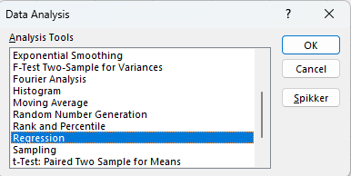
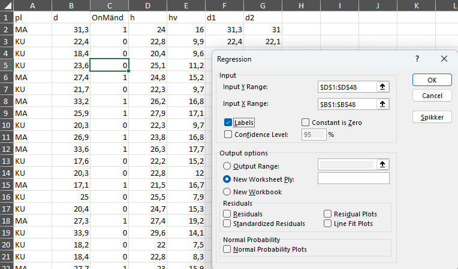
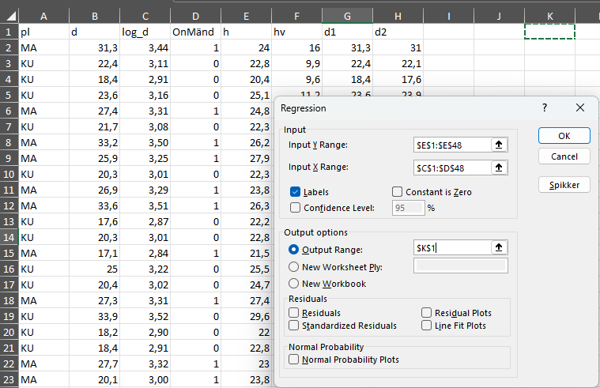

# Mitme tunnuse koosanalüüs

## Lineaarne regressioon

Lineaarne regressioon on üks viis, kuidas uurida, kuidas kaks või enam asja on omavahel seotud. Selle abil saame aru saada, kuidas ühe tunnuse muutumine mõjutab teist. Näiteks, kui me teame, kuidas ühe tunnuse väärtus muutub, saame ennustada, mis võib juhtuda teise tunnusega.

Lineaarne regressioon lähtub eeldusest, et kahe asja vaheline suhe on sirgejooneline. See tähendab, et kui üks tunnus muutub, siis teine asi muutub kindlal viisil, mida saab joonistada sirgjoonena. Selle meetodi eesmärk on leida kõige sobivam sirgjoon, mis näitab, kuidas need kaks tunnust on omavahel seotud. Lineaarse regressioonimudeli võib esitada võrrandina: 

\[Y = a + bX + \epsilon \]

Kus:

- Y on funktsioontunnus
- X on argumenttunnus
- a on lõikepunkt, mis näitab, kui suur on Y väärtus, kui X väärtus on 0
- b on regresseerimiskordaja, mis näitab, kui palju muutub Y väärtus, kui X väärtus suureneb ühe ühiku võrra
- $\epsilon$ on veaväärtus, mis tähistab juhuslikke kõrvalekaldeid mudelist

Lineaarse regressiooni puhul kasutatakse mitmesuguseid meetodeid, et hinnata, kui hästi meie sirgjoon mudelina toimib. Üks selline meetod on vähim ruutude meetod. See tähendab, et me otsime sirgjoont, mis käitub nii, et meie ennustuste ja tegelikkuses mõõdetud väärtuste erinevused oleksid võimalikult väikesed. Lihtsamalt öeldes, me püüame leida sirgjoont, mis sobib kõige paremini meie andmetega, minimeerides vigu ennustustes.

Lineaarse regressiooni usaldusväärsed tulemused sõltuvad teatud eeldustest. Need eeldused aitavad tagada, et meie analüüs peegeldaks tegelikkust võimalikult täpselt. Siin on need eeldused lihtsustatult:

- **Lineaarsus.** Eeldatakse, et kahe tunnuse vaheline suhe on sirgjooneline. See tähendab, et kui üks tunnus muutub, siis teise tunnus vastus on alati sellega proportsioonis, sõltumata olukorrast.

- **Normaaljaotus.** Hälve ehk ennustuste ja tegelike tulemuste erinevused järgivad kindlat mustrit, mis vastab normaaljaotusele.

- **Homoskedastilisus.** Sõltuva tunnuse väärtuste hajuvus on ühtlane kogu sõltumatu tunnuse ulatuses, mis tähendab, et erinevused ei suurene ega vähene sõltumatu tunnuse väärtuse kasvades.

- **Autokorrelatsiooni puudumine.** Vaatluste vead on omavahel sõltumatud, st et ühe vaatluse viga ei mõjuta teise vaatluse viga.

- **Multikollineaarsuse puudumine.** Analüüsitavad tunnused on sõltumatud, st ühe tunnuse väärtus ei sõltu teise tunnuse väärtusest ega ole nendega liiga tihedalt seotud.

Need eeldused aitavad tagada, et lineaarne regressioonimudel oleks usaldusväärne ja et selle abil tehtud järeldused peegeldaksid tegelikke seoseid.


### Lineaarne regressioon R keskkonnas 

```{r, warning=FALSE, message=FALSE}
# Näide R keskkonnas
# Laadime peatükis kasutatavad paketid
library(dplyr)
library(ggplot2)
library(readxl)
library(car)
library(ggpmisc)

```


Loeme andmed failist [naited.xlsx](data/naited.xlsx) töölehelt "prt_andmed" ja salvestame selle tabelisse:
```{r}
# Näide R keskkonnas
andmed <- read_excel("data/naited.xlsx","prt_andmed") %>% filter(h > 0)
```

Teeme lineaarse regressiooni tunnuste D ja H vahel:
```{r}
# Näide R keskkonnas
print(lm_model <- lm(h ~ d, data = andmed))
```

Järgnevalt visualiseerime nii andmeid kui ka mudelit funktsiooni `ggplot()` abil.

```{r, fig.cap="Lineaarne regressioon"}
# Näide R keskkonnas
ggplot(andmed, aes(x = d, y = h)) +
  stat_poly_line() +
  stat_poly_eq(use_label(c("eq", "R2"))) +
  geom_point() +
  xlim(c(10, 40)) + ylim(c(10, 40))

```
Järgnevalt käsu selgitus:

* `ggplot(andmed, aes(x = d, y = h))`: See algatab ggplot-objekti, määrates andmestiku (data) ja esteetilised vastavused. See tähendab, et andmestiku veerg `d` vastendatakse x-teljega ja veerg `h` y-teljega.

* `stat_poly_line()`: See lisab graafikule polünoomilise regressioonijoone. Vaikimisi kasutab see lineaarset mudelit (astmega 1), kuid seda saab muuta, kasutades argumenti `formula`. Näiteks `stat_poly_line(formula = y ~ x^2)` lisaks graafikule ruutvõrrandi.

* `stat_poly_eq(use_label(c("eq", "R2")))`: See lisab graafikule polünoomilise regressioonivõrrandi ja R-ruudu väärtuse. `use_label()` funktsiooniga saab määrata, milliseid tunnuseid kuvatakse. Antud juhul kuvatakse võrrand (`eq`) ja R-ruut (`R2`).

* `geom_point()`: See lisab graafikule punktid, mis tähistavad andmepunkte.

* `xlim(c(10, 40))`: See seab x-telje piirid vahemikku 10 kuni 40.

* `ylim(c(10, 40))`: See seab y-telje piirid vahemikku 10 kuni 40.


```{r, fig.cap="Lineaarne regressioon argumenttunnuse logistilise teisendusega"}
# Näide R keskkonnas
ggplot(andmed, aes(x = d, y = h)) +
  stat_poly_line(formula = y ~ log(x)) +
  stat_poly_eq(formula = y ~ log(x), use_label(c("eq", "R2"))) +
  geom_point() +
  xlim(c(10, 40)) + ylim(c(10, 40))

```

R-is on võimalik lihtalt lisada mudelisse täiendavad tunnuseid, mis arvutakse otse mudeli arvutamise käigus ning seetõttu ei ole vajalik eraldi eelnevalt täiendavat tunnust välja arvutada. Funktsiooniga `I()` saab luua uusi tunnuseid olemasolevate tunnuste põhjal. Uus tunnus arvutatakse iga andmerea jaoks mudeli arvutamise käigus.

Järgnevas näites on muudetud mudelit: `lm(h ~ log(d)+I(pl == "MA"), data = andmed)`

* **`log(d)`**: Funktsioon `log()` arvutab `d` naturaallogaritmi, mis aitab lineariseerida seost diameetri ja kõrguse vahel.
* **`I(pl == "MA")`**: See on teine sõltumatu tunnus, mis luuakse jooksvalt funktsiooni `I()` abil. See on loogiline tunnus, mis on `TRUE`, kui tunnus `pl` väärtus on "MA" , ja `FALSE` vastasel juhul. Sisuliselt lisab see mudelisse teavet selle kohta, kas puu on mänd. Arvutustes kasutatakse antud tunnust vastavalt 1 või 0 väärtusena.


```{r}
# Näide R keskkonnas
# täiendatud argumenttunnustega regressioon
summary(lm_model_pl <- lm(h ~ log(d)+I(pl == "MA"), data = andmed))
```

Antud juhul on näha, et mänd on teistest statistiliselt oluliselt erinev.


### Lineaarne regressioon MS Exceli keskkonnas

MS Exceli keskkonnas saab lineaarse regressiooni parameetreid arvutada mitmel viisil. 

* Kui argumenttunnuseid on vaid üks, siis saab kasutada funktsioone `intercept()` ja `slope()`. 
* Kui argumenttunnuseid on mitu (või ka ainult üks), siis saab kasutada funktsiooni `linest()`, mis annab tulemuseks juba ka täpsemad mudeli parameetrite hinnangud.
* Ühe ja mitme argumenttunnuse puhul saab kasutada *Analysis Toolpak* protseduuri *Regression*.


Avame faili [naited.xlsx](data/naited.xlsx) töölehel "linreg", kus on samad andmed nagu "prt_andmed", aga sellel on juba välja filtreeritud ainult mudelpuude andmed. MS Exceli keskkonnas on üldiselt vajalik filtreeritud andmed viia eraldi tabelisse, et regressiooni käigus muid andmeid ei kasutataks. 

*Analysis Toolpak* abil regressioonanalüüsi tegemiseks tuleb menüüs "Andmed" valida "Data Analysis", mis järel avaneb analüüsivahendite aken.



{width=80%}


Kordame samasugust analüüsi ka MS Exceli keskkonnas nagu R-is, arvutame diameetrist naturaallogaritmi funktsiooniga `ln()` ning kasutame `OnMänd` tunnust. 

{width=80%}


\clearpage

Table: Lineaarse regressiooni tulemus MS Excelis.

**SUMMARY OUTPUT**

| **Regression Statistics** |       |
| ------------------------- | -----:|
| Multiple R                | 0,841 |
| R Square                  | 0,707 |
| Adjusted R Square         | 0,694 |
| Standard Error            | 1,268 |
| Observations              |    47 |


**ANOVA**

|            | **df** | **SS**  | **MS** | **F**   | **Significance F** |
| ---------- | -----: | ------: | -----: | ------: | -----------------: |
| Regression |       2|  171,139|  85,570|  53,191 |              0,000 |
| Residual   |      44|   70,783|   1,609| 
| Total      |      46|  241,922| 


|             | **Coefficients** | **Standard Error** | **t Stat** | **P-value** |
| ----------- | ---------------: | -----------------: | ---------: | ----------: |
| Intercept   |          -3,5829 |             2,7247 |    -1,3150 | 0,1953      | 
| log_d       |           8,9235 |             0,8718 |    10,2358 | 0,0000      |
| OnMänd      |          -0,9776 |             0,4300 |    -2,2737 | 0,0279      |


### Regressioonanalüüsi tulemuste tõlgendamine

Lineaarse regressioonimudeli kokkuvõte sisaldab mitmeid olulisi statistilisi näitajaid, mis aitavad hinnata mudeli sobivust andmetele. 

Determinatsioonikordaja, tuntud ka kui \(R^2\) (R-ruut), on statistiline mõõdik, mida kasutatakse lineaarse regressiooni kontekstis, et hinnata, kui suures ulatuses argumenttunnuse variatsioon on seletatav sõltumatute tunnuste abil mudelis. \(R^2\) väärtus varieerub vahemikus 0 kuni 1, kus 0 tähendab, et mudel ei seleta argumenttunnuse variatsiooni üldse, samas kui 1 tähendab, et mudel seletab argumenttunnuse variatsiooni täielikult.

\(R^2\) arvutamiseks kasutatakse järgmist valemit:

\[ R^2 = 1 - \frac{\text{SS}_\text{res}}{\text{SS}_\text{tot}} \]

kus:

- \(\text{SS}_\text{res}\) on jääkide ruutude summa (residual sum of squares), mis mõõdab mudeli poolt seletamata variatsiooni.
- \(\text{SS}_\text{tot}\) on kogu variatsiooni ruutude summa (total sum of squares), mis mõõdab argumenttunnuse variatsiooni võrreldes tema keskmisega.


**Kõrge \(R^2\) väärtus** (lähedane 1-le) näitab, et mudeli poolt seletatav variatsioon on suur, mis tähendab, et mudel sobib andmetele hästi. See viitab sellele, et suur osa argumenttunnuse variatsioonist on seletatav mudeli sõltumatute tunnustega.

**Madal \(R^2\) väärtus** (lähedane 0-le) näitab, et mudel seletab argumenttunnuse variatsioonist väikese osa, mis tähendab, et mudeli sobivus andmetele on kehv. See võib viidata sellele, et mudelis kasutatavad sõltumatud tunnused ei ole sõltuva tunnuse variatsiooni seletamisel tõhusad.

Oluline on mõista, et kuigi \(R^2\) on kasulik mõõdik mudeli sobivuse hindamisel, ei tähenda kõrge \(R^2\) automaatselt, et mudel on õige või, et argumenttunnused põhjustavad funktsioontunnuse käitumist. Samuti ei pruugi madal \(R^2\) alati tähendada mudeli ebatõhusust, eriti keerukamate või mittelineaarsete suhete puhul. Lisaks tuleks mudeli hindamisel arvesse võtta ka muid tegureid, nagu mudeli tõlgendatavus, argumenttunnuste olulisus ja korrigeeritud \(R^2\).

Lineaarse regressioonimudeli **nihutamata hinnang**, tuntud ka kui korrigeeritud \(R^2\) (inglise keeles "adjusted \(R^2\)"), on statistiline mõõdik, mida kasutatakse mudeli seletusvõime hindamiseks, võttes arvesse mudeli sõltumatute tunnuste arvu. Erinevalt lihtsast \(R^2\)-st, mis mõõdab, kui suur osa argumenttunnuse variatsioonist on seletatav mudeli abil, arvestab korrigeeritud \(R^2\) mudeli keerukust, arvestab mudeli liigsete sõltumatute tunnuste lisamise eest. See on oluline, kuna mudelisse liiga palju tunnusid lisades võib \(R^2\) väärtus eksitavalt tõusta, viidates paremale mudeli sobivusele, kuigi tegelikult võivad lisatud tunnused olla statistiliselt mitteolulised.

Korrigeeritud \(R^2\) arvutatakse järgmise valemi järgi:

\[ R^2_{\text{adj}} = 1 - \left( \frac{(1 - R^2)(n - 1)}{n - k - 1} \right) \]

kus:

* \(R^2\) on mudeli lihtne determinatsioonikoefitsient,
* \(n\) on vaatluste arv,
* \(k\) on sõltumatute tunnuste arv mudelis.

Valemist nähtub, et \(R^2_{\text{adj}}\) väheneb, kui lisatakse tunnusid, mis ei paranda mudeli seletusvõimet proportsionaalselt nende arvuga. Seega, erinevalt lihtsast \(R^2\)-st, pakub korrigeeritud \(R^2\) ausamat hinnangut mudeli sobivusele, eriti kui võrrelda mudeleid, mis sisaldavad erinevat arvu sõltumatuid tunnusid. Korrigeeritud \(R^2\) on eriti kasulik mudelite võrdlemisel ja mudeli valimisel, aidates vältida ülemudelitamist ja eelistades mudelit, mis annab parima tasakaalu seletusvõime ja keerukuse vahel.

* P-väärtused näitavad, kas argumenttunnus on statistiliselt oluline mudelis. Kui P-väärtus on väiksem kui 0,05, siis võib järeldada, et argumenttunnus mõjutab oluliselt sõltuvat tunnust.

* Regressioonikordaja väärtused annavad teavet sõltumatute tunnuste mõju kohta sõltuvale tunnusle. 

Kokkuvõttes aitab väljund mõista, kuidas mudel sobitub andmetega ja millist infot see pakub sõltuvate ja sõltumatute tunnuste seoste kohta.


### Homoskedastilisuse testimine

Statistilise regressioonimudeli kontekstis viitab homoskedastiivsus olukorrale, kus jääkliikmete (ehk mudeli veatermini) dispersioon on konstantne sõltumata seletavate muutujate väärtustest.  See tähendab, et mudeli ennustusvead on ühtlase hajuvusega kogu vaadeldava andmevahemiku ulatuses, ega ole süstemaatiliselt seotud ennustatud väärtustega. Homoskedastiivsus on kriitiline eeldus mitmetes statistilistes meetodites, eriti vähimruutude meetodil baseeruva lineaarse regressiooni puhul. Selle eelduse rikkumine, tuntud kui heteroskedastiivsus, võib moonutada mudeli parameetrite hinnanguid, viies ebatäpsete usaldusvahemike ja potentsiaalselt vigaste järeldusteni hüpoteeside testimisel.

On mitmeid viise, kuidas testida, kas andmetes esineb homoskedastiivsust:

1.  **Visuaalne analüüs:** Lihtsaim viis on vaadata jääkliikmete graafikut seletavate muutujate või ennustatud väärtuste suhtes. Kui jääkliikmed on ühtlaselt hajunud nulljoone ümber, on homoskedastiivsus tõenäoline. Kui tekib mingi muster (näiteks koonusekujuline hajumine), on tõenäoline heteroskedastiivsus.
2.  **Formaliseeritud testid:** On olemas mitmed statistilised testid, näiteks Breusch-Pagani test ja White’i test, mis testivad heteroskedastiivsust formaalselt. Need testid kontrollivad, kas jääkliikmete dispersioon on seotud seletavate muutujatega.
3.  **Robustsed meetodid:** Kui andmetes esineb heteroskedastiivsust, võib kasutada robustseid regressioonimeetodeid, mis on vähem tundlikud heteroskedastiivsuse suhtes.


```{r, fig.cap = "Jäägid vs prognoositud väärtus"}
# Näide R keskkonnas
plot(lm_model, which=1, main = "") 
```

Lineaarse mudeli homoskedastilisuse testimiseks saab kasutada Breush-Pagan või White'i testi. Need testid hindavad, kas jääkide varieeruvus on seotud sõltumatute tunnustega ning kas see varieeruvus on ühtlane.

```{r}
# Näide R keskkonnas
lmtest::bptest(lm_model)
```

Paketi `lmtest` funktsioon `bptest()` testib regressioonimudeli jääkide heteroskedastsuse olemasolu. See tähendab, et jääkide varieeruvus ei ole konstantne üle kõigi sõltumatute tunnuste väärtuste ning võib tekitada probleeme statistiliste hüpoteeside testimisel.

Testi tulemusi võib lugeda järgmiselt:

- Nullhüpotees (H0): jääkide varieeruvus on konstantne (st heteroskedastsust ei esine).
- Alternatiivhüpotees (H1): jääkide varieeruvus ei ole konstantne (st heteroskedastsus esineb).

Testist saadav p-väärtus aitab hinnata, kas on piisavalt tõendeid, et lükata ümber nullhüpotees heteroskedastsuse puudumise kohta. Väike p-väärtus (<0,05) viitab sellele, et saame nullhüpoteesi ümber lükata ja järeldada, et heteroskedastsust esineb.

### Jääkide normaalsuse test

Üks oluline eeldus, mida lineaarses regressioonis kasutatakse, on see, et mudeli jäägid vastaksid normaaljaotusele. Normaaljaotus tähendab, et andmete jaotus on sümmeetriline ning keskmise jaotusega. Kui jäägid on normaaljaotusele lähedased, siis on regressioonimudeli ennustused usaldusväärsemad ja täpsemad. Paljud statistilised testid eeldavad, et andmed vastavad normaaljaotusele. Kui jäägid ei vasta normaaljaotusele, võivad testide tulemused olla ebatäpsed või valed. Normaaljaotuse eeldustele mitte vastamine võib viidata sellele, et mudel ei sobi antud andmetele hästi ning on vajalik leida alternatiivseid mudeleid.

Normaliseeritud jääkide graafik on üks viis, kuidas hinnata, kas jäägid vastavad normaaljaotusele. See graafik aitab visualiseerida, kas jäägid on juhuslikult hajutatud ümber nulli ja kas nende jaotus on ligilähedane normaaljaotusele.


```{r}
# Näide R keskkonnas

ggplot(lm_model, aes(x = .fitted, y = .resid)) +
  geom_point() +
  geom_hline(yintercept = 0)+
  geom_smooth(method = "gam", formula = y ~ s(x))  # Lisab sujuva joone GAM mudeli abil

```
Koodi selgitus:

**`ggplot(lm_model, aes(x = .fitted, y = .resid))`**

*   See käsk loob aluse graafikule ggplot2 paketiga.
*   `lm_model` määrab andmeallika, milleks on lineaarne mudel.
*   `aes(x = .fitted, y = .resid)` määrab x-teljele mudeli sobitatud väärtused (.fitted) ja y-teljele jääkväärtused (.resid).

**`geom_point()`**

*   See lisab graafikule punktid, mis esindavad iga andmepunkti jääki ja sobitatud väärtust.

**`geom_hline(yintercept = 0)`**

*   See lisab horisontaalse joone y-telje väärtusel 0. See joon aitab visuaalselt hinnata jääkide jaotust - ideaalses mudelis peaksid punktid jaotuma ühtlaselt joone ümber.

**`geom_smooth(method = "gam", formula = y ~ s(x))`**

*   See lisab graafikule sujuva joone, mis on arvutatud GAM mudeli (Generalized Additive Model) abil.
*   `method = "gam"` määrab joone arvutamise meetodiks GAM.
*   `formula = y ~ s(x)` määrab mudeli valemi, kus y (jääkväärtused) on seotud x-i (sobitatud väärtused) sujuva funktsiooniga s(x).

**Kokkuvõtteks:**

Kood genereerib diagnostilise graafiku, mis aitab hinnata lineaarse mudeli sobivust andmetega. Jääkide jaotus 0-joone ümber ja sujuva joone kuju annavad informatsiooni mudeli eelduste (nt homoskedastsus ja lineaarsus) täidetuse kohta.


Samuti saab vaadata jääkide jagunemist tihedusfunktsiooni abil koostatud graafikul.

```{r, fig.cap = "Jääkide tihedusfunktsioon"}
# Näide R keskkonnas

ggplot(lm_model, aes(x = .resid)) +
  geom_density()

```

Sellise protseduuri abil saad hinnata, kui hästi sobib loodud lineaarne regressioonimudel andmetele ning kas jääkide jaotus vastab normaalsuse eeldusele.

```{r}
# Näide R keskkonnas
# ANOVA
anova(lm_model)
confint(lm_model)
```


### Multikollineaarsus

Lineaarses regressioonis tähistab multikollineaarsus olukorda, kus kaks või enam sõltumatut tunnust (selgitajat) on omavahel tugevalt seotud või korreleerunud. See tähendab, et ühe selgitaja väärtusi saab suure täpsusega ennustada teiste selgitajate väärtuste põhjal. Multikollineaarsus võib olla probleemiks, sest:

Mõjutab koefitsientide hinnangute täpsust: multikollineaarsus suurendab koefitsientide hinnangute varieeruvust, mis muudab need ebastabiilseks. Väiksed muudatused andmestikus võivad tuua kaasa suuri muutusi koefitsientide hinnangutes, muutes mudeli interpretatsiooni keeruliseks.

Raskendab tunnuste tähtsuse hindamist: kõrge multikollineaarsuse korral võib olla raske kindlaks teha, milline argumenttunnus mõjutab sõltuvat tunnust, sest statistilised testid ei pruugi olla usaldusväärsed. See võib viia oluliste tunnuste ebaõiglase kõrvalejätmiseni või ebaoluliste tunnuste mudelisse lisamiseni.

Vähendab mudeli interpretatsiooni selgust: kui argumenttunnused on omavahel tugevalt seotud, muutub mudeli interpretatsioon keerulisemaks, kuna keeruline on eristada iga tunnus unikaalset mõju argumenttunnusele .

Multikollineaarsuse tuvastamiseks lineaarses regressioonis kasutatakse tavaliselt järgmisi meetodeid:

- **Korrelatsioonimatriks**: Vaadeldakse sõltumatute tunnuste vahelisi korrelatsioonikoefitsiente. Kõrge korrelatsioon näitab võimalikku multikollineaarsust.
- **Variance Inflation Factor (VIF)**: VIF mõõdab, kui palju tunnus variatiivsus suureneb multikollineaarsuse tõttu. Tavaliselt peetakse VIF väärtust üle 5 või 10 viitavaks tugevale multikollineaarsusele.
- **Tolerants**: Tolerants on VIF-i pöördväärtus ja näitab, kui suur osa tunnus variatsioonist ei ole seletatav teiste mudeli tunnustega. Madal tolerants viitab multikollineaarsusele.

Multikollineaarsuse lahendamiseks võib kasutada mitmeid lähenemisviise, näiteks tunnuste eemaldamist mudelist, tunnuste kombineerimist või andmete transformeerimist. Samuti võib kasulikuks osutuda regulaarimismeetodite, nagu ridge regressioon või lasso regressioon, kasutamine, mis aitavad vähendada koefitsientide varieeruvust, karistades suuri koefitsiente.

Vaatame järgmist näidet, kus puude kõrgust ennustame mõlema diameetri alusel. Kui varasemalt oli näha, et üks diameeter on oluline, siis antud mudelid ei ole enam kumbki oluline, sest nende tunnuse vahel on korrelatsioon.

```{r}
# Näide R keskkonnas
summary(lm.col <- lm(h ~ d1 + d2, data = andmed))
```

Tehes täiendavalt ANOVA, on näha, et diameeter, mis lineaarses regressioonimudelis ei olnud oluline, on dispersioonanalüüsi järgi peamine varieeruvuse kirjeldaja.

```{r}
# Näide R keskkonnas
anova(lm.col)
# Arvutame VIF väärtuse multikollineaarsuse tuvastamiseks
vif(lm.col)
```

Kui VIF väärtus on üle 5, siis on tunnuste vahel tugev korrelatsioon, mida saame kontrollida ka korrelatsioonimaatriksiga.

```{r}
# Näide R keskkonnas
cor(andmed[,c("d1","d2")])
```
Sellest on näha, et need on tugevas korrelatsioonis (0,986). See mõjutab ka lineaarse regressiooni parameetrite arvutamist.


## Dispersioonanalüüs
Mitmese regressioonanalüüsi korral on tegemist mudeliga, kus pidev funktsioontunnus avaldub pidevate argumenttunnuste lineaarkombinatsioonina. Dispersioonanalüüsi korral on tegemist mudelitega, kus funktsioontunnuseks on pidev tunnus, kuid argument-tunnused on diskreetsed (võivad olla nii arvulised kui ka mittearvulised). Dispersioon-analüüsi argumenttunnuseid nimetatakse faktoriteks. Ühefaktorilise dispersioonanalüüsi puhul uuritakse funktsioontunnuse sõltuvust ainult ühest faktorist. Faktori võimalikke väärtusi nimetatakse faktori tasemeteks.

Olgu üldkogum jaotatud mittelõikuvateks osadeks ehk rühmadeks faktori tasemete järgi. Öeldakse, et faktor X mõjub tunnusele Y, kui tunnuse Y keskväärtused eri rühmades on erinevad. Uurija käsutuses on valimi mõõtmisandmed, mille funktsioon-tunnuse rühmakeskmised tavaliselt erinevad. Dispersioonanalüüs on meetod, millega otsitakse vastust küsimusele, kas valimi rühmakeskmiste erinevus on põhjustatud uuritava faktori mõjust või valimi juhuslikkusest. 

Dispersioonanalüüsi võimalused ja vahendid sõltuvad oluliselt valitud mudelist ja katsekorraldusest. Kui iga faktortunnuse igal tasemel on tehtud ühepalju mõõtmisi, nimetatakse mudelit tasakaalustatuks, vastasel juhul on tegemist tasakaalustamata mudeliga. Kui mõõtmisi on tehtud faktori kõigil võimalikel tasemetel, siis nimetatakse seda fikseeritud faktoriks. Kui faktortunnusel on palju erinevaid väärtusi ja mõõdetud tasemeid vaadeldakse juhusliku valimina faktori võimalike tasemete hulgast, siis nimetatakse seda juhuslikuks faktoriks. Järgnevalt käsitleme ainult fikseeritud faktoritega mudeleid.
