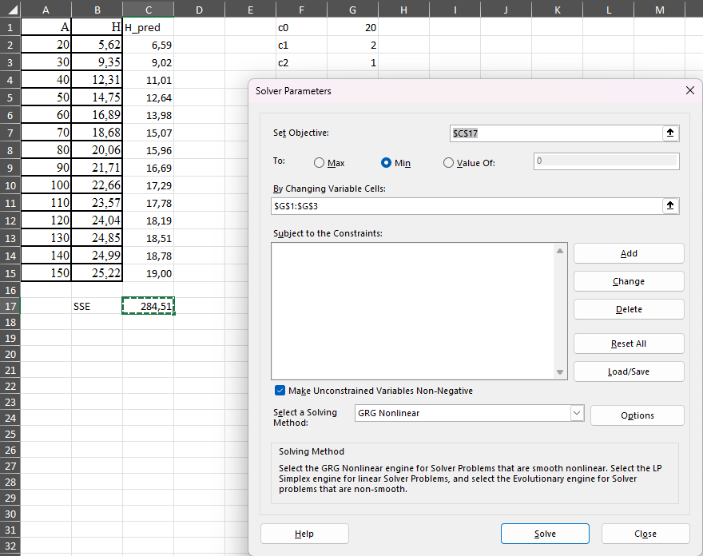

```{r, include=F}
knitr::opts_chunk$set(
  comment = '', fig.width = 8, fig.height = 6, out.width = "80%", fig.pos = "!ht"
)

```

# Mittelineaarne regressioon

**Mittelineaarne regressioon** on statistiline meetod, mida kasutatakse sõltuva muutuja ja ühe või mitme sõltumatu muutuja vahelise mittelineaarse seose modelleerimiseks. Erinevalt lineaarsest regressioonist, mis eeldab sirgjoonelist seost, võimaldab mittelineaarne regressioon paindlikumaid seoseid, näiteks kõverjoonelisi, eksponentsiaalseid või logistilisi seoseid.

Metsanduses esineb sageli mittelineaarseid seoseid. Mittelineaarne regressioon võimaldab neid keerukaid seoseid täpsemalt modelleerida ja paremini mõista.

Mittelineaarne regressioonimudel kirjutatakse üldjuhul kujul:
  

\[Y = f(X, \beta) + \epsilon\]

kus:
  
*   **Y** on sõltuv muutuja.
*   **X** on sõltumatu(te) muutuja(te) vektor.
*   **\(f(X, \beta)\)** on mittelineaarne funktsioon, mis kirjeldab seost X ja Y vahel.
*   **\(\beta\)** on mudeli parameetrite vektor, mida tuleb hinnata.
*   **\(\epsilon\)** on vealiige, mis esindab juhuslikku varieeruvust.


Mittelineaarse regressiooni parameetreid hinnatakse tavaliselt **vähimruutude meetodil**, kus otsitakse parameetrite väärtusi, mis minimeerivad mudeli ennustatud väärtuste ja tegelike väärtuste vaheliste ruutude summat. See on iteratiivne protsess, mis nõuab arvutitarkvara kasutamist.

## R


Näiteks, kui soovime R-is kasutada `nls()` mudelit, mis kirjeldab puu kõrgust sõltuvalt puu diameetrist, võime kasutada järgmist näidiskoodi. 

```{r, warning=FALSE, message=FALSE}
# Laadime peatükis kasutatavad paketid
library(dplyr)
library(readxl)
library(ggplot2)
library(broom)
```

```{r}
# Laadime andmed sisse failist ning
# filtreerime välja puud, mille h > 0
andmed <- read_excel("data/naited.xlsx","PH_MA")
```

Olgu meil ülesandeks lähendada Eesti riigimetsa pohla kasvukohatüübi männikute keskmiste kõrguste vanuserea andmed Mitcherlichi kasvufunktsiooniga

\[H = c0 * (1 - exp(-c1 * A))^{c2}\]

Kus A on vanus, H on puistu kõrgus ning c0, c1 ja c2 on mudeli parameetrid. 

Mudeli lähendamiseks koostame esmalt oma funktsiooni ning lisame täiendava teisenduse, kus vanus jagatakse 100-ga. Kuna parameeter c1 korrutatakse valemis vanusega ning selle parameetri väärtus on väga väike, siis lähendamine on lihtsam, kui see on sada korda suurem ehk 0,02 asemel on 2.

```{r}
# Määratleme mudeli funktsioon
kasvuMudel <- function(A, c0, c1, c2) {
 c0 * (1 - exp(-c1 * A/100))^c2
}
```

```{r}
# Omista algväärtused parameetritele
alg_param <- list(c0 = 20, c1 = 2, c2 = 1)
```

```{r}
# Sobita mudel andmetele
mudel <- nls(H ~ kasvuMudel(A, c0, c1, c2), data = andmed, start = alg_param)

```

```{r}
# Vaata mudeli kokkuvõtet
summary(mudel)

```

Esitame selle kohta ka graafiku.

```{r, fig.cap = "Mittelineaarne regressioon"}

ggplot(andmed, aes(x = A, y = H)) +
  geom_point() +
  stat_function(
    fun = function(x)
      predict(mudel, newdata = data.frame(A = x)),
    color = 2
  ) 

```

**`ggplot(andmed, aes(x = A, y = H)) +`**

- **`ggplot(andmed, ...)`:** See alustab `ggplot2` graafiku loomist. `andmed` on andmestik (tõenäoliselt `data.frame` objekt), mida graafikul kasutatakse.
- **`aes(x = A, y = H)`:** See määrab graafiku esteetilised omadused (aesthetics).
    - **`x = A`:** Määrab, et graafiku x-teljel kuvatakse andmestiku `andmed` veerg `A`.
    - **`y = H`:** Määrab, et graafiku y-teljel kuvatakse andmestiku `andmed` veerg `H`.
- **`+`:** See märk näitab, et graafiku definitsioon jätkub järgmistel ridadel (lisatakse kihte).

**`geom_point() +`**

- **`geom_point()`:** See lisab graafikule punkti kihi (scatter plot). Iga punkt vastab ühele vaatluspaarile andmestikus `andmed`, kus punkti x-koordinaat on `A` väärtus ja y-koordinaat on `H` väärtus.
- **`+`:** Jätkab graafiku definitsiooni.

**`stat_function(...)`**

- **`stat_function(...)`:** See lisab graafikule funktsiooni joonistamise kihi. See on kasulik, kui tahame joonistada mingit matemaatilist funktsiooni või, nagu antud juhul, mudeli ennustust.
    - **`fun = function(x) predict(mudel, newdata = data.frame(A = x))`:** See määrab joonistatava funktsiooni.
        - **`function(x)`:** See defineerib anonüümse funktsiooni, mille sisendiks on `x`.  `stat_function` annab sellele funktsioonile automaatselt x-telje väärtused mingis vahemikus.
        - **`predict(mudel, newdata = data.frame(A = x))`:** See on funktsiooni tuum. See kutsub välja `predict()` funktsiooni, et arvutada `mudel` (eeldame, et see on eelnevalt defineeritud `nls` mudel) ennustused uutele andmepunktidele.
            - **`mudel`:** Eelnevalt defineeritud mudeli objekt.
            - **`newdata = data.frame(A = x)`:** See loob uue `data.frame` objekti, kus veeru `A` väärtuseks on funktsiooni sisend `x`. Sisuliselt arvutab see mudeli ennustused erinevatele `A` väärtustele, mida `stat_function` ette annab.
    - **`color = 2`:** See määrab joonistatava joone värviks punase (värvikood 2 R-is on punane).


Järgnevalt kontrollime ka jääkide hajuvust.

```{r, fig.cap = "Jäägid vs ennustatud"}

ggplot(data.frame(fitted = fitted(mudel), resid = resid(mudel)),
       aes(x = fitted, y = resid)) +
  geom_point() +
  geom_hline(yintercept = 0) +
  geom_smooth(method = "gam", formula = y ~ s(x))  # Lisab sujuva joone GAM mudeli abil

```


**`ggplot(data.frame(fitted = fitted(mudel), resid = resid(mudel)), ...)`**

- **`ggplot(...)`:** See alustab `ggplot2` graafiku loomist.
- **`data.frame(fitted = fitted(mudel), resid = resid(mudel))`:** See loob andmestiku (`data.frame` objekti), mida graafikul kasutatakse. See on selle koodilõigu tuum.
    - **`fitted = fitted(mudel)`:** See arvutab mudeli `mudel` abil ennustatud väärtused (fitted values) kõikidele andmepunktidele, mis olid algselt kasutusel mudeli treenimisel. Need väärtused salvestatakse tulpa nimega `fitted`.
    - **`resid = resid(mudel)`:** See arvutab jäägid (residuals) mudeli `mudel` jaoks. Jääk on tegeliku väärtuse ja ennustatud väärtuse vahe. Need väärtused salvestatakse tulpa nimega `resid`.
- **`aes(x = fitted, y = resid) +`:** See määrab graafiku esteetilised omadused:
    - **`x = fitted`:** Määrab, et x-teljel kuvatakse ennustatud väärtused (tulbast `fitted`).
    - **`y = resid`:** Määrab, et y-teljel kuvatakse jäägid (tulbast `resid`).
- **`+`:** See märk näitab, et graafiku definitsioon jätkub järgmistel ridadel.

**`geom_point() +`**

- **`geom_point()`:** See lisab graafikule punkti kihi. Iga punkt vastab ühele vaatluspunktile, kus punkti x-koordinaat on ennustatud väärtus ja y-koordinaat on jääk.
- **`+`:** Jätkab graafiku definitsiooni.

**`geom_hline(yintercept = 0) +`**

- **`geom_hline(yintercept = 0)`:** See lisab graafikule horisontaalse joone, mille y-koordinaat on 0. See joon on abiks jääkide jaotuse hindamisel - ideaalis peaksid jäägid paiknema juhuslikult nulljoone ümber.
- **`+`:** Jätkab graafiku definitsiooni.

**`geom_smooth(method = "gam", formula = y ~ s(x))`**

- **`geom_smooth(...)`:** See lisab graafikule silutud joone kihi.
    - **`method = "gam"`:** See määrab silumise meetodiks GAM (Generalized Additive Model). GAM on paindlik meetod mittelineaarsete seoste modelleerimiseks.
    - **`formula = y ~ s(x)`:** See määrab mudeli valemi.
        - **`y ~ ...`:** Näitab, et modelleeritakse y-telje väärtust (jääke).
        - **`s(x)`:** Näitab, et x-telje väärtuse (ennustatud väärtuste) ja y-telje väärtuse (jääkide) vahelist seost modelleeritakse sujuva funktsiooniga (splainiga). See võimaldab tuvastada mittelineaarseid mustreid.


**Mida sellelt graafikult otsida:**

- **Juhuslik hajuvus:** Ideaalis peaksid punktid paiknema juhuslikult nulljoone ümber, ilma selge mustrita.
- **Süsteemne muster:** Kui punktid moodustavad mingi süsteemse mustri (nt kaar, lehter), siis see viitab probleemidele mudelis (nt mittelineaarsus, heteroskedastiivsus).
- **Silutud joone kuju:** Kui silutud joon on sirge ja horisontaalne, siis see viitab, et ennustatud väärtuste ja jääkide vahel puudub süsteemne seos. Kui joon on kõver, siis see viitab mittelineaarsele seosele, mida mudel ei pruugi arvesse võtta.


\clearpage
## MS Excel

MS Exceli keskkonnas saab mittelineaarse funktsiooni parameetrite hindamiseks kasutada optimeerimisprotseduuri Solver. Selleks tuleks MS Exceli töölehele salvestada argumenttunnuse väärtused, funktsioontunnuse väärtused, prognoosifunktsiooni arvutusvalemid ja prognoosijääkide ruutude summa  arvutuseeskiri. Samuti peavad töölehel olema lahtrid funktsiooni parameetrite jaoks, mida prognoosifunktsiooni arvutusvalemid kasutavad. MS Exceli optimeerimisalgoritm käivitatakse menüüst: Andmed, Solver. 

Andmete ettevalmistamisel tuleb esmalt määrata lahtrid, kuhu kirjutatakse mudeli parameetrid. Järgnevas näites on need lahtrites G1:G3 ning nende nimetused on lahtrites F1:F3. Kõrguse kõrval tulpa on sisestatud valem, millega kõrgust prognoositakse sõltuvalt vanusest. Eraldi on välja arvutatud 	prognoosijääkide ruutude summa (SSE) MS Exceli funktsiooniga `SUMXMY2()`, millel on sisendiks tegelik kõrgus ja prognoositud kõrgus. 

Solverile tuleb anda ette lahtrid, mille väärtust minimeeritakse (SSE) ja lahtrid, mille väärtusi protseduur hakkab muutma, et minimeerida prognoosijääkide ruutude summat.

